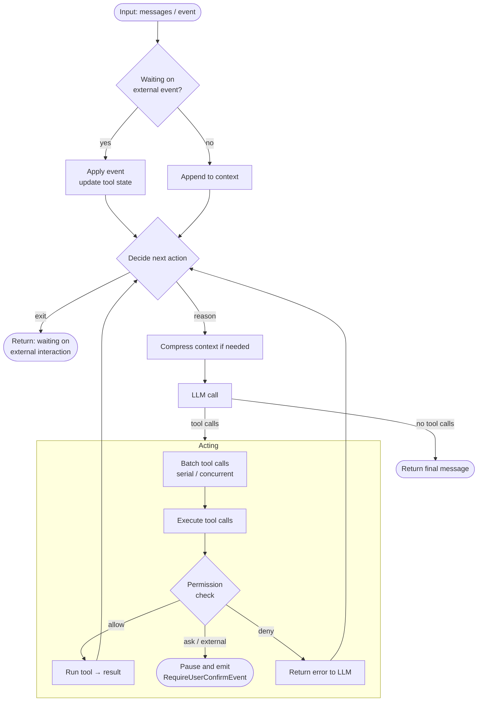

## Overview

`Agent` (interface at `io.agentscope.core.agent.Agent`, default implementation `ReActAgent`) is the core abstraction — a reasoning-acting loop engine that integrates models, tools, the permission system, human-in-the-loop, context management, middlewares, state management, and the event system into a single unified interface.

Its primary responsibilities are:

- Receive input messages or events; orchestrate tools to complete tasks.
- Manage context (conversation history is held on `AgentState.getContext()` and can be persisted automatically via an `AgentStateStore`).
- Provide middleware hooks at key lifecycle points for custom logic.
- Manage concurrent and sequential tool execution automatically.

### Core interface

The `Agent` interface composes three capability interfaces: `CallableAgent`, `StreamableAgent`, `ObservableAgent`. The most commonly used methods:

| Method | Description |
|--------|-------------|
| `call(List<Msg>)` / `call(List<Msg>, RuntimeContext)` | Run the reasoning-acting loop and return `Mono<Msg>` |
| `streamEvents(List<Msg>)` / `streamEvents(Msg)` | Same loop, but emits `AgentEvent`s incrementally |
| `observe(Msg)` / `observe(List<Msg>)` | Append messages to context without triggering reasoning (returns `Mono<Void>`) |

`ReActAgent` adds overloads for structured output (`call(msgs, structuredOutputClass, runtimeContext)`) and convenient per-call metadata via `RuntimeContext`.

### Main loop

Each `call` runs through the reasoning-acting loop. The diagram below shows the main control flow:



## Configuring an agent

Build an agent with `ReActAgent.builder()...build()`. `.model(...)` takes either a `ModelRegistry`-resolved string id (most common — picks up env vars automatically) or an explicit `Model` instance (when you need explicit control over timeouts / custom endpoints / etc.).


<Tabs>


<Tab title="String model id (recommended)">

```java
import io.agentscope.core.ReActAgent;
import io.agentscope.core.tool.Toolkit;

ReActAgent agent =
        ReActAgent.builder()
                .name("my_agent")
                .sysPrompt("You are a helpful assistant.")
                // Resolved by ModelRegistry; reads DASHSCOPE_API_KEY automatically.
                // Switch providers by using "openai:gpt-5.5" / "anthropic:claude-sonnet-4-5"
                // / "deepseek:deepseek-v4-flash" / "gemini:gemini-2.0-flash" / "ollama:llama3".
                .model("dashscope:qwen-plus")
                .toolkit(new Toolkit())
                .build();
```

</Tab>


<Tab title="Explicit Model builder">

```java
import io.agentscope.core.ReActAgent;
import io.agentscope.extensions.model.dashscope.formatter.DashScopeChatFormatter;
import io.agentscope.extensions.model.dashscope.DashScopeChatModel;
import io.agentscope.core.tool.Toolkit;

ReActAgent agent =
        ReActAgent.builder()
                .name("my_agent")
                .sysPrompt("You are a helpful assistant.")
                .model(
                        DashScopeChatModel.builder()
                                .apiKey("YOUR_API_KEY")
                                .modelName("qwen-max")
                                .stream(true)
                                .formatter(new DashScopeChatFormatter())
                                .build())
                .toolkit(new Toolkit())
                .build();
```

</Tab>


<Tab title="With Toolkit / MCP">

```java
import io.agentscope.core.ReActAgent;
import io.agentscope.core.tool.Toolkit;
import io.agentscope.core.tool.builtin.TodoTools;
import io.agentscope.core.tool.mcp.McpClientBuilder;
import io.agentscope.core.tool.mcp.McpClientWrapper;

Toolkit toolkit = new Toolkit();
toolkit.registerTool(new TodoTools());          // reflectively register @Tool methods
toolkit.registerTool(new MyCustomTools());      // custom tool class

McpClientWrapper amap = McpClientBuilder.streamableHttp()
        .name("amap")
        .url("https://mcp.amap.com/mcp?key=" + System.getenv("AMAP_API_KEY"))
        .build();
toolkit.registerMcpClient(amap).block();

ReActAgent agent =
        ReActAgent.builder()
                .name("my_agent")
                .sysPrompt("You are a helpful assistant.")
                .model("dashscope:qwen-max")
                .toolkit(toolkit)
                .build();
```

</Tab>


</Tabs>


<Tip>


<!-- Content truncated to meet Windsurf 6KB limit -->

---
> Source: [agentscope-ai/agentscope-java](https://github.com/agentscope-ai/agentscope-java) — distributed by [TomeVault](https://tomevault.io).
<!-- tomevault:4.0:windsurf_rules:2026-09-10 -->
