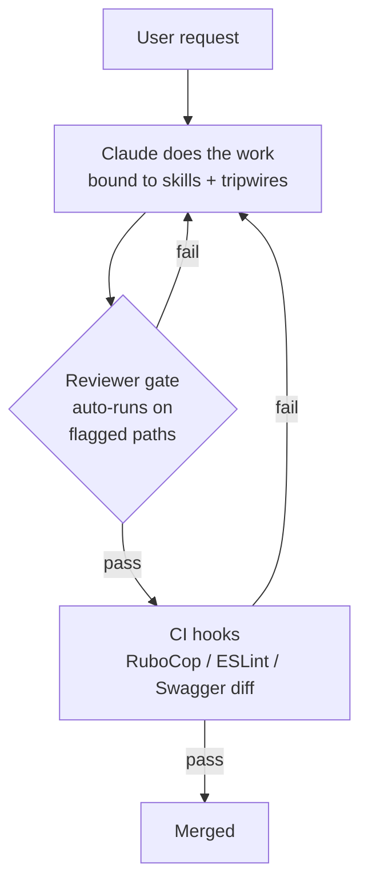
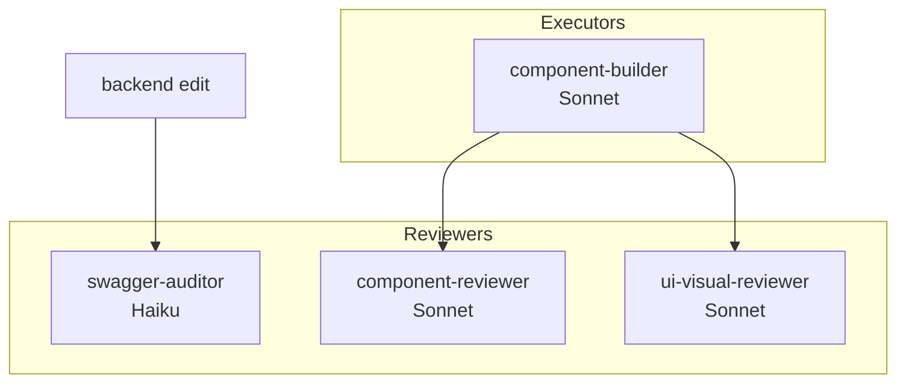

# AGENTS.md — Claude tooling guide for Aixle Insights

Welcome! This doc explains the Claude tooling you have access to in this project: commands you can type, agents the model can spawn, skills that auto-load when you're editing certain files, and hooks that run automation for you.

> Use Grep, Glob, and Read to explore the codebase. For directed searches use those tools directly. For broader exploration use the Explore subagent.

**Who this is for:** every engineer on Aixle Insights, whether day-one or day-1000. The tooling teaches itself — if you forget how something works, just ask.

**Quick start:** run `/onboard` in Claude Code for a guided 10-minute walkthrough, or `/help-tooling` anytime to see a live catalog of what's available.

For conventions the tooling *enforces* (Alba, ActionPolicy, Swagger sync, etc.), see [CLAUDE.md](CLAUDE.md).

## TL;DR

| Primitive | Invoked by | Use for | File location |
|---|---|---|---|
| **Command** | You type `/name` | Explicit workflows you run on demand | `.claude/commands/*.md` |
| **Agent** | Model spawns via Task tool, or you `@agent-name` | Isolated deep work, specialist reviews | `.claude/agents/*.md` |
| **Skill** | Model auto-triggers on matching context | Domain knowledge pulled in silently | `.claude/skills/<name>/SKILL.md` |
| **Hook** | Harness runs on Claude events | Automation outside the model (lint, tests) | `.claude/hooks/*.ts` via `settings.json` |

Works identically in Claude Code CLI (terminal) and in Agent SDK sessions. Same folder, same schema.

---

## Architecture overview



Reviewer/auditor agents gate sensitive paths; CI hooks backstop everything. The model itself is single-tier — no executor/advisor split.

---

## Folder layout

```
.claude/
├── agents/
│   ├── component-builder.md      # executor — Figma-driven UI build
│   ├── component-reviewer.md     # reviewer — token/a11y gate
│   ├── swagger-auditor.md        # auditor — swagger-sync compliance
│   └── ui-visual-reviewer.md     # reviewer — screenshot regression
├── commands/
│   ├── debug-issue.md
│   ├── help-tooling.md
│   ├── implement-design.md       # Figma URL → production code (7-step MCP workflow)
│   ├── manage-worktrees.md
│   ├── migrate-component.md      # orchestrated component migration
│   ├── onboard.md
│   ├── review-architecture.md
│   └── review-commit.md
├── skills/
│   ├── actionpolicy-check/SKILL.md  # auto-triggered — controller actions
│   ├── design-system-guide/SKILL.md # auto-triggered — components/ui/**
│   └── swagger-sync/SKILL.md        # auto-triggered — controllers/routes
├── hooks/
│   └── on-edit-lint.ts           # PostToolUse: ESLint/RuboCop on edited file (Node.js, cross-platform)
├── scripts/
│   └── convention-check.ts       # Branch name + commit message format checker
├── settings.json                 # committed, portable (DB90_COACHING=true default)
└── settings.local.json           # gitignored, per-dev overrides
```

---

## Primitives in detail

### Commands — things you type (`/name`)

Type `/` in Claude Code to see them all autocomplete. Not sure which to use? Just ask — any command or agent can explain itself if you say "how does this work?"

| Command | When to use | Who it calls |
|---|---|---|
| `/help-tooling` | *"What's available and when do I use what?"* | — (meta) |
| `/onboard` | *"I'm new, walk me through this"* | — (guided) |
| `/review-architecture` | Before a big PR — deep architectural review | Reviewer agents |
| `/review-commit` | Pre-push sanity check | Reviewer agents |
| `/debug-issue` | Hunting a specific bug | — |
| `/migrate-component` | Migrating one component to new design system | component-builder + component-reviewer + ui-visual-reviewer |
| `/manage-worktrees` | Creating/opening/cleaning worktrees | — |
| `/implement-design` | Implement a Figma node URL into code — 7-step MCP workflow | Figma MCP |

### Agents — model invokes (specialists, isolated context)

Every agent is either an **executor** (does work) or a **reviewer** (gates work). Never both.



| Agent | Role | Scope | Model |
|---|---|---|---|
| `swagger-auditor` | Auditor (hard gate) | Controller diff + swagger.yaml diff | Haiku |
| `component-builder` | Executor | Figma node → shadcn/Radix component | Sonnet |
| `component-reviewer` | Reviewer | Token usage, dark mode, a11y | Sonnet |
| `ui-visual-reviewer` | Reviewer | Screenshots in both themes, visual regression | Sonnet |


<!-- Content truncated to meet Windsurf 6KB limit -->

---
> Source: [AixleHQ/insights](https://github.com/AixleHQ/insights) — distributed by [TomeVault](https://tomevault.io).
<!-- tomevault:4.0:windsurf_rules:2026-08-11 -->
