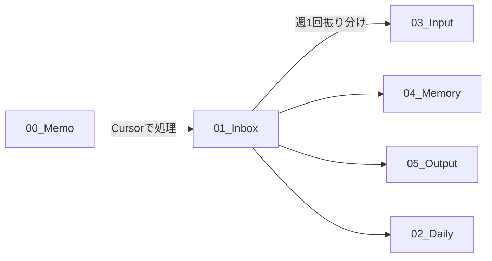

# 🧠 汎用セカンドブレイン - Brain System Rules

**バージョン**: 1.0  
**最終更新**: 2025-01-13  
**対象**: AI、新メンバー、未来の自分

---

## 📖 目次

1. [システム全体の哲学](#システム全体の哲学)
2. [フォルダ構成の全体像](#フォルダ構成の全体像)
3. [各フォルダの詳細ルール](#各フォルダの詳細ルール)
4. [ファイル命名規則](#ファイル命名規則)
5. [タグ付けルール](#タグ付けルール)
6. [双方向リンクの使い方](#双方向リンクの使い方)
7. [日々のワークフロー](#日々のワークフロー)
8. [よくある質問と回答](#よくある質問と回答)
9. [具体例で学ぶ](#具体例で学ぶ)
10. [トラブルシューティング](#トラブルシューティング)

---

## 🎯 システム全体の哲学

### このシステムが目指すもの

このObsidianシステムは、**人間の脳の情報処理**を模倣して設計されています。

```
【人間の脳】              【Obsidianフォルダ】
感覚入力（5感）      →   00_Memo
注意・選択            →   01_Inbox
短期記憶（作業台）    →   03_Input
エピソード記憶        →   02_Daily
長期記憶（知識）      →   04_Memory
実行・出力            →   05_Output
テンプレート（習慣）  →   06_Templates
メタ認知（システム）  →   07_System
忘却（アーカイブ）    →   99_Archive
```

### 3つの基本原則

#### 原則1: 完璧主義を捨てる
- ❌ **ダメな例**: 「きれいに整理してから保存しよう」→ 結局保存しない
- ✅ **良い例**: 「とりあえず00_Memoに放り込む」→ 後で整理

**理由**: 情報は「記録する」ことが第一優先。整理は後からできます。

---

#### 原則2: 情報は「流れる」もの
```
00_Memo (生まれた瞬間)
   ↓
01_Inbox (Cursorで整理)
   ↓
03_Input (今週使う) or 04_Memory (ずっと使う) or 05_Output (アウトプット)
   ↓
99_Archive (役目を終えた)
```

**理由**: 情報は時間とともに価値が変わります。固定せず、流れに任せましょう。

---

#### 原則3: リンクが知識を作る
- ❌ **フォルダに閉じ込める**: `AI/Tools/Cursor/tip-001.md` (見つからない)
- ✅ **リンクで繋ぐ**: `[[Cursor Tips]]` `[[Prompt Engineering]]` `[[Keyboard Shortcuts]]`

**理由**: 情報の価値は「繋がり」から生まれます。

---

## 🗂️ フォルダ構成の全体像

```
SecondBrain_Vault/
├─ 00_Memo/          # ← 何も考えず放り込む
├─ 01_Inbox/         # ← Cursor処理済み（週1回整理）
├─ 02_Daily/         # ← 毎日自動生成
├─ 03_Input/         # ← 今週〜今月使う資料
├─ 04_Memory/        # ← 永久保存の知識
├─ 05_Output/        # ← プロジェクト・継続活動
├─ 06_Templates/     # ← テンプレート集
├─ 07_System/        # ← システム設定・ダッシュボード
├─ 08_prompts/       # ← プロンプト集
└─ 99_Archive/       # ← 終わったもの
```

**覚え方**:
- **00〜02**: 入力系（情報が入ってくる）
- **03〜04**: 記憶系（情報を保持する）
- **05**: 出力系（情報を使う）
- **06〜08**: メタ系（システム自体）
- **99**: 墓場系（もう使わない）

---

## 📁 各フォルダの詳細ルール

### 00_Memo - 何でも放り込む場所

#### 役割
**5秒以内にメモできる、摩擦ゼロの場所**

#### ルール
```markdown
✅ やっていいこと:
- 何でも放り込む
- ファイル名適当でOK
- 整理しなくてOK
- 音声メモ、スクショ、テキスト、なんでもOK
- 1行だけでもOK

❌ やってはいけないこと:
- 整理しようとする（時間の無駄）
- フォルダ分けする（意味がない）
- タグ付けする（まだ早い）
- リンク付ける（今じゃない）
```

#### 使い方
```
# こんな感じでOK
memo-001.md
voice-20250113-1234.m4a
screenshot-idea.png
とりあえずメモ.md
```

#### ファイルの寿命
- **最長1週間**: 1週間以上放置されたら、週次レビューで処理
- **理想は3日以内**: 新鮮なうちに01_Inboxへ

#### よくある質問

**Q: このフォルダ、いつ整理するの？**
**A**: 整理しません。週に1回、中身を確認して01_Inboxに移すだけです。

**Q: ファイル名どうすればいい？**
**A**: 適当でOK。`memo-001.md`、`アイデア.md`、なんでもいいです。

**Q: 何個までファイル入れていい？**
**A**: 目安は20個まで。それ以上は「サボってる証拠」なので、01_Inboxに移しましょう。

---

### 01_Inbox - Cursor処理済みの場所

#### 役割
**00_Memoから取り出して、Cursorで「Obsidian用に整理されたmdファイル」が入る場所**

#### ルール
```markdown
✅ やっていいこと:
- タグ付き
- 双方向リンク付き
- YAML frontmatter付き
- ファイル名がわかりやすい

❌ やってはいけないこと:
- フォルダ分けする
- 長期保存する（1週間が限度）
- ここで完璧に仕上げようとする
```

#### 処理フロー



#### ファイル例

```markdown
# ❌ ダメな例（00_Memoレベル）
memo.md

# ✅ 良い例（01_Inboxレベル）
2025-01-13-Cursor新機能.md
---
title: Cursorの新機能メモ
tags: [cursor, ai-tool, tips]
created: 2025-01-13
---

# Cursorの新機能

[[Cursor]]の最新アップデートで、[[Multi-line Edit]]が追加された。
これは[[VS Code]]の拡張機能を超える便利さ。

関連: [[AI Coding Tools]], [[Productivity Tips]]
```

#### 処理タイミング
- **毎週日曜夜**: 01_Inboxを空にする
- **目標**: 10ファイル以下を保つ

#### 振り分け判定フロー

```
このファイル、どこに行くべき？

┌─ 今週使う？
│   YES → 03_Input
│   NO ↓
│
┌─ 3ヶ月後も見る？
│   YES → 04_Memory
│   NO ↓
│
┌─ プロジェクト関連？
│   YES → 05_Output/Projects
│   NO ↓
│
┌─ 継続エリア関連？
│   YES → 05_Output/Areas
│   NO ↓
│
└─ よくわからない
    → とりあえず03_Input
    （来週また考える）
```

---

### 02_Daily - 毎日の記録

#### 役割
**エピソード記憶（いつ、どこで、何をしたか）を時系列で保存**

#### フォルダ構造

```
02_Daily/
├─ 2025/
│  ├─ 2025-01/
│  │  ├─ 2025-01-13/              ← 日付フォルダ
│  │  │  ├─ 2025-01-13-Daily.md   ← デイリーログ（必須）
│  │  │  ├─ 2025-01-13-TODO.md    ← TODOリスト（必須）
│  │  │  ├─ クライアントABCとの打ち合わせ.md ← 会議メモ（任意）
│  │  │  ├─ Cursor学習メモ.md    ← 学習メモ（任意）
│  │  │  └─ YouTube動画アイデア.md       ← アイデア（任意）
│  │  ├─ 2025-01-14/
│  │  └─ ...
│  ├─ 2025-02/
│  └─ ...
├─ Weekly-Reviews/
│  └─ 2025/
│     ├─ 2025-W01.md
│     └─ ...
└─ Monthly-Reviews/
   └─ 2025/
      ├─ 2025-01.md
      └─ ...
```

#### 命名規則

```markdown
# 必須ファイル（毎日作成）
YYYY-MM-DD-Daily.md   ← デイリーログ
YYYY-MM-DD-TODO.md    ← その日のTODO

# 任意ファイル（必要に応じて、日本語で命名）
[相手]-との打ち合わせ.md
[トピック]-学習メモ.md
[内容]-アイデア.md
[内容]-メモ.md
```

#### Daily.mdの構造

```markdown
---
date: 2025-01-13
day: Monday
week: 2025-W02
tags: [daily, 2025, 2025-01]
---

# 2025-01-13 - Monday

## 🔋 Today's Energy & Focus
- Energy Level: 8/10 ⚡
- Focus Quality: High 🎯
- Mood: 😊

## ⭐ Top 3 Priorities
1. [x] YouTube動画スクリプト完成
2. [x] SURVIBE AI カリキュラム修正
3. [ ] ブログ記事下書き

## 📝 Today's Notes
### 💡 Ideas
- Cursorの新機能で動画作れそう
  → [[2025-01-13/idea-youtube-cursor]]

### 📚 Learned
- [[Claude Sonnet 4]]の新機能すごい
  → [[04_Memory/AI/Tools/Claude/claude-sonnet4.md]]

### 🤝 Meetings
- [[meeting-client-abc]]

## 🌙 Evening Reflection
### ✅ Accomplished
- YouTube動画スクリプト完成！
- カリキュラム80%完成

### 💭 Key Learnings
- 朝の集中時間が一番生産的

### 📌 Tomorrow's Preparation
- [ ] 動画撮影
- [ ] カリキュラム最終調整
```

#### よくある質問

**Q: 毎日必ず書かないといけない？**
**A**: Daily.mdとTODO.mdは必須。それ以外は任意です。

**Q: 会議メモとか、別ファイルにする必要ある？**
**A**: 長い内容（300文字以上）なら別ファイル推奨。短いならDaily.mdに書いてOK。

**Q: 過去のDaily、いつ整理する？**
**A**: 基本整理しません。ただし、重要な知識は04_Memoryに移動します。

---


<!-- Content truncated to meet Windsurf 6KB limit -->

---
> Source: [Akira-Papa/sample-obsidian-antigravity-1](https://github.com/Akira-Papa/sample-obsidian-antigravity-1) — distributed by [TomeVault](https://tomevault.io).
<!-- tomevault:4.0:windsurf_rules:2026-05-03 -->
