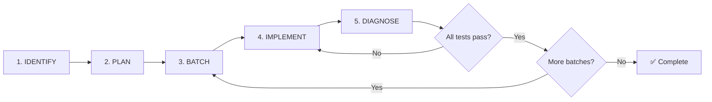
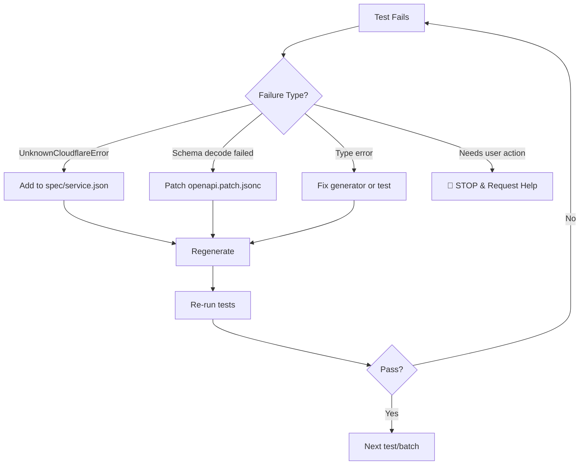

# distilled-cloudflare

Effect-native Cloudflare SDK generated from the [Cloudflare OpenAPI spec](https://github.com/cloudflare/api-schemas).

## COMMANDS

```bash
bun generate                              # Generate all services
bun generate --service r2                 # Generate single service
bun generate --fetch                      # Fetch latest spec first
bun vitest run ./test/services/r2.test.ts # Run tests
bun tsc -b                                # Type check (run before committing)
```

## AGENT TESTING PROTOCOL

This section defines the **mandatory** process for AI agents adding comprehensive test coverage to a service.

### Protocol Overview



### Step 1: Identify Services Needing Tests

Enumerate all operations for the target service and identify which need tests:

```bash
# List all exported functions for a service
grep "^export const" src/services/{service}.ts | head -100

# Check existing test coverage
grep "describe\|test(" test/services/{service}.test.ts 2>/dev/null || echo "No tests yet"
```

For each operation, determine:
- Does it have a happy path test?
- Does it have error case tests?
- What error cases are possible?

### Step 2: Create Test Plan

Document ALL operations with their happy path and error cases **before writing any code**:

```markdown
## Test Plan: {Service}

### Operation: createBucket
**Happy Path:** Create bucket with valid name, verify bucket is created
**Error Cases:**
| Error Tag | Trigger | Expected? |
|-----------|---------|-----------|
| BucketAlreadyExists | Create bucket with existing name | ❌ Discover |
| ValidationError | Create bucket with invalid name | ❌ Discover |

### Operation: deleteBucket  
**Happy Path:** Delete existing bucket
**Error Cases:**
| Error Tag | Trigger | Expected? |
|-----------|---------|-----------|
| NoSuchBucket | Delete non-existent bucket | ✅ In spec |
| BucketNotEmpty | Delete bucket with objects | ❌ Discover |
```

**Expected?** column indicates:
- ✅ In spec - Error already defined in `spec/{service}.json`
- ❌ Discover - Error needs to be discovered and added

### Step 3: Batch Tests

Group tests into batches of ~3-5 operations for manageable iteration:

```markdown
## Batch 1: Bucket CRUD
- createBucket
  - happy: Create bucket, verify bucket exists
  - error: BucketAlreadyExists - create bucket with existing name
  - error: ValidationError - create bucket with invalid name
- getBucket
  - happy: Get existing bucket metadata
  - error: NoSuchBucket - get non-existent bucket
- deleteBucket
  - happy: Delete existing empty bucket
  - error: NoSuchBucket - delete non-existent bucket
  - error: BucketNotEmpty - delete bucket with objects

## Batch 2: Bucket Configuration  
- getBucketCorsPolicy
  - happy: Get CORS policy from bucket with CORS configured
  - error: NoSuchBucket - get CORS from non-existent bucket
  - error: NoCorsConfiguration - get CORS from bucket without CORS
- putBucketCorsPolicy
  - happy: Set CORS policy on bucket
  - error: NoSuchBucket - set CORS on non-existent bucket
- deleteBucketCorsPolicy
  - happy: Delete CORS policy from bucket
  - error: NoSuchBucket - delete CORS from non-existent bucket
  - error: NoCorsConfiguration - delete CORS from bucket without CORS
```

### Step 4: Implement Tests

For each batch:

1. **Write all tests** (happy path + error cases)
2. **Type-check**: `bun tsc -b`
3. **Fix type errors** before running tests
4. **Run tests**: `bun vitest run ./test/services/{service}.test.ts`

### Step 5: Diagnose Failures

When tests fail, categorize the issue:

| Failure Type | Symptom | Fix |
|--------------|---------|-----|
| **Spec Bug** | `Schema decode failed` | Patch `spec/openapi.patch.jsonc` |
| **Generator Bug** | Type mismatch between interface and schema | Fix `scripts/generate-clients.ts` |
| **Client Bug** | Incorrect request/response handling | Fix `src/client/*.ts` |
| **Missing Error** | `UnknownCloudflareError` | Add to `spec/{service}.json` |

#### For UnknownCloudflareError:

1. Extract the error code from the failure message
2. Add error to `spec/{service}.json`:

```json
{
  "errors": {
    "NewErrorTag": { "code": 12345 }
  },
  "operations": {
    "operationName": {
      "errors": { "NewErrorTag": {} }
    }
  }
}
```

3. Regenerate: `bun generate --service {service}`
4. Re-run tests

### Step 6: Iterate Until Complete



**Rules:**
- ❌ Do NOT mark tests as skipped or todo
- ❌ Do NOT move to next batch until current batch passes
- ✅ Iterate until 100% operation coverage

<!-- Content truncated to meet Windsurf 6KB limit -->

---
> Source: [alchemy-run/distilled-cloudflare](https://github.com/alchemy-run/distilled-cloudflare) — distributed by [TomeVault](https://tomevault.io).
<!-- tomevault:4.0:windsurf_rules:2026-04-23 -->
