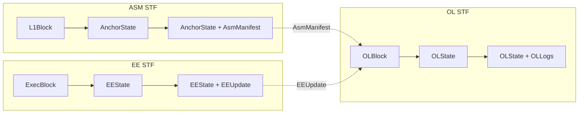

# AGENTS.md

This file provides guidance to AI coding assistants when working with code in this repository.

## Overview

**Alpen** is an EVM-compatible Bitcoin layer 2. It provides programmable Bitcoin functionality through a layer 2 solution with a decoupled architecture separating the Anchor State Machine (ASM), Orchestration Layer (OL), and Execution Environment (EE).

## Architecture

Alpen uses a layered architecture with three main State Transition Functions (STFs):

**State Transition Functions:**

- **ASM STF**: `AnchorState + L1Block → (AnchorState', AsmManifest)`
- **OL STF**: `OLState + OLBlock → (OLState', OLLogs)`
- **EE STF**: `EEState + ExecBlock → (EEState', EEUpdate)`

The OL block contains the `AsmManifest` (from ASM) and `EEUpdate` (from EE), orchestrating the two layers.

### Layer Descriptions

#### L1 Layer (Bitcoin)

Bitcoin serves as the data availability and settlement layer. Protocol transactions are tagged with SPS-50 headers for recognition by the ASM.

- **Bitcoin Blocks**: Source of truth for L1 state and, hence, for everything actually.
- **SPS-50 Tagged Transactions**: Protocol transactions generally use standardized headers (magic, subprotocol ID, tx_type, aux data). Some EE DA transactions use the SPS-51 chunked-envelope path instead, where a compact commit `OP_RETURN` plus taproot reveal scripts carries the payload to reduce fee overhead.

#### ASM Layer (Anchor State Machine)

ASM is the core of the Strata protocol, functioning as a "virtual smart contract" anchored to L1. It processes L1 blocks and maintains state through subprotocols.

- **ASM STF**: State transition function processing L1 blocks
- **Header Verification**: PoW verification state for L1 headers
- **Subprotocols**: Modular components (Bridge V1, Checkpoint, Admin, Debug) with defined IDs
- **Moho Framework**: Upgradeable proof mechanism wrapping ASM transitions
- **Export State**: Accumulator for bridge proofs and operator claims

The ASM implementation is consumed through the `strata-asm-*` workspace dependencies pinned in the root `Cargo.toml`.

**Subprotocol IDs:**

| ID | Subprotocol | Purpose |
|----|-------------|---------|
| 0 | Admin | System upgrades |
| 1 | Checkpoint | OL checkpoint verification |
| 2 | Bridge V1 | Deposit/withdrawal management |
| 3 | Execution DA | EE data availability |
| 254 | Debug | Development/testing |

#### OL Layer (Orchestration Layer)

The OL manages L2 state, accounts, and epoch processing. It produces checkpoints that are proven and posted to L1.

- **OL STF**: Processes OL blocks and transactions
- **Account System**: Ledger accounts (with state) and system accounts (precompile-like)
- **Snark Accounts**: Actor-like accounts with inbox MMRs, proven state updates
- **Epochs & Checkpoints**: Time ranges of blocks with DA diffs posted to L1
- **DA Reconstruction**: State can be reconstructed from L1 DA payloads

#### EE Layer (Execution Environment)

The EE provides EVM execution, decoupled from OL. Currently implemented via Alpen Reth.

- **Alpen Reth**: Custom Reth node with rollup-specific precompiles
- **EE Chain**: Execution chain state management
- **OL Tracker**: Tracks finalized OL state from EE perspective
- **Package Chain**: Off-chain interface between OL and EE

## Workspace Crates

Crate tables list repository paths. Package names usually carry a `strata-*` or `alpen-*` prefix in `Cargo.toml`.

### Binary Crates (`bin/`)

| Path | Binary target | Description |
|------|---------------|-------------|
| `bin/strata` | `strata` | OL (Strata) client, sequencer, RPC, and prover entrypoint |
| `bin/strata-signer` | `strata-signer` | Detached signer for OL sequencer duties |
| `bin/alpen-client` | `alpen-client` | EE client with OL tracking and payload building, embedding Alpen Reth |
| `bin/alpen-cli` | `alpen` | End-user wallet CLI for deposits, withdrawals, L2 transactions, and bridge tooling |
| `bin/strata-dbtool` | `strata-dbtool` | Database inspection and debugging utility |
| `bin/strata-test-cli` | `strata-test-cli` | Bridge, ASM, and transaction testing utility |
| `bin/datatool` | `strata-datatool` | Development utility for test data and key generation |
| `bin/prover-perf` | `strata-provers-perf` | Performance benchmarking for proof systems |

The workspace default members include the main runtime and testing binaries, but not every workspace crate. Check root `Cargo.toml` before assuming a crate is built by default.

## Library Crates

### ASM Domain

<!-- Content truncated to meet Windsurf 6KB limit -->

---
> Source: [alpenlabs/alpen](https://github.com/alpenlabs/alpen) — distributed by [TomeVault](https://tomevault.io).
<!-- tomevault:4.0:windsurf_rules:2026-07-22 -->
