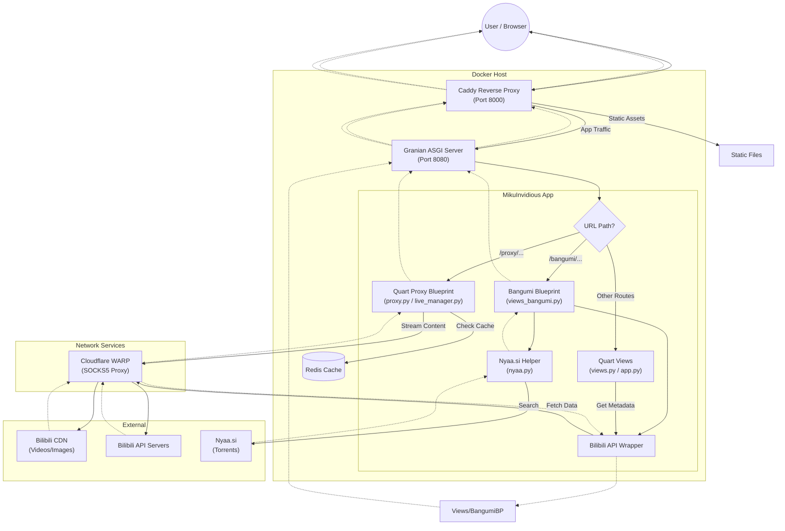

# MikuInvidious Project Overview

MikuInvidious is a free and open-source frontend for Bilibili, inspired by Invidious. It aims to provide a lightweight, privacy-focused experience for browsing Bilibili content without the need for heavy official clients or extensive tracking.

## Core Technologies

- **Language:** Python 3.14+
- **Web Framework:** [Quart](https://pgjones.gitlab.io/quart/) (Modern asynchronous web framework)
- **Web Server:** [Caddy](https://caddyserver.com/) (Reverse proxy) + [Granian](https://github.com/emmett-framework/granian) (Rust-powered ASGI server)
- **Database/Cache:** [Redis](https://redis.io/) (required for caching video URLs, session management, and credential storage)
- **API Wrapper:** [bilibili-api-python](https://github.com/nemo2011/bilibili-api)
- **Video Player:** `hls.js`, `mpegts.js`, and `dash.js` (for live streams, FLV, and DASH support)
- **Templating:** Jinja2 (with theme support)

## System Architecture

### High-Level Design

The system uses **Caddy** as a reverse proxy and static file server, which forwards application requests to **Granian** running the **Quart** (ASGI) application. All logic and proxying are handled within the Quart application using asynchronous I/O.

- **Reverse Proxy (Caddy):** Handles incoming traffic (port 8000), serves static assets, and proxies requests to the ASGI server.
- **ASGI Server (Granian):** Runs the Quart application (port 8080 in Docker).
- **App Logic (`app.py`):** Main entry point for the application, registering blueprints and routes.
- **Reverse Proxy (`proxy.py`):** Handles video and image streaming using Quart's async generators and `httpx`.
- **Network Transport:** Integrates with **Cloudflare WARP** (via SOCKS5) to route traffic to Bilibili.

### Request Flowchart

### Component Breakdown

- **Application Logic:**
  - `app.py`: Initializes the Quart app, error handlers, and registers blueprints.
  - `views.py`: Main routing logic for home, search, video, space, and author views.
  - `views_bangumi.py`: Blueprint for Bangumi (Anime/Show) indexing and playback.
  - `shared.py`: Centralized configuration, `httpx` client management, Redis connection, and theming utilities.
  - `proxy.py`: Quart Blueprint for media proxying. Uses a robust `ProxyResponse` class and `ClosingIterator` to prevent file descriptor leaks.
  - `live_manager.py`: Manages persistent live stream connections, chunk buffering, and heartbeat (Type 18) injection.
  - `danmaku.py`: Fetches and converts Bilibili danmaku.
  - `nyaa.py`: Scraper and helper for searching Nyaa.si torrents (integrated into Bangumi view).
  - `extra.py`: Utilities for article-to-HTML conversion and ID manipulation.
  - `transformers.py`: Data transformation logic to standardize API responses for the frontend.
  - `filters.py`: Custom Jinja2 template filters (e.g., date formatting).
  - `res.py`: Serves dynamic resources like Danmaku XML.
  - `refresher.py`: Utility to refresh Bilibili credentials.

## Deep Analysis & Architectural Insights

### 1. Structural Integrity & Core Patterns

* **Quart Framework:** Chosen for its async capabilities, essential for high-concurrency streaming.

<!-- Content truncated to meet Windsurf 6KB limit -->

---
> Source: [apicalshark/mikuinvidious](https://github.com/apicalshark/mikuinvidious) — distributed by [TomeVault](https://tomevault.io).
<!-- tomevault:4.0:windsurf_rules:2026-07-28 -->
