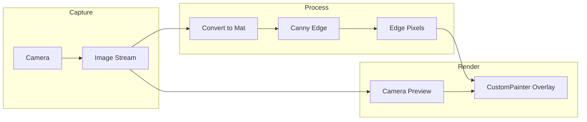

# AGENTS.md — HC4RL (suite → single App Store app)

This file governs development for the HC4RL project and future tools in the same app package.

---

## Project and suite goals

- **Phase 1 (current)**: Edge-overlay camera tool—real-time Canny edge detection over camera preview, low-light visibility, same edge pixels later driving Brilliant Labs Halo (640×400, 2-color).
- **Suite vision**: Multiple tools (starting with this one) in one codebase, shipped as a **single app** on the App Store. Architecture and layout should support adding more “tools” or “modes” without a rewrite.
- **Non-goals**: No general-purpose engine first; no premature abstraction; optimize only when needed (e.g. low-end devices, frame drops).

---

## Constraints (treat as fixed)

- **Stack**: Flutter; `camera`, `opencv_dart`, optionally `image`; Android minSdk 21+ (or 24+ per camera plugin); iOS/macOS camera usage and entitlements.
- **Performance**: `ResolutionPreset.low` for image stream; process in an isolate; throttle (e.g. 10–15 fps or “latest only”); release `Mat`/buffers per frame.
- **Display model**: Edge output is **pixels only** (no vectors); overlay and Halo both consume the same edge-pixel list (rasterized to 640×400 for Halo, 2 colors: VOID + foreground).
- **Suite constraint**: New features should be addable as modules/screens behind a single app entry (e.g. `main.dart` → shell → tool picker or deep link to tools).

---

## Architecture overview

- **Camera** → `startImageStream()` gives `CameraImage` (YUV420 on Android, BGRA on iOS).
- **Conversion** → Turn `CameraImage` into grayscale/Mat for OpenCV.
- **Edge detection** → Canny + findNonZero in **opencv_dart**; output list of edge pixel coordinates.
- **Overlay** → Flutter `CustomPainter` on top of `CameraPreview`; one point per edge pixel. Later rasterize same list to 640×400 for TxSprite/Halo.

### Halo / Frame

- Display: **640×400**; 2-color bitmap (VOID + foreground). Rasterize edge pixels to 640×400 and send via **frame_msg** TxSprite (e.g. `TxSprite.fromPngBytes` / pack). Docs: [Frame Hardware – Display](https://docs.brilliant.xyz/frame/hardware/#display), [Lua API – Display](https://docs.brilliant.xyz/frame/frame-sdk-lua/#display), [frame_msg TxSprite](https://github.com/CitizenOneX/frame_msg/blob/main/lib/tx/sprite.dart), [Frame SDK for Flutter](https://docs.brilliant.xyz/frame/frame-sdk-flutter/).

---

## 1. Project setup

- Flutter project in this repo. **Dependencies** in `pubspec.yaml`: **camera** (e.g. `^0.11.3`), **opencv_dart** (e.g. `^2.1.0`), **image** (e.g. `^4.x`, optional).
- **Android**: minSdkVersion 21+ (24+ if camera plugin requires it); camera permission in manifest.
- **iOS**: Camera usage description in `Info.plist`.
- **macOS** (if targeting desktop): Camera entitlement and usage description.

---

## 2. Camera layer

- Use **camera** package: enumerate with `availableCameras()`, pick first/default; optionally allow switch later.
- Initialize with `ResolutionPreset.low`; check `supportsImageStreaming()` before starting stream.
- **Lifecycle**: Init in dedicated screen; dispose controller and stop image stream on pause/dispose.
- **Permissions**: Handle camera permission before `initialize()`; surface clear error or permission UI if denied.

---

## 3. Frame conversion: CameraImage → OpenCV Mat

- **CameraImage**: Android usually YUV420 (`planes[0]` = Y); iOS often BGRA.
- **Grayscale only**: For Canny, use Y plane (YUV) or BGR→gray (BGRA); build `Mat` from 1-channel buffer (width × height). Respect `bytesPerRow` / strides so image is not skewed.
- Do minimal conversion; avoid full YUV→RGB. Reference: [opencv_dart Uint8List to Mat](https://github.com/rainyl/opencv_dart/discussions/18).

---

## 4. Edge detection (Canny + edge pixels)

- **Pipeline**: Grayscale → Gaussian blur (3×3 or 5×5) → Canny (tune low/high thresholds for low light) → **findNonZero** → list of (x, y). No vector/line conversion.
- Run in a **background isolate**; pass raw buffer in/out; drop frames when busy (“latest only”).
- Expose sliders or presets for Canny and blur so you can adapt to low light vs normal.

---

## 5. Overlay rendering

- **Widget tree**: `Stack` with bottom `CameraPreview(controller)`, top `CustomPainter` with current edge pixel list and same aspect/size as preview.
- Draw **one point per edge pixel** (e.g. `Canvas.drawPoints`) in high-contrast color; optional transparency.
- Edge coords are in image space; scale/letterbox to match preview. State holds latest edge list/mask; repaint only when new data arrives.
- Same pixel list rasterized to 640×400 drives Halo (pixel(x,y)=foreground).

---

## 6. Performance and robustness

- Keep `ResolutionPreset.low` for image stream.
- Throttle: fixed max rate (e.g. 10–15 fps) or “skip if busy”.
- Use `compute()` or long-lived isolate for convert → Canny → edge list; pass only necessary data.
- Release OpenCV `Mat` and large buffers after each frame in the isolate.
- Low light: rely on Canny + blur; avoid heavy normalization that amplifies noise. Optionally add CLAHE later.

---

## 7. Halo / Frame integration (later)

- Rasterize edge pixels to **640×400** 2-color buffer (0 = VOID, 1 = edge). Build TxSprite (or use `TxSprite.fromPngBytes`); send via **frame_ble** / **frame_msg** at target refresh rate. No camera pixels—only edge-pixel bitmap.

---

## Suggested file structure (phase 1, suite-ready)

- **lib/main.dart** – App entry; later can become shell that routes to tools.
- **lib/screens/camera_edge_screen.dart** – Camera init, permissions, preview + overlay stack.
- **lib/services/camera_service.dart** – Camera selection, init, dispose.
- **lib/services/edge_detector_service.dart** – Isolate: CameraImage → Canny → edge pixel list.
- **lib/utils/camera_image_converter.dart** – YUV/BGRA → grayscale buffer for OpenCV.
- **lib/widgets/edge_overlay_painter.dart** – CustomPainter for edge pixels.
- Reserve room for **lib/tools/** or **lib/features/** when adding more tools (e.g. `camera_edge/`, `next_tool/`).

---

## Implementation order

1. Flutter project + deps + Android/iOS (and macOS if needed) permissions.
2. Camera screen: preview, stream lifecycle, permissions.
3. CameraImage → grayscale buffer → Mat (verify with one frame).
4. Canny + findNonZero + overlay on main thread first; draw edge pixels in CustomPainter.
5. Move convert + Canny + edge extraction into isolate; throttle and “latest only”; connect result to overlay state.
6. Tune Canny/blur for low light; add sliders or presets.
7. (Later) frame_ble / frame_msg; rasterize edge pixels to 640×400 2-color; TxSprite to Halo.

---

## Definition of “done” for a change

- App runs on target platform(s) without crashes; camera and overlay work; no regression on existing flow.
- Changes respect constraints (isolate for heavy work, no vector pipeline for edges, suite-friendly layout).
- Subtle behavior is visible (e.g. debug overlay or log) or documented.

---

## Agent roles (optional)

- **FLOW**: Slice work into small, testable tasks; milestone list; risks/rollback.
- **PULSE**: Implement in Dart/Flutter; keep isolate/camera lifecycle correct; small refactors only when needed.
- **GAUGE**: Tune Canny/blur and performance knobs with reproducible scenarios.
- **LENS**: Critique UX and clarity (overlay readability, low-light, future Halo UX).

**Workflow**: FLOW slices → PULSE implements → GAUGE tunes → LENS reviews; repeat.

---

## Risks and mitigations

- **opencv_dart API**: Check current API and Mat-from-buffer patterns; adapt conversion.
- **CameraImage formats**: Handle both YUV and BGRA; test on Android and iOS.
- **Real-time on low-end**: Downscale before Canny if needed; keep coordinates in processed space; scale to preview and to 640×400 for Halo.
- **Suite growth**: Add new tools as features/modules; keep shared app shell and single `main.dart` entry for the App Store package.

---

## References

- Plan: `@/Users/austen/.cursor/plans/flutter_edge_overlay_app_01a7e9f6.plan.md`
- Frame/Halo: [Frame Hardware](https://docs.brilliant.xyz/frame/hardware/), [Frame SDK Lua](https://docs.brilliant.xyz/frame/frame-sdk-lua/), [frame_msg TxSprite](https://github.com/CitizenOneX/frame_msg/blob/main/lib/tx/sprite.dart), [Frame SDK for Flutter](https://docs.brilliant.xyz/frame/frame-sdk-flutter/)
- opencv_dart: [Mat from Uint8List](https://github.com/rainyl/opencv_dart/discussions/18)

---
> Converted and distributed by [TomeVault](https://tomevault.io/claim/Arcadesys)
> This is a context snippet only. You'll also want the standalone SKILL.md file — [download at TomeVault](https://tomevault.io/claim/Arcadesys)
<!-- tomevault:4.0:windsurf_rules:2026-04-08 -->
