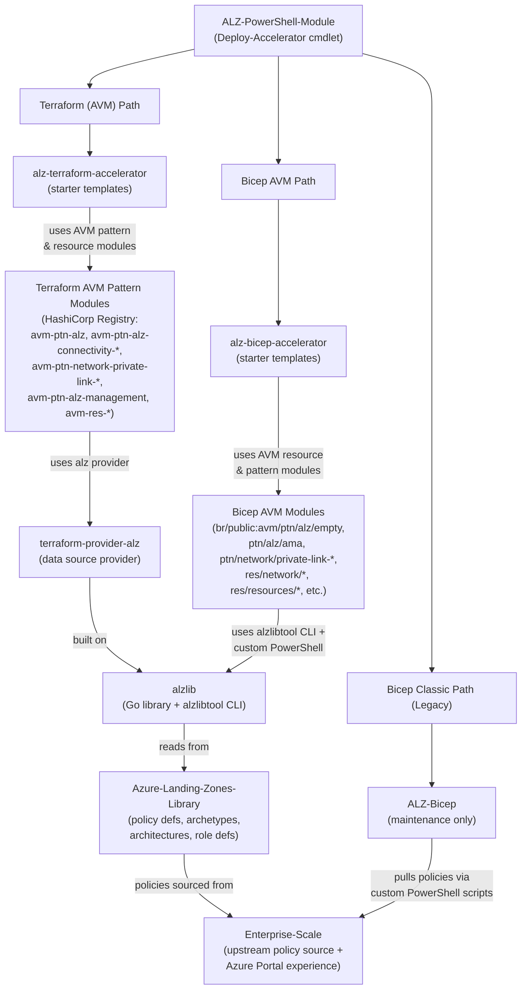

# Azure Landing Zones — Crosscutting Ecosystem Guide

This file provides context for AI agents and agentic workflows operating across the Azure Landing Zones (ALZ) polyrepo ecosystem. The `Azure/Azure-Landing-Zones` repo is the **centralised documentation hub** and **issue tracker** for the entire ecosystem — it does not contain deployable source code.

> **Scope guidance for agents**: If you are editing documentation content in this repo, skip to the **"This Repo — Documentation Conventions"** section for the rules you need. The ecosystem architecture, deployment flow, and issue triage sections below are background context — use them when triaging issues, answering cross-repo questions, or navigating the polyrepo dependency chain.

## Ecosystem Overview

Azure Landing Zones is a multi-repo platform-engineering framework that deploys enterprise-scale Azure governance, networking, and management infrastructure. It supports four deployment paths:

1. **Terraform (AVM)** — Current recommended IaC path using HashiCorp Registry AVM pattern modules and underlying resource modules
2. **Bicep (AVM)** — Current recommended IaC path using Bicep public registry AVM modules
3. **Azure Portal** — No-code deployment via custom portal experience in Enterprise-Scale repo
4. **Terraform (Classic)** / **Bicep (Classic)** — Legacy paths in maintenance mode

The **ALZ-PowerShell-Module** (`Deploy-Accelerator` cmdlet), which uses the **Accelerator Bootstrap Modules**, is the **recommended entry point** for IaC deployments.

However, it is not the only option—customers can also consume the AVM modules directly from the HashiCorp Registry or the Bicep public registry without using the accelerator orchestration.

Both Terraform and Bicep AVM accelerators compose **Azure Verified Modules (AVM)** — reusable, tested resource and pattern modules from the public registries — rather than implementing Azure resources from scratch.

## Polyrepo Architecture

The ecosystem is layered. Understanding the dependency chain is essential for navigating issues, making changes, and knowing where code lives.

The Azure Portal path is independent of the dependency stack shown above — see the **Deployment Flow** section for its details.

All IaC paths share:
- **accelerator-bootstrap-modules** — Terraform modules that create CI/CD infrastructure (GitHub Actions, Azure DevOps, or local) with OIDC authentication, state storage, and managed identities.
- **Azure-Landing-Zones** (this repo) — Centralised technical documentation and issue tracking.

## Repository Reference

### This Repo — Azure-Landing-Zones (Documentation & Issues)

| Attribute | Detail |
|-----------|--------|
| **Purpose** | Technical documentation site (https://aka.ms/alz/techdocs) and centralised issue tracker for the ALZ ecosystem |
| **Tech stack** | Hugo (Extended) with hugo-geekdoc theme |
| **Content** | Markdown with YAML front matter in `docs/content/` |
| **Templates** | Go HTML templates in `docs/layouts/` |
| **Config** | TOML (`docs/hugo.toml`) |
| **Utilities** | PowerShell scripts in `utl/` |
| **Build** | `make server` or `cd docs && hugo server` |
| **GitHub** | `Azure/Azure-Landing-Zones` |

**Documentation site structure** (`docs/content/`):
- `accelerator/` — ALZ Accelerator guides (bootstrap, deployment, customisation)
- `bicep/` — Bicep module documentation
- `terraform/` — Terraform module documentation
- `bootstrap/` — Bootstrap infrastructure setup
- `policy/` — Azure Policy documentation

<!-- Content truncated to meet Windsurf 6KB limit -->

---
> Source: [Azure/Azure-Landing-Zones](https://github.com/Azure/Azure-Landing-Zones) — distributed by [TomeVault](https://tomevault.io).
<!-- tomevault:4.0:windsurf_rules:2026-07-24 -->
