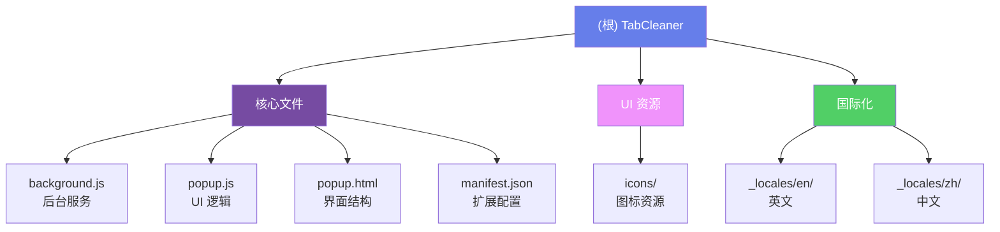

# TabCleaner - 浏览器扩展项目

## 变更记录 (Changelog)

- **2025-12-06 10:55:54**: 初始化 AI 上下文文档

---

## 项目愿景

TabCleaner 是一个 Chrome 浏览器扩展，旨在通过自动管理和丢弃闲置标签页来节省内存并提升浏览器性能。项目提供智能的标签页生命周期管理、灵活的保护机制和现代化的用户界面。

## 架构总览

这是一个基于 Chrome Extension Manifest V3 的浏览器扩展项目，采用经典的前后端分离架构：

- **前端 UI 层**: Popup 界面（HTML + CSS + JavaScript）
- **后台服务层**: Service Worker 处理标签页监控和自动丢弃逻辑
- **数据存储层**: Chrome Storage API 存储用户配置和白名单
- **国际化层**: 支持中英文双语

### 核心功能模块

1. **标签页监控系统**: 实时追踪所有标签页的活跃状态和闲置时间
2. **自动丢弃引擎**: 基于时间阈值自动释放内存
3. **保护机制**: 临时保护（24小时/1周）+ 永久白名单（支持通配符）
4. **快速操作**: 手动丢弃当前/其他/标签组/闲置标签页
5. **状态监控**: 实时显示活跃/已丢弃/总计标签页数量

## 模块结构图



## 模块索引

| 模块路径 | 职责 | 语言 | 入口文件 |
|---------|------|------|---------|
| `/` (根目录) | 核心扩展逻辑 | JavaScript | background.js, popup.js |
| `/_locales/en/` | 英文国际化 | JSON | messages.json |
| `/_locales/zh/` | 中文国际化 | JSON | messages.json |
| `/icons/` | 图标资源 | PNG/SVG | icon16.png, icon32.png, icon48.png, icon128.png |

## 运行与开发

### 安装方式

1. 打开 Chrome 浏览器，访问 `chrome://extensions/`
2. 启用右上角的"开发者模式"
3. 点击"加载已解压的扩展程序"
4. 选择项目根目录
5. 扩展图标将出现在工具栏

### 开发调试

- **Popup 调试**: 右键点击扩展图标 → 检查弹出内容
- **Background 调试**: 扩展管理页面 → 点击"Service Worker"链接
- **重新加载**: 修改代码后，在扩展管理页面点击刷新按钮

### 配置说明

- **默认闲置时间**: 1800 秒（30 分钟）
- **检查间隔**: 10 秒
- **状态更新频率**: 5 秒

## 测试策略

当前项目无自动化测试，依赖手动测试：

- 标签页丢弃功能测试
- 白名单保护测试
- 临时保护过期测试
- 多窗口场景测试
- 国际化文本显示测试

## 编码规范

- **JavaScript 风格**: ES6+ 语法，使用 async/await 处理异步
- **命名约定**: 驼峰命名法（camelCase）
- **注释**: 关键逻辑添加中文注释
- **错误处理**: 使用 try-catch 包裹 Chrome API 调用
- **日志输出**: 使用 emoji 标记不同类型的日志（✅ 成功、❌ 错误、⚠️ 警告、ℹ️ 信息）

## AI 使用指引

### 适合 AI 协助的任务

- 添加新的快速操作按钮
- 优化 UI 样式和动画效果
- 扩展白名单匹配规则
- 添加新的国际化语言
- 重构代码结构
- 添加新的统计指标

### 关键约束

- 必须遵循 Chrome Extension Manifest V3 规范
- 不能访问外部网络（纯本地运行）
- Service Worker 生命周期有限，避免长时间运行的任务
- 所有用户数据必须存储在 chrome.storage.local

### 常见修改场景

1. **修改默认闲置时间**: 修改 `background.js` 中的 `IDLE_LIMIT` 常量
2. **调整检查间隔**: 修改 `background.js` 中 `setInterval` 的时间参数
3. **添加新按钮**: 在 `popup.html` 添加按钮，在 `popup.js` 添加事件监听
4. **修改 UI 样式**: 编辑 `popup.html` 中的 `<style>` 标签

### 文件依赖关系

```
manifest.json (入口配置)
├── background.js (后台服务，独立运行)
└── popup.html (弹出界面)
    ├── popup.js (UI 逻辑)
    └── _locales/*/messages.json (国际化文本)
```

## 技术栈

- **框架**: 原生 JavaScript（无框架依赖）
- **UI 库**: Font Awesome 5.15.4（CDN）
- **字体**: Google Fonts - Inter
- **API**: Chrome Extensions API (Manifest V3)
- **存储**: chrome.storage.local
- **国际化**: chrome.i18n

## 已知问题与改进方向

- 无自动化测试覆盖
- 白名单管理界面较简单，可增强为列表视图
- 缺少标签页丢弃历史记录功能
- 可添加内存使用统计
- 可支持更多浏览器（Firefox、Edge）

---

**最后更新**: 2025-12-06 10:55:54
**版本**: 0.4
**维护者**: chen

---
> Source: [barryoo/TabCleaner](https://github.com/barryoo/TabCleaner) — distributed by [TomeVault](https://tomevault.io).
<!-- tomevault:4.0:windsurf_rules:2026-06-05 -->
