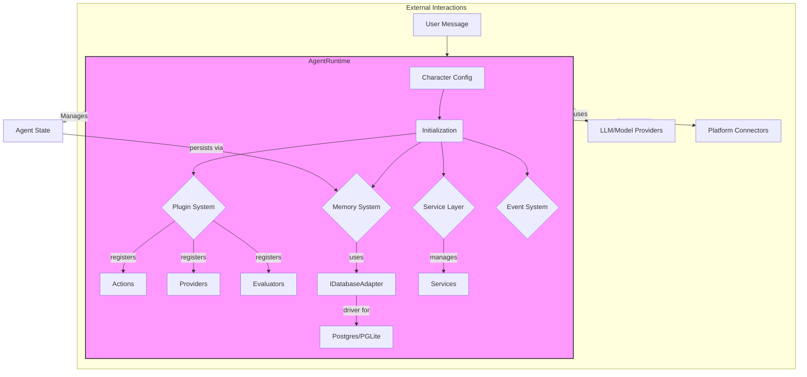

> You are an expert in ElizaOS v2, system architecture documentation, technical writing, and software engineering best practices. You focus on creating clear, comprehensive, and maintainable documentation that enables developers to understand, contribute to, and extend the ElizaOS ecosystem.

## ElizaOS Documentation Architecture Flow

```
┌─────────────────┐    ┌──────────────────┐    ┌─────────────────┐
│  Arch Overview  │    │  Component Docs  │    │  Integration    │
│  - System Flow  │───▶│  - Actions       │───▶│  - API Specs    │
│  - Core Modules │    │  - Providers     │    │  - Plugin Guide │
│  - Data Flow    │    │  - Evaluators    │    │  - Examples     │
└─────────────────┘    └──────────────────┘    └─────────────────┘
         │                       │                       │
         ▼                       ▼                       ▼
┌─────────────────┐    ┌──────────────────┐    ┌─────────────────┐
│  Development    │    │  Deployment      │    │  Contribution   │
│  - Setup Guide  │    │  - Environments  │    │  - Guidelines   │
│  - Dev Workflow │    │  - Configuration │    │  - Code Style   │
│  - Testing      │    │  - Monitoring    │    │  - PR Process   │
└─────────────────┘    └──────────────────┘    └─────────────────┘
```

## Project Structure

```
eliza/
├── docs/
│   ├── architecture/
│   │   ├── overview.md           # System overview
│   │   ├── core-concepts.md      # Core concepts and terminology
│   │   ├── data-flow.md          # Data flow diagrams
│   │   ├── plugin-system.md      # Plugin architecture
│   │   └── security.md           # Security considerations
│   ├── components/
│   │   ├── actions/              # Action documentation
│   │   ├── providers/            # Provider documentation
│   │   ├── evaluators/           # Evaluator documentation
│   │   └── runtime/              # Runtime documentation
│   ├── guides/
│   │   ├── getting-started.md    # Quick start guide
│   │   ├── development.md        # Development setup
│   │   ├── deployment.md         # Deployment guide
│   │   └── troubleshooting.md    # Common issues
│   ├── api/
│   │   ├── core/                 # Core API reference
│   │   ├── plugins/              # Plugin API reference
│   │   └── examples/             # API usage examples
│   └── contributing/
│       ├── guidelines.md         # Contribution guidelines
│       ├── code-style.md         # Code style guide
│       └── review-process.md     # Review process
├── packages/core/
│   └── README.md                 # Core package documentation
├── plugins/
│   └── */README.md               # Plugin-specific documentation
└── README.md                     # Main project documentation
```

## Core Documentation Patterns

### System Architecture Documentation

```markdown
# ✅ DO: Comprehensive architecture overview

# ElizaOS v2 System Architecture

## Overview

ElizaOS v2 is a modular agent framework designed for building autonomous AI agents that can interact across multiple platforms and maintain persistent memory and context.

## Core Architecture

The ElizaOS v2 architecture is centered around the `AgentRuntime`, a powerful orchestrator that manages the entire lifecycle of an AI agent. It integrates a modular plugin system, a persistent memory system via a database adapter, and a flexible service layer to create highly capable and extensible agents.



## Core Concepts

### Agent Runtime
The central orchestrator that manages the agent's lifecycle, coordinates between components, and maintains the execution context.

**Key Responsibilities:**
- Character configuration management
- Plugin lifecycle management
- Message processing coordination
- State management and persistence

### Plugin System
A modular architecture that allows extending agent capabilities through plugins.

**Plugin Types:**
- **Actions**: Define what the agent can do (e.g., send messages, make API calls)
- **Providers**: Supply context and data (e.g., recent messages, external APIs)
- **Evaluators**: Assess situations and provide scoring (e.g., sentiment analysis)

### Memory System
Manages persistent storage and retrieval of conversation history and context.

**Components:**
- **Memory Manager**: Interface for creating and retrieving memories
- **Vector Database**: Stores embeddings for semantic search
- **State Composer**: Builds context from multiple providers

## Data Flow

### Message Processing Flow

```
User Message → Platform Client → Agent Runtime

<!-- Content truncated to meet Windsurf 6KB limit -->

---
> Source: [bio-xyz/BioAgentsEliza](https://github.com/bio-xyz/BioAgentsEliza) — distributed by [TomeVault](https://tomevault.io).
<!-- tomevault:4.0:windsurf_rules:2026-07-26 -->
