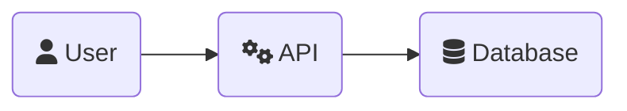
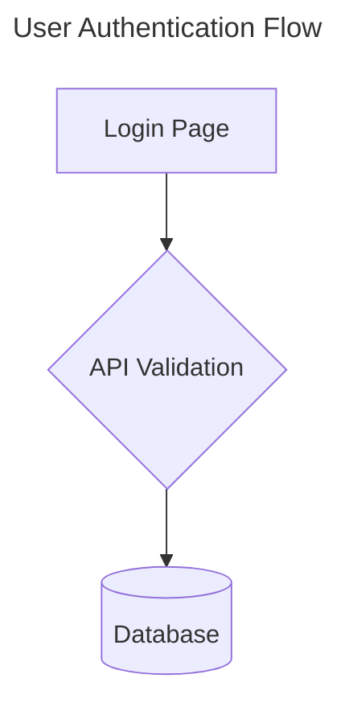

# Mermaid.js Best Practices

This guide provides best practices for creating clear, maintainable, and error-free diagrams using Mermaid.js. Following these guidelines will help prevent common parsing errors and ensure diagrams are accessible and easy to understand.

## 1. Core Principles

- **Clarity Over Complexity**: Prioritize conveying information clearly. Mermaid is for creating understandable diagrams, not for intricate graphic design.
- **Use the Live Editor**: Always use the [Mermaid Live Editor](https://mermaid.live/) for creating, testing, and debugging diagrams. It provides real-time feedback and helps catch syntax errors instantly.
- **Commit Text, Not Images**: The primary benefit of Mermaid is its text-based format. Always commit the `.mmd` or Markdown source file to version control, not the rendered images. Images should be generated from the source as part of a build or documentation process.

## 2. Avoiding Common Parsing Errors

Parsing errors, like the ones we encountered, are often caused by special characters in node text or edge labels.

### Node and Edge Text

- **Avoid Special Characters in Text**: To prevent parsing issues, avoid using the following special characters in node descriptions or edge labels: `|`, `(`, `)`, `[`, `]`.
  - **Good**: `NodeA --> |sends data to| NodeB`
  - **Bad (risky)**: `NodeA --> |sends data (and other items)| NodeB`
- **Use Alternatives**: If you need a separator, use a hyphen `-` or slash `/` instead of a pipe `|`.
  - **Good**: `Replica: 1 (Team) / N (Prod)`
  - **Bad**: `Replica: 1 (Team) | N (Prod)`
- **Quoting Text**: If you must use special characters, try enclosing the text in quotes. This can sometimes help the parser correctly interpret the string.
  - **Example**: `A["Node A with (special) characters"]`

### Node IDs

- **Use Simple Alphanumeric IDs**: Node IDs should be simple and contain no spaces or special characters.
  - **Good**: `authService`, `databaseNode`, `userGateway`
  - **Bad**: `auth-service`, `(database)`, `user gateway`

## 3. Structure and Readability

### Layout

- **Choose the Right Direction**: Use `graph TD` (Top-Down) for hierarchical flows or `graph LR` (Left-to-Right) for process flows. `LR` is often more readable on wide screens.
- **Use Subgraphs**: Group related nodes into subgraphs to create logical boundaries and improve clarity.

```mermaid
subgraph "Authentication Service"
    authDB[(Database)]
    authAPI[API]
end
```

### Node Shapes

- Use distinct node shapes to represent different types of entities. This adds an extra layer of visual information.
  - `id[text]`: Rectangle
  - `id(text)`: Rounded rectangle
  - `id([text])`: Stadium-shaped
  - `id{text}`: Diamond (for decisions)
  - `id((text))`: Circle
  - `id>text]`: Asymmetric (for flags or tags)

### Line Breaks

- Use the `<br>` tag inside node text to create multi-line labels. This is essential for keeping nodes tidy and readable.

```mermaid
A[This is a long description<br>that has been broken<br>into multiple lines.]
```

## 4. Icons and Visuals

- **Use FontAwesome Icons**: Add visual cues to your diagrams using FontAwesome icons. This makes them more intuitive.
- **Syntax**: Use the `fa:fa-icon-name` prefix for regular icons and `fab:fa-brand-name` for brand icons.



- **Troubleshooting**: If an icon doesn't appear, check the [FontAwesome website](https://fontawesome.com/icons) for its official name or aliases.

## 5. Accessibility

- **Problem**: Screen readers cannot easily interpret the visual relationships in a rendered SVG diagram.
- **Solution**: Always include accessibility information.

### Title and Description

- **`title`**: Provide a descriptive title using frontmatter. This gives the diagram an accessible name.
- **`accDescr`**: Provide a detailed text description of the diagram's structure and flow. This is crucial for screen reader users.



### Themes and Colors

- **Avoid Hardcoded Themes**: In environments like GitHub that support automatic light/dark mode, do not use the `%%{init}: {'theme': 'dark'}%%` directive. It will override the platform's theme switching and can make the diagram unreadable.
- **High Contrast**: If using custom colors, ensure they have sufficient contrast in both light and dark modes.

## 6. Makefile for Rendering (Example)

For projects with multiple diagrams, use a `Makefile` to automate rendering.

```makefile
## charts/render: Render all Mermaid diagrams to PNG.
charts/render:
	@echo "🎨 Rendering architecture charts..."
	mmdc -i docs/charts/architecture.mmd -o docs/charts/architecture.png
	@echo "✅ Charts rendered!"
.PHONY: charts/render
```

This ensures consistency and saves time. If rendering fails, it's a signal that a diagram has a syntax error that needs to be fixed.

---
> Source: [biokraft/my-cursor-framework](https://github.com/biokraft/my-cursor-framework) — distributed by [TomeVault](https://tomevault.io).
<!-- tomevault:4.0:windsurf_rules:2026-05-19 -->
