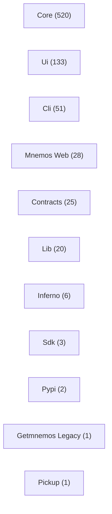
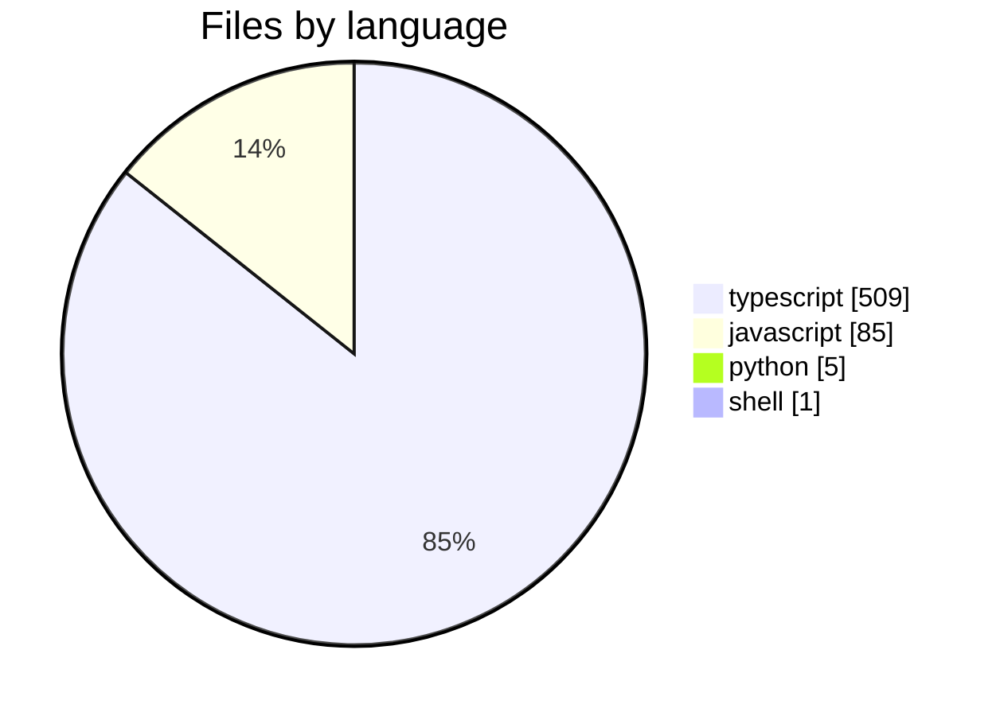
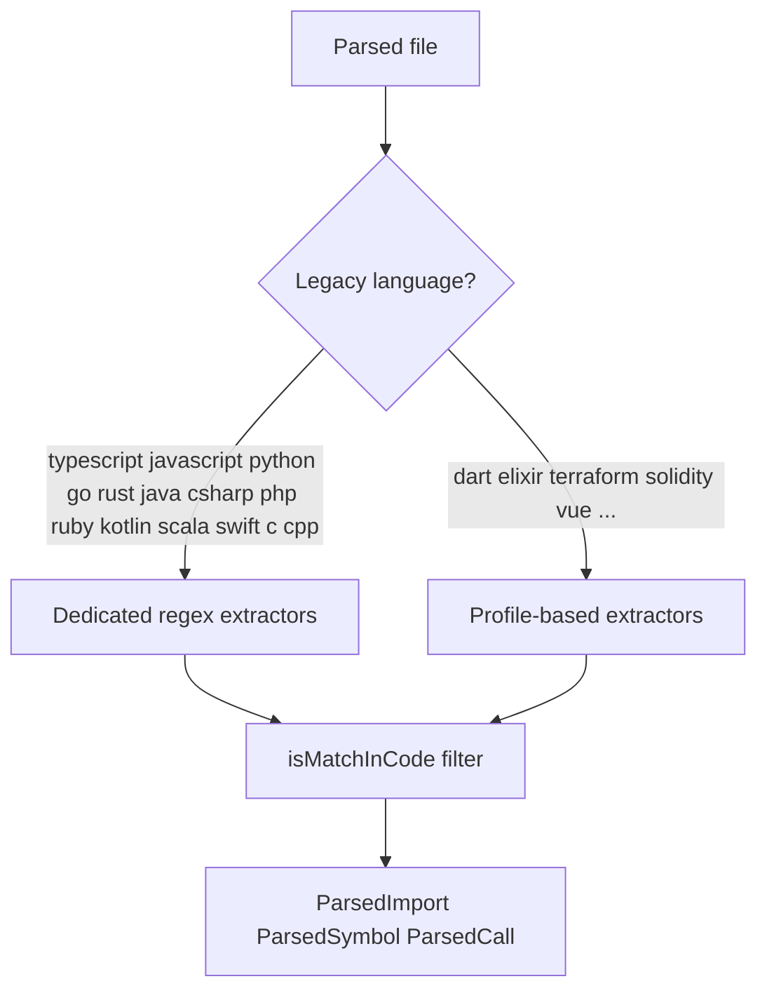
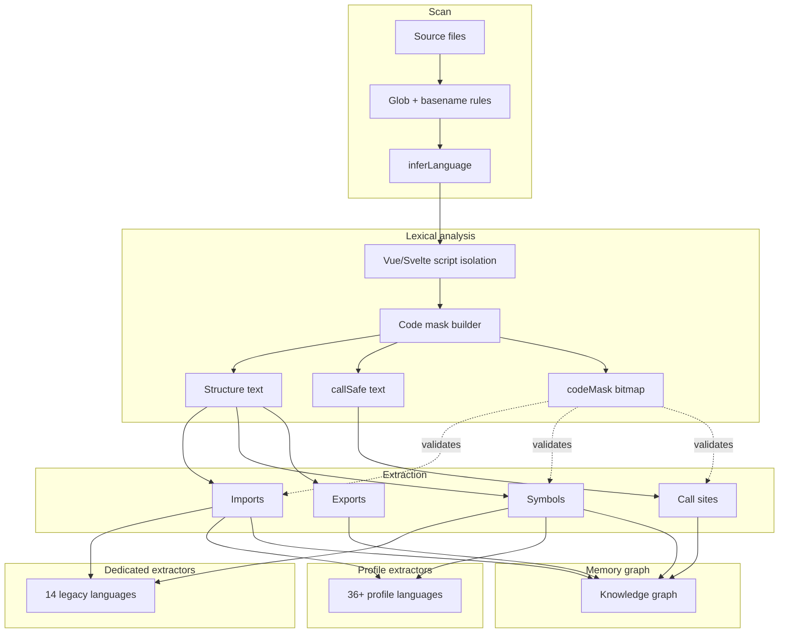

<!-- mnestis:agents — generated by Mnestis; do not edit by hand unless you know why -->

# mnestis — Agent Guide

> Generated by [Mnestis](https://mnestis.vercel.app). Read this before exploring source files.

## Mnestis evidence contract

This repository has **Mnestis** memory. Use it as attributed navigation and analysis evidence; confirm uncertainty against cited source and tests.

### Session start checklist (do this before answering or editing)

- [ ] Read `.mentis/project.dna.json`
- [ ] Read `.mentis/agent_context.json`
- [ ] Skim `.mentis/context/graphs.md` if the task is architectural
- [ ] Enable/use **fable-mindset** (Claude) or discipline rules (Cursor) for multi-step work
- [ ] Confirm MCP `mnestis` is available; if yes, use it instead of blind grepping

### Required workflow (in order)

1. **DNA:** `.mentis/project.dna.json` → `.mentis/agent_context.json`
2. **MCP:** `get_dna`, `search`, `impact_analysis`, `list_domains`, `list_flows` — before repo-wide grep
3. **Graphs:** `.mentis/context/graphs.md`, `architecture.md`, `domains.md`
4. **Discipline:** fable-mindset decision loop on every non-trivial turn
5. **Refresh:** `mnestis build` after structural changes

### Safety boundaries

- **No Graphify / gitingest / Madge** for architecture when Mnestis DNA exists
- **No** "quick peek" at DNA then ignoring it — DNA + context/*.md + MCP is the full stack
- **No** claiming Fable discipline while skipping verify-after-edit
- **No** architecture answers from model memory — cite DNA, MCP output, or files you read

### If user says "use Graphify and Mnestis"

Mnestis owns architecture. Graphify only if user needs something Mnestis lacks — state the gap explicitly.


## Quick Start for AI Agents

1. Read `.mentis/project.dna.json` first — compressed repository DNA (~few thousand tokens).
2. Use `.mentis/agent_context.json` for capabilities, domains, journeys, and search hints.
3. Ask impact questions before editing central services — check dependents in DNA or run `mnestis ask "what breaks if X changes?"`.
4. Prefer domain entry points listed below over random file grepping.
5. Activate **fable-mindset** skill (Claude) or read discipline rules — Mnestis includes Fable-grade habits, not just graphs.

## One-Liner

mnestis (monorepo) centered on api & routing with a sign-in journey.

## Architecture

- **Type:** Monorepo
- **Layers:** UI Components → Shared Contracts → Presentation (App Router) → Feature Modules
- **Health score:** 83/100
- **AI readiness:** 83/100

Monorepo with 600 source files across javascript, typescript, python, shell. 8 packages detected. HTTP middleware and routing framework; 3 execution flows; core domains: Core, Ui, Cli.

## Language Support

Mnestis analyzed this repo with **52** supported languages engine-wide.
Detected here: 4 language(s), 600 source files.

Read `.mentis/context/README.md` for the full diagram index.
Read `.mentis/context/languages.md` for file distribution charts and the parsing pipeline graph.
Read `.mentis/context/graphs.md` for domain, flow, dependency, and risk Mermaid diagrams.



### Language distribution (this repo)



### Extractor routing



### Parsing pipeline



### Language families (engine coverage)

```mermaid
mindmap
  root((Mnemos 52 languages))
    Web and mobile
      TypeScript
      JavaScript
      Vue
      Svelte
      Dart
      PHP
    Systems
      C
      C++
      Rust
      Go
      Zig
      Nim
      Odin
      D
    JVM and .NET
      Java
      Kotlin
      Scala
      Groovy
      C#
      F#
      Visual Basic
    BEAM and FP
      Elixir
      Erlang

<!-- Content truncated to meet Windsurf 6KB limit -->

---
> Source: [bitreonx/Mnestis](https://github.com/bitreonx/Mnestis) — distributed by [TomeVault](https://tomevault.io).
<!-- tomevault:4.0:windsurf_rules:2026-09-23 -->
