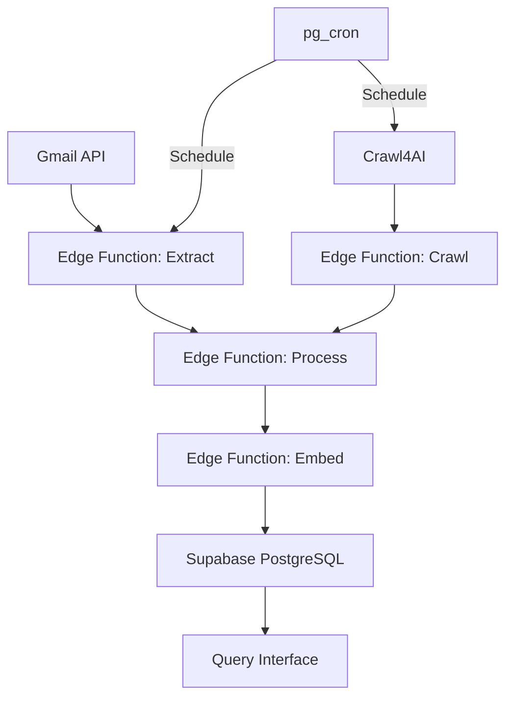

# Project Configuration (LTM)

This file contains the stable, long-term context for the project. It is read at the beginning of sessions and referenced when needed for critical decisions.

## Project Overview

### Project Name
MIDS Gmail Knowledge Base RAG Pipeline

### Project Description
A deterministic and programmatic Gmail to Supabase vector knowledge base pipeline with web crawling capabilities.

### Key Objectives
- Create efficient Gmail content extraction and processing pipeline
- Implement hierarchical knowledge organization using ltree
- Enable semantic search via pgvector and OpenAI embeddings
- Automate web crawling for linked content enrichment
- Provide programmatic query interface for RAG operations

### Success Criteria
- Stable Gmail API authentication and content extraction
- Reliable vector indexing and semantic search capabilities
- Efficient web crawling of linked content
- Scheduled automatic updates via pg_cron
- Comprehensive test coverage for all components

## Tech Stack

### Programming Languages
- TypeScript - Deno 1.40
- SQL - PostgreSQL 15

### Frameworks & Libraries
- Supabase - Latest
- pgvector - Latest
- ltree - Latest
- OpenAI Embeddings API - Latest
- Gmail API - V1
- Crawl4AI API - Latest

### Development Environment
- IDE/Editor: Cursor
- OS: Linux
- Tools: Git, GitHub Actions, Supabase CLI

### Deployment Environment
- Supabase Hosted PostgreSQL
- Supabase Edge Functions
- pg_cron for scheduled tasks
- GitHub Actions for CI/CD

## Architecture & Design

### System Architecture
The system follows a pipeline architecture with modular components for extraction, transformation, and loading.



### Data Model
The database uses a flexible schema with hierarchical organization via ltree paths.

### API Design
Edge Functions expose a RESTful API for interactions with the system.

## Standards & Conventions

### Coding Standards
- TypeScript strict mode
- Comprehensive error handling with structured logging
- Functional programming approach where possible

### Naming Conventions
- Files/Modules: kebab-case
- Classes/Components: PascalCase
- Functions/Methods: camelCase
- Variables: camelCase
- Database: snake_case

### Documentation Standards
- TSDoc for code documentation
- README.md for high-level project overview
- Embedded documentation in SQL migrations

## Project Structure

### Directory Organization
```
supabase-vector-gmailkb-rag/
├── .github/workflows/     # CI/CD pipelines
├── schema/                # Database schema definitions
├── supabase/
│   ├── functions/         # Edge Functions
│   ├── migrations/        # Database migrations
│   └── config.toml        # Supabase configuration
├── tests/                 # Test files
└── docs/                  # Documentation
```

### Key Files
- schema/schema.sql: Main database schema
- supabase/functions/gmail-extract/index.ts: Gmail extraction function
- supabase/functions/process-content/index.ts: Content processing
- supabase/functions/embed-content/index.ts: Vector embeddings generation

## Constraints & Considerations

### Performance Requirements
- Email extraction: < 2s per email
- Embedding generation: < 5s per document
- Query response time: < 1s for vector searches

### Security Requirements
- OAuth 2.0 for Gmail API authentication
- Supabase RLS policies for data access
- API key rotation for OpenAI and Crawl4AI

### Compatibility Requirements
- Support for all Gmail email formats
- Handling of various MIME types in attachments
- Compatibility with Supabase and pgvector versions

## Tokenization Settings

### Characters Per Token (Estimation)
- Average characters per token: 4
- Model context window: 16K tokens

### Token Usage Strategy
- Efficient JSON serialization for API payloads
- Chunking strategy for large documents
- Contextual token optimization for embeddings

---
> Converted and distributed by [TomeVault](https://tomevault.io/claim/BjornMelin) — claim your Tome and manage your conversions.
<!-- tomevault:4.0:windsurf_rules:2026-04-09 -->
