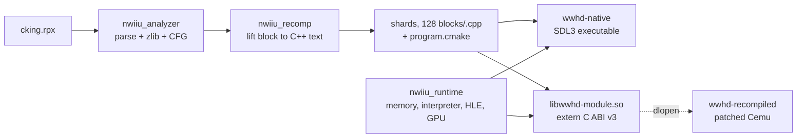

# Repository Guidelines

Conventions and hard-won facts for nWiiURecomp. Read before changing the
recompiler, the runtime, or the Cemu-derived port.

## Project Overview

nWiiURecomp statically recompiles Nintendo Wii U executables (`.rpx`/`.rpl`)
into native code backed by a checked Cafe OS runtime. The only *validated*
target is *The Legend of Zelda: The Wind Waker HD* EU v0 (`WUP-P-BCZP`, title
version 0), but it is no longer compiled in: per-game facts live in `.toml`
profiles under `configs/`, passed with `--config`. See "Game profiles" below.

Two consumers share one lifter:

- **`wwhd-native`** — standalone SDL3 runner with the in-tree GX2/Latte renderer.
- **`wwhd-recompiled`** — a patched Cemu that `dlopen`s `libwwhd-module.so` and
  dispatches guest PPC blocks to it, falling back to its own JIT/interpreter.
  This is the one that actually plays the game.

Branch note: this document describes `feature/shader-extractor`. The LLVM-IR
backend, region formation, and the shader AOT table live on
`feature/wwhd-direct-llvm-backend` (the trunk, 571 commits). **There is no LLVM
or `llc` dependency on this branch** — the generator emits C++ source text.

## Architecture & Data Flow



Library dependency is strictly one-way: `nwiiu_recomp` → `nwiiu_runtime` →
`nwiiu_analyzer`. **None of the three link Cemu.** The port is a parallel build
that meets the generated code only at the `extern "C"` seam in
`nWiiURecomp/include/nwiiu/static_module.h` (ABI version 3).

Lifting emits per-instruction C++ calling the runtime's header-inline PPC
semantics (`runtime/ppc_semantics_inl.h`), so the host compiler does the real
optimisation. `project_generator.cpp:499` writes the shards, a registry, a
`main.cpp`, a `module.cpp` and a `program.cmake`, replacing the output directory
atomically with rollback (`:471-497`).

At runtime the port hands the module a **flat mapping** of the guest address
space (`nwiiu_static_memory::flat_base`) rather than per-access callbacks:
2.75 ns → 0.74 ns per access. A host that cannot map the full 32-bit range
leaves `flat_base` null and the callbacks still work.

## Key Directories

| path | purpose |
| --- | --- |
| `nWiiUAnalyzer/` | RPX/RPL parse, relocation, function + basic-block recovery, JSON manifest. Namespace `nwiiu::analyzer`. |
| `nWiiURecomp/` | The lifter (`native_generator.cpp`), project emitter, both CLIs, and the GPU7 shader extractor. Namespace `nwiiu::recomp`. |
| `nWiiURuntime/` | Guest memory, Espresso interpreter, scheduler, Cafe OS HLE, GX2/Latte/AddrLib, SDL3 renderer. Namespace `nwii::runtime` — note the missing trailing `u`. |
| `configs/` | Per-game profiles. `wwhd-eu-v0.toml` is the pinned target; `generic.toml` authenticates nothing and is the starting point for a new game. |
| `nWiiUAnalyzer/Ghidra/` | `ExportWiiUProfile.java` — emits a profile plus a `Name,Start,End,Size` symbol CSV from an analysed RPX. |
| `nWiiUStudio/` | GUI, sources imported from NWiiRecomp. **Does not build**: `StudioState.hpp` includes NWii headers (`loader/loader.h`, `recompiler/recompiler.h`, `toml++`) that do not exist here. Gated behind `-DNWIIU_BUILD_STUDIO=ON`, OFF by default. |
| `extern/Cemu/` | Vendored submodule, pinned + patched. See the patch workflow below. |
| `tools/` | Three bash scripts, no Python. |
| `patches/cemu/` | The entire port as one tracked git diff. |
| `media/` | Logos plus `wwhd-port.rc` / `wwhd-port-icon.*`, consumed as `NWIIU_PORT_ASSET_DIR`. |

Dead code that looks alive: `nWiiURuntime/src/main.cpp` and
`nWiiURuntime/src/hle/` are absent from the CMake source lists.

## Development Commands

```bash
# Host libs, CLIs and the 36 unit tests. ~15 s including the nested-configure test.
cmake -S . -B build -DCMAKE_BUILD_TYPE=Release
cmake --build build -j8
ctest --test-dir build --output-on-failure

# Analyze an RPX into a deterministic manifest. Exit 3 is NORMAL (unresolved
# control-flow records remain); 2 is a usage error; 0 means none remain.
# Without --config the built-in WWHD profile applies; --any-title drops the gates.
./build/nWiiUAnalyzer/nwiiu-analyze --config configs/wwhd-eu-v0.toml \
  /path/to/code/cking.rpx build/wwhd-eu-v0.json

# Headless interpreter-only runner. 0 = guest_exit, 2 = usage, 3 = structured stop.
# --list-hooks prints every name a profile's [hle_hooks] may use.
./build/nWiiURecomp/nwiiu-run /path/to/code/cking.rpx \
  --config configs/wwhd-eu-v0.toml \
  --max-instructions 50000000 --save-root /tmp/wwhd-recomp-save --trace

# Full windowed port. Argument MUST be absolute and contain code/cking.rpx. ~25 min.
tools/build-wwhd-port.sh /absolute/path/to/WWHD

# Cemu patch lifecycle. Run the export after ANY edit under extern/Cemu/src.
tools/export-cemu-patch.sh    # regenerate + round-trip verify the patch
tools/prepare-cemu.sh         # verify pin, init submodules, apply the patch
```


<!-- Content truncated to meet Windsurf 6KB limit -->

---
> Source: [BlackLineInteractive/nWiiURecomp](https://github.com/BlackLineInteractive/nWiiURecomp) — distributed by [TomeVault](https://tomevault.io).
<!-- tomevault:4.0:windsurf_rules:2026-09-28 -->
