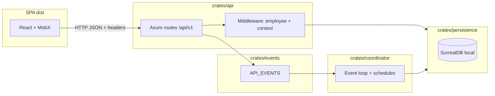

# AGENTS.md — blprnt

This document orients AI and human contributors to **blprnt**: the Rust runtime plus the Vite/React SPA it serves. It describes how the backend and frontend are structured, how they communicate, and the conventions we expect when adding code.

---

## 1. What this repository is

- **Runtime**: A single `blprnt` binary (`crates/blprnt`) starts the HTTP API, optional adapter runtime, and coordinator loop, backed by **local SurrealDB** persistence.
- **Web UI**: A **React 19** SPA (Vite) in `src/`, built to `dist/`, which the API serves as static assets.
- **Contract**: Shared request/response shapes are defined in Rust with **`ts-rs`** and exported to TypeScript under `src/bindings/` so the UI stays aligned with the API.

**Excluded from the active workspace** (not built by default): `crates/engine_v2`, `crates/providers` — see `Cargo.toml` `[workspace] exclude`.

---

## 2. End-to-end architecture

**Operational defaults** (from `README.md`):

- API listens on **`0.0.0.0:9171`**.
- Data directory: **`~/.blprnt/data`** (Rocks-backed SurrealDB).
- Static files: **`./dist`** unless `BLPRNT_BASE_DIR` overrides it.
- Frontend uses `VITE_API_URL` or defaults to `http://localhost:9171/api/v1` (`src/lib/api/fetch.ts`).

### 2.1 Project directories in runtime context

- A **project record** can include one or more **working directories**. These are the actual source/work folders for the project. They are not blprnt metadata folders.
- **`PROJECT_HOME`** is separate from those working directories. It lives under `~/.blprnt/projects/<project_id>` and stores blprnt-managed project metadata.
- Treat **project working directories** as the correct places for code edits, source inspection, builds, tests, and normal project-file work.
- Treat **`PROJECT_HOME`** as the place for blprnt-managed files such as:
  - `PROJECT_HOME/memory` for project memory files
  - `PROJECT_HOME/plans` for plan documents
- Do not treat `PROJECT_HOME` as the primary project source tree unless the task is specifically about blprnt-managed metadata there.

---

## 3. Backend (Rust workspace)

### 3.1 Process model

The binary entrypoint is `crates/blprnt/src/main.rs`. It runs **concurrently** (via `tokio::join!`):

| Task | Feature flag | Role |
|------|----------------|------|
| `api::start_server()` | `api` | HTTP server + static SPA |
| `adapters::runtime::AdapterRuntime` | `adapter` | Local adapter server for agents/tools |
| `coordinator::Coordinator` | `coordinator` | Subscribes to API events; schedules runs per employee |

Default features: `api`, `coordinator`, `adapter` (`crates/blprnt/Cargo.toml`).

### 3.2 Crate map (workspace members)

| Crate | Responsibility |
|-------|----------------|
| **`blprnt`** | Binary entry; wires logging and subsystems |
| **`api`** | Axum app: `/api` → `/v1` JSON routes, CORS, middleware, DTOs, static file serving |
| **`coordinator`** | Heartbeat-style loop on `API_EVENTS`; creates/updates runs, employee schedules |
| **`persistence`** | SurrealDB connection, IDs, repositories (issues, employees, projects, runs, …) |
| **`events`** | In-process event buses (`API_EVENTS`, `COORDINATOR_EVENTS`, …) |
| **`shared`** | Errors, tool schemas, paths, helpers used across crates |
| **`tools`** | File/host tool implementations for agents |
| **`adapters`** | Adapter runtime (prompts, HTTP surface for adapter workflows) |
| **`memory`**, **`vault`**, **`oauth`**, **`qmd`**, **`json-repair`**, **`macros`**, **`sandbox`**, **`tools`** | Supporting libraries; **api** depends on e.g. `memory` and `vault` — follow imports when touching a feature |

### 3.3 HTTP API shape

- Routes are mounted under **`/api`**, with versioned API under **`/api/v1`** (`crates/api/src/routes/mod.rs`).
- **Protected routes** (issues, employees, runs, memory, projects, …) use **`api_middleware`**: requires header **`x-blprnt-employee-id`** and loads the employee from the DB (`crates/api/src/middleware/mod.rs`).
- Optional headers: **`x-blprnt-project-id`**, **`x-blprnt-run-id`** (attached to `RequestExtension` in `crates/api/src/state.rs`).
- **Owner-only** routes add **`owner_only`** middleware (e.g. providers).
- **Public** routes (e.g. onboarding/signup) sit under `routes/v1/public.rs` without the same guard.
- **Debug-only** routes may be merged under `#[cfg(debug_assertions)]` (`routes/v1/dev.rs`).

<!-- Content truncated to meet Windsurf 6KB limit -->

---
> Source: [blprnt-ai/blprnt](https://github.com/blprnt-ai/blprnt) — distributed by [TomeVault](https://tomevault.io).
<!-- tomevault:4.0:windsurf_rules:2026-04-24 -->
