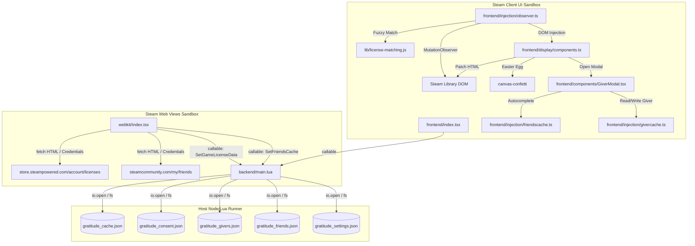

# Architectural Overview & Developer Guide (AGENTS.md)

This document provides a comprehensive guide to the **Gratitude** Steam library plugin, detailing its architectural patterns, runtime contexts, data synchronization flows, fuzzy matching algorithms, persistence mechanics, and development gotchas.

---

## 1. High-Level Purpose

The Steam Library does not natively indicate if a game was gifted to you or who the gifter was. **Gratitude** is a [Millennium](https://steambrew.app/) framework plugin that bridges this gap by:
1. **Scraping** the user's Steam Account license list to identify gifted games.
2. **Persisting** this metadata locally, categorized by Steam Account ID to support multiple users.
3. **Observing** the Steam UI DOM (in both Standard Desktop and Big Picture Mode) to inject a custom "Gifted" badge and details tooltip.
4. **Enabling annotations** where users can record who gifted a game (with friends-list autocomplete) and leave personal notes.

---

## 2. Runtime Architecture & Sandbox Contexts

Millennium plugins operate across three distinct environments. Each surface has unique security constraints and API accessibility:

### Context Breakdown

| Context | Main File / Folder | Environment & Execution Context | Capabilities & Limits |
| :--- | :--- | :--- | :--- |
| **Backend** | [backend/main.lua](backend/main.lua) | Lua execution runtime running directly on the host system. | Has full filesystem access. Persists state, runs database lookups, and exposes callback functions called by the Frontend and Webkit. |
| **Frontend** | [frontend/](frontend) | React & TypeScript running inside Steam's main library interface. | Detects active games, hooks popup/window events via `window.g_PopupManager`, listens to DOM mutations, and patches Steam UI. Restricted by Chromium sandbox (cannot write to host disk directly). |
| **Webkit** | [webkit/index.tsx](webkit/index.tsx) | Plain JavaScript & DOM running inside Steam browser views (Store/Community). | Runs on web pages like `store.steampowered.com` or `steamcommunity.com`. Uses standard browser `fetch` to scrape page markup. Cannot access Steam's React layer or direct host resources. |

---

## 3. Data Synchronization & Flows

### 3.1 License Synchronization
1. **Initialization**: When the user browses the Steam Store, [webkit/index.tsx](webkit/index.tsx) triggers a fetch request to `https://store.steampowered.com/account/licenses/`.
2. **Page Scraping**: The HTML is parsed for `table.account_table tbody tr`.
3. **Data Extraction**:
   - `item`: Name of the game or package.
   - `date`: The acquisition date (standardized to `"MMM DD, YYYY"`, e.g., `"Mar 5, 2025"`).
   - `acquisition`: Type of acquisition (filtered specifically for `"Gift/Guest Pass"`).
4. **Persistence**: Webkit invokes the backend callable `SetGameLicenseData` to parse and write this data to `backend/gratitude_cache.json`.

### 3.2 Library UI Injection
1. **DOM Tracking**: The frontend observer in [observer.ts](frontend/injection/observer.ts) listens to subtree changes.
2. **Game Detection**: When a game details page is rendered, the active game name (e.g. `"Serious Sam 3: BFE"`) is extracted.
3. **Matching Algorithm**: The game name is matched against the local backend cache using the fuzzy matching module [license-matching.js](lib/license-matching.js).
4. **Badge Insertion**: If there is a match showing the game was acquired as a `"Gift/Guest Pass"`, the UI builder in [components.ts](frontend/display/components.ts) creates a "Gifted" badge and injects it adjacent to the playtime tooltip element.
5. **Confetti Easter Egg**: Clicking the gift icon fires a confetti animation using `canvas-confetti`.

### 3.3 Friends Scraping & Giver Association

<!-- Content truncated to meet Windsurf 6KB limit -->

---
> Source: [BlythT/Gratitude-Millennium-Plugin](https://github.com/BlythT/Gratitude-Millennium-Plugin) — distributed by [TomeVault](https://tomevault.io).
<!-- tomevault:4.0:windsurf_rules:2026-09-22 -->
