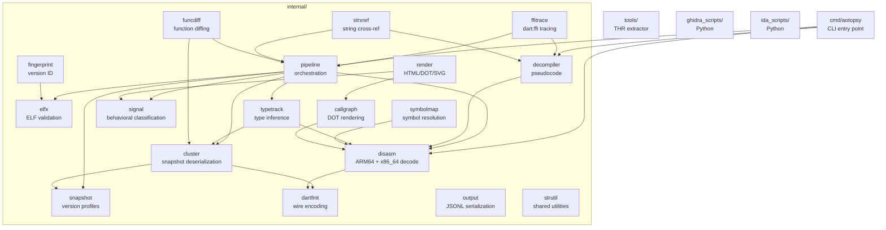

# AGENTS.md — AOTopsy

## Build & Test

Do NOT use `./...` — it traverses `runtime_test/` (thousands of non-Go files) causing slow stat and OOM. Use:

```bash
go build ./cmd/... ./internal/... ./tools/...
go test ./cmd/... ./internal/... ./tools/...
```

Build just the binary: `go build -o aotopsy ./cmd/aotopsy/`

## Project Structure



- `cmd/aotopsy/` — CLI entry point, command handlers
- `internal/` — library packages (21 packages, see ARCHITECTURE.md)
- `tools/` — standalone utilities (THR table extractor)
- `ghidra_scripts/` — Ghidra integration (Python)
- `ida_scripts/` — IDA integration (Python)

## Integration Tests

Set environment variables to enable regression tests:

- `AOTOPSY_TEST_SAMPLE_ARM64` — Dart 3.9.2 ARM64 libapp.so
- `AOTOPSY_TEST_SAMPLE_312_ARM64` — Dart 3.12 ARM64 libapp.so
- `AOTOPSY_TEST_SAMPLE_312_X64` — Dart 3.12 x86_64 libapp.so
- `AOTOPSY_TEST_SAMPLE_DART212` — Dart 2.12.0 ARM64 libapp.so

Tests skip automatically if not set.

## Key Conventions

- `main.go`'s `switch` statement is the source of truth for command dispatch — always check it
- `PoolLookups` (`pipeline.PoolLookups`) is the central name-resolution surface
- PatchClass hop: `OwnerRefID` may point at a PatchClass (CID 6), not the real Class
- `DetectVersion` returns a copy to prevent data races
- `LiftState.Clone` shares Locals by reference (intentional for cross-branch visibility)

---
> Source: [BroNils/aotopsy](https://github.com/BroNils/aotopsy) — distributed by [TomeVault](https://tomevault.io).
<!-- tomevault:4.0:windsurf_rules:2026-08-09 -->
