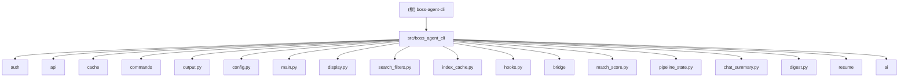

# boss-agent-cli

# Agent Team PUA 配置
所有 teammate 开工前必须加载 pua skill。
teammate 失败 2 次以上时向 Leader 发送 [PUA-REPORT] 格式汇报。
Leader 负责全局压力等级管理和跨 teammate 失败传递。

## 项目愿景

专为 AI Agent 设计的 BOSS 直聘求职 CLI 工具。结合 geekgeekrun（浏览器自动化 + 反检测）和 boss-cli（CLI + 结构化输出）的优势，让 AI Agent 通过 subprocess 调用 CLI、读取 stdout JSON 输出，完成完整的求职操作链。

## 架构总览

```
CLI 入口 (Click)
    |
    +---> AuthManager (Token 生命周期)
    |         |
    |         +---> TokenStore (Fernet 加密持久化)
    |         +---> Playwright (Headless 登录 / stoken 刷新)
    |
    +---> BossClient (httpx + BrowserSession)
    |         |
    |         +---> RequestThrottle (共享反检测延迟)
    |         +---> BrowserSession (CDP 优先 / patchright 降级)
    |         |         |
    |         |         +---> CDP 连接用户 Chrome（真实指纹 + stoken 自动生成）
    |         |         +---> Headless patchright（降级方案）
    |         |
    |         +---> BridgeClient (可选 — Chrome 扩展通道)
    |         |         |
    |         |         +---> BridgeDaemon (HTTP + WebSocket 服务)
    |         |         +---> Chrome 扩展（真实浏览器环境执行）
    |         |
    |         +---> httpx（低风险 API 请求）
    |         +---> BOSS 直聘 wapi 接口
    |
    +---> CacheStore (SQLite WAL)
    |
    +---> display.py (Rich 渲染 / TTY 自适应)
    |
    +---> output.py (JSON 信封) ---> stdout
```

**数据流**：CLI 命令 -> AuthManager 确保有效 Token -> BossClient 发起 API 请求 -> output.py 格式化为 JSON 信封 -> stdout

**输出约定**：
- stdout: 仅 JSON 结构化数据
- stderr: 日志和进度信息（通过 `--log-level` 控制）
- exit code 0: 命令成功 (ok=true)
- exit code 1: 命令失败 (ok=false)

## 不变量契约

以下规则为 breaking change 红线，违反即为破坏性变更：

- **信封格式**：stdout 仅输出 JSON 信封 `{ok, schema_version, command, data, pagination, error, hints}`，任何命令不得直接 `print()` 到 stdout
- **错误三元组**：`error` 对象必须包含 `code` + `recoverable` + `recovery_action` 三个字段，缺一不可
- **福利筛选**：`--welfare` 为核心差异化功能，不得移除或降级
- **能力真源**：`boss schema` 返回完整工具自描述 JSON，是 Agent 理解能力的唯一入口，新增命令必须同步注册
- **信封字段**：不得移除或重命名现有信封顶层字段（ok / schema_version / command / data / pagination / error / hints）

## 模块结构图



## 模块索引

| 模块路径 | 语言 | 职责 | 入口文件 | 测试 |
|----------|------|------|----------|------|
| `src/boss_agent_cli/` | Python | 包根目录，版本号 | `__init__.py` | - |
| `src/boss_agent_cli/auth/` | Python | Token 生命周期：加密存储、Cookie 提取、patchright 扫码登录、stoken 刷新、文件锁 | `manager.py` | `tests/test_auth.py` |
| `src/boss_agent_cli/api/` | Python | wapi 端点常量、API 返回码常量、数据模型 (dataclass)、httpx 统一请求（高斯抖动+指数退避）、CDP/patchright 浏览器通道、共享请求限速 | `client.py` | `tests/test_api.py`, `tests/test_throttle.py`, `tests/test_browser_client.py` |
| `src/boss_agent_cli/cache/` | Python | SQLite WAL 缓存（搜索历史 100 条上限、已打招呼记录） | `store.py` | `tests/test_cache.py` |
| `src/boss_agent_cli/commands/` | Python | Click CLI 命令：schema/login/logout/status/doctor/search/detail/greet/batch-greet/recommend/export/cities/me/show/history/chat/chatmsg/chat-summary/mark/exchange/interviews/watch/preset/pipeline/follow-up/apply/shortlist/digest/resume/ai/config/clean | `search.py`, `greet.py`, `me.py` | `tests/test_commands.py`, `tests/test_new_commands.py`, `tests/test_welfare_filter.py`, `tests/test_pipeline_commands.py`, `tests/test_apply.py`, `tests/test_preset.py`, `tests/test_shortlist.py`, `tests/test_watch.py`, `tests/test_chat_summary_command.py`, `tests/test_digest_command.py`, `tests/test_resume_commands.py`, `tests/test_ai_commands.py`, `tests/test_config_cmd.py`, `tests/test_clean_cmd.py` |
| `src/boss_agent_cli/output.py` | Python | JSON 信封封装 + Logger（stderr 日志级别过滤） | - | `tests/test_output.py` |
| `src/boss_agent_cli/config.py` | Python | 配置文件读取与默认值 (`~/.boss-agent/config.json`) | - | `tests/test_output.py` |
| `src/boss_agent_cli/main.py` | Python | Click CLI group 入口 + 全局选项 + 配置加载 | - | `tests/test_commands.py` |
| `src/boss_agent_cli/display.py` | Python | Rich 终端渲染 + TTY/Pipe 自动切换 + `@handle_auth_errors` 统一装饰器 | - | `tests/test_display.py`, `tests/test_commands.py`（间接覆盖） |
| `src/boss_agent_cli/search_filters.py` | Python | 搜索结果预过滤：城市/薪资/学历/经验客户端筛选 | - | `tests/test_search_filters.py`, `tests/test_search_pipeline.py` |
| `src/boss_agent_cli/index_cache.py` | Python | 搜索结果索引缓存，支持 `boss show N` 快速导航 | - | `tests/test_index_cache.py` |
| `src/boss_agent_cli/hooks.py` | Python | 轻量事件钩子系统（SyncHook / BailHook） | - | `tests/test_hooks.py` |
| `src/boss_agent_cli/match_score.py` | Python | 职位匹配评分：基于薪资/经验/学历/城市计算匹配分和原因 | - | `tests/test_match_score.py` |
| `src/boss_agent_cli/pipeline_state.py` | Python | 候选进度状态机：聊天阶段判定、跟进筛选 | - | `tests/test_pipeline_state.py` |
| `src/boss_agent_cli/chat_summary.py` | Python | 聊天消息结构化摘要：阶段/待办/关键事实/风险标记 | - | `tests/test_chat_summary.py` |
| `src/boss_agent_cli/digest.py` | Python | 日报数据聚合：新增职位/待跟进/面试汇总 | - | `tests/test_digest.py` |

<!-- Content truncated to meet Windsurf 6KB limit -->

---
> Source: [can4hou6joeng4/boss-agent-cli](https://github.com/can4hou6joeng4/boss-agent-cli) — distributed by [TomeVault](https://tomevault.io).
<!-- tomevault:4.0:windsurf_rules:2026-04-22 -->
