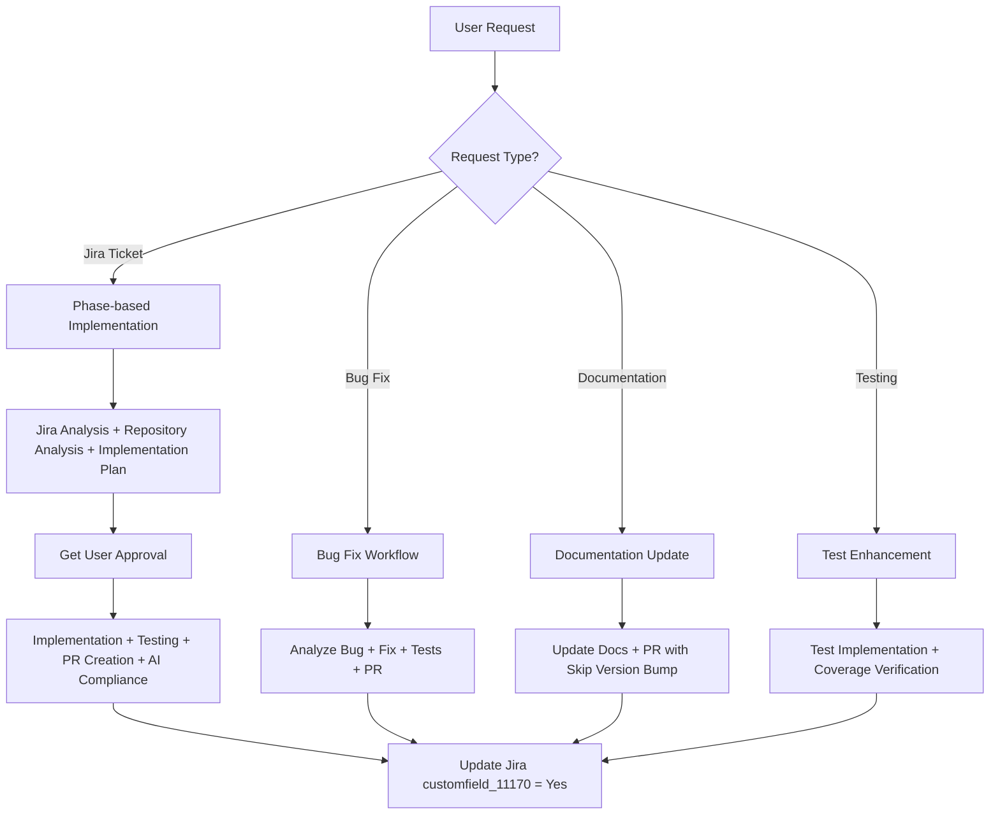

# GitHub Copilot Instructions for knife-azure

This document provides comprehensive guidance for GitHub Copilot when working with the knife-azure repository. Follow these instructions meticulously to ensure high-quality contributions, proper testing coverage, and seamless integration with the existing Chef ecosystem.

## ⚡ Quick Start for GitHub Copilot

### 🎯 CRITICAL SUCCESS FACTORS
1. **>80% Test Coverage** - NON-NEGOTIABLE for all code changes
2. **AI Compliance** - ALL PRs MUST include `ai-assisted` label and Jira field updates
3. **DCO Signoff** - ALL commits MUST be signed off (`git commit --signoff`)
4. **knife Plugin Architecture** - Extends [chef/knife](https://github.com/chef/knife) with Azure functionality

### 🚀 PRIMARY WORKFLOWS
- **Feature Implementation**: [Phase-based workflow](#development-workflow-integration) with Jira integration
- **Testing**: [RSpec framework](#testing-requirements-critical) with comprehensive coverage
- **PR Creation**: [Automated process](#pull-request-creation-process) with AI compliance
- **Code Quality**: [Chefstyle standards](#code-quality--standards) with Ruby best practices

### 🤖 COPILOT DECISION TREE



#### 🔍 When to Use Each Workflow:
- **Jira Ticket (PROJ-XXX)**: Use full phase-based workflow with comprehensive analysis
- **Bug Fix**: Focus on root cause analysis, regression tests, and priority labeling
- **Documentation**: Use expeditor skip labels, focus on clarity and accuracy
- **Testing**: Ensure >80% coverage, comprehensive test scenarios
- **Emergency**: Use expeditor skip all, focus on critical fixes

## Table of Contents

1. [Repository Overview & Structure](#repository-overview--structure)
2. [Development Workflow Integration](#development-workflow-integration)
3. [Testing Requirements (CRITICAL)](#testing-requirements-critical)
4. [Pull Request Creation Process](#pull-request-creation-process)
5. [AI-Assisted Development & Compliance](#ai-assisted-development--compliance)
6. [DCO (Developer Certificate of Origin) Compliance](#dco-developer-certificate-of-origin-compliance)
7. [Build System Integration](#build-system-integration)
8. [Label Management System](#label-management-system)
9. [Prompt-Based Execution Protocol](#prompt-based-execution-protocol)
10. [Repository-Specific Guidelines](#repository-specific-guidelines)
11. [Code Quality & Standards](#code-quality--standards)
12. [Security and Compliance Requirements](#security-and-compliance-requirements)
13. [Build & Development Environment](#build--development-environment)
14. [Integration & Dependencies](#integration--dependencies)
15. [Release & CI/CD Awareness](#release--cicd-awareness)
16. [Code Ownership & Review Process](#code-ownership--review-process)
17. [Ruby-Specific Guidelines](#ruby-specific-guidelines)
18. [Example Workflow Execution](#example-workflow-execution)

---

## Repository Overview & Structure

### Project Purpose
knife-azure is a Chef knife plugin that enables creation, deletion, and management of Microsoft Azure resources through Chef Infra. It extends the core knife tool (maintained in the [chef/knife](https://github.com/chef/knife) repository) with Azure-specific functionality, providing seamless integration between Chef's infrastructure automation and Azure's cloud platform.

### Plugin Architecture
- **Core Tool**: Built as an extension to the knife command-line tool from chef/knife
- **Plugin Type**: Standalone gem that integrates with knife's plugin system
- **Installation**: Distributed as a separate gem (`knife-azure`) that extends knife functionality
- **Integration**: Follows knife's plugin conventions and extends `Chef::Knife` base classes

### Technology Stack
- **Primary Language**: Ruby (3.1+)
- **Testing Framework**: RSpec
- **Code Style**: Chefstyle (RuboCop-based)
- **Build Tool**: Rake + Bundler
- **Package Manager**: RubyGems
- **CI/CD**: Buildkite + Expeditor
- **Azure SDK**: azure_mgmt_* gems
- **License**: Apache License 2.0

### Repository Structure

```
knife-azure/
├── .expeditor/                 # Expeditor CI/CD configuration
│   └── config.yml             # Build automation and release config
├── .github/                   # GitHub-specific files
│   └── CODEOWNERS            # Code ownership definitions
├── docs/                     # Documentation
│   ├── ARM.md               # Azure Resource Manager docs
│   ├── bootstrap.md         # VM bootstrapping guide

<!-- Content truncated to meet Windsurf 6KB limit -->

---
> Source: [chef/knife-azure](https://github.com/chef/knife-azure) — distributed by [TomeVault](https://tomevault.io).
<!-- tomevault:4.0:windsurf_rules:2026-07-24 -->
