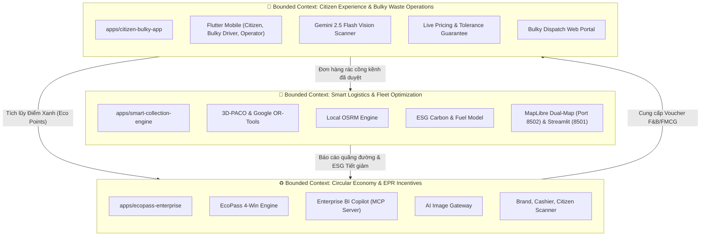

# AGENTS.md — Hướng Dẫn Kỹ Thuật Dành Cho AI Coding Agents

> Tài liệu này được biên soạn đặc biệt cho các AI Coding Agents (Claude, Gemini, Cursor, Copilot, Antigravity, Devin, v.v.) khi đọc hiểu, định hướng, phân tích và thực hiện sửa đổi mã nguồn trong Monorepo **NaN-EcoNet**.

---

## 🧭 1. Bản Đồ Ngữ Cảnh Bounded Contexts (Domain-Driven Design)

Toàn bộ hệ thống NaN-EcoNet được kiến trúc theo phương pháp Domain-Driven Design (DDD), phân tách rành mạch thành 3 Bounded Contexts tương ứng với 3 thư mục trong `apps/`:

### 1.1. `apps/smart-collection-engine` (Logistics & Routing Context)
* **Trách nhiệm cốt lõi**: Giải quyết bài toán định tuyến phương tiện có tải trọng và khung thời gian (CVRPTW) cho các đội xe thu gom rác đô thị.
* **Thành phần**:
  * `src/`: Thuật toán 3D-PACO (Parallel Ant Colony Optimization) viết bằng C++ và Python, tích hợp Google OR-Tools CVRPTW solver.
  * `backend/`: FastAPI cung cấp REST API giải bài toán VRP, nhận danh sách trạm/điểm thu gom, trả về lộ trình tối ưu và ma trận OSRM.
  * `streamlit/`: Bảng điều khiển phân tích thông số thuật toán, đồ thị hội tụ và mô hình tính toán tiết giảm phát thải CO2, tiết kiệm dầu Diesel.
  * `map_ui/`: Giao diện bản đồ số MapLibre GL thời gian thực, mô phỏng xe chạy, hỗ trợ so sánh đối đầu (Dual-Map) giữa PACO và OR-Tools.

### 1.2. `apps/ecopass-enterprise` (Circular Economy & Commercial Context)
* **Trách nhiệm cốt lõi**: Tạo động lực kinh tế tuần hoàn liên kết 4 bên (Citizen, FMCG Brand, Merchant Store, Recycler) theo chuẩn trách nhiệm mở rộng của nhà sản xuất (EPR).
* **Thành phần**:
  * `ecopass/`: Hệ thống các Web Portal (Next.js, Django, SQLite):
    * `client-scanner` (Port 3011): Quét tem QR nhiệt 1-Time Burn từ thùng rác, trả lời khảo sát và nhận voucher.
    * `brand-portal` (Port 3009): Doanh nghiệp tài trợ ngân sách xanh, cấu hình chiến dịch voucher và theo dõi báo cáo EPR.
    * `cashier-pos` (Port 3010): Điểm bán lẻ/quán nước quét hủy voucher khi cư dân đổi quà.
  * `enterprise-bi-copilot/`: Triển khai giao thức **Model Context Protocol (MCP)** kết nối CopilotKit để hỗ trợ truy vấn báo cáo tài chính, tỷ lệ đổi quà (Redemption Rate) và phân tích dữ liệu rác thải bằng ngôn ngữ tự nhiên.
  * `agy-image-gateway/`: Proxy backend FastAPI điều phối sinh ảnh và phân tích thị giác AI.
  * `awesome-gpt-image-2/`: Studio thiết kế prompt phong cách công nghiệp cho chiến dịch truyền thông xanh.

### 1.3. `apps/citizen-bulky-app` (Citizen Portal & Bulky Operations Context)
* **Trách nhiệm cốt lõi**: Giải quyết triệt để vấn đề rác thải cồng kềnh (sofa, nệm, tủ gỗ, phế thải xây dựng) vốn không thể thu gom bằng xe ép rác thông thường.
* **Thành phần**:
  * `mobile/`: Ứng dụng di động Flutter phân quyền vai trò (Role-Based Access Control - RBAC):
    * *Cư dân (Citizen)*: Quét camera AI nhận diện đồ vật, chọn quy trình 3 bước Request Wizard, nhận báo giá tức thì, giữ chỗ cọc 15 phút và đổi voucher quà tặng.
    * *Tài xế cồng kềnh (Bulky Driver)*: Xem lộ trình ca làm việc chuyên dụng cho xe tải cồng kềnh, điều hướng bản đồ, lập biên bản sai lệch hiện trường (Discrepancy Report).
    * *Điều phối viên (Operator)*: Giám sát tải trọng, duyệt giá cước chính xác và phân công chuyến xe.
  * Camera AI: Tích hợp Gemini 2.5 Flash Vision Scanner vẽ Bounding Box, đo đạc kích thước và phân loại chất liệu.

---

## 📖 2. Bảng Thuật Ngữ Nghiệp Vụ (Domain Ontology & Glossary)

Khi sinh mã hoặc trao đổi kỹ thuật, AI Agent **bắt buộc** sử dụng chính xác các thuật ngữ miền chuẩn sau:

| Thuật Ngữ Miền | Khái Niệm & Định Nghĩa Kỹ Thuật | Phạm Vi Sử Dụng |
|---|---|---|
| **Bulky Waste** (Rác cồng kềnh) | Đồ phế thải có kích thước hoặc trọng lượng vượt ngưỡng thu gom thông thường (sofa, nệm, tủ, bàn ghế, thiết bị gia dụng cỡ lớn). | `citizen-bulky-app` |

<!-- Content truncated to meet Windsurf 6KB limit -->

---
> Source: [chinhanxt/NaN-EcoNet](https://github.com/chinhanxt/NaN-EcoNet) — distributed by [TomeVault](https://tomevault.io).
<!-- tomevault:4.0:windsurf_rules:2026-09-26 -->
