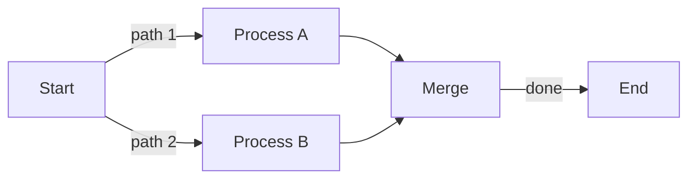

# Lawbrokr Engineering Vault

This is an Obsidian vault used as an LLM-readable knowledge base for the Lawbrokr product ecosystem. It is designed to give AI coding assistants full context on active projects, architecture decisions, and workflow notes.

## Company

**Lawbrokr** — a SaaS platform for law firms that provides marketing funnels, lead capture, analytics, and AI-powered marketing assistance.

## Product Ecosystem

| Project | Tech Stack | Description |
|---------|-----------|-------------|
| **Storefront** | Rails, Hotwire/Turbo, Tailwind, Sidekiq, PostgreSQL | Main web application — funnels, workflows, lead management, admin |
| **Justice Sync** | FastAPI, PostgreSQL, Redis, Google Vertex AI (Gemini), Python 3.12 | AI backend — chat agent with 40+ tools for ad analytics, SEO, call tracking |
| **Justice Frontend** | Next.js 15, React 19, TypeScript, Tailwind CSS 4 | AI chat UI — SSO auth, conversation management, service connections |
| **Chrome Extension** | React, Chrome APIs, Shadow DOM | Browser extension — lead notifications, funnel stats, quick access dashboard |
| **Figma-to-React** | Next.js, Storybook, ApexCharts | Component library & design system prototyping |

## Vault Structure

```
vault/
├── CLAUDE.md                  ← You are here. Start reading from this file.
├── .gitignore                 ← Excludes credentials/ from git
├── credentials/               ← NOT IN GIT. Local-only secrets and passwords.
├── projects/
│   ├── justice-sync.md        ← Justice backend: full API, schema, AI agent docs
│   ├── justice-frontend.md    ← Justice frontend: features, routes, components
│   ├── chrome-extension.md    ← Chrome ext: architecture, modal persistence, task log
│   ├── storefront.md         ← Rails app: controllers, models, auth, architecture
│   └── internal-dashboard-api.md ← Internal dashboard API documentation
├── reference/
│   ├── rails-commands.md      ← How to run/develop the Rails app locally
│   ├── sidekiq.md             ← Sidekiq background job notes
│   └── postgres.md            ← Useful psql commands (credentials removed)
├── tickets/
│   ├── bot-detection.md       ← Research: bot detection for lead forms
│   ├── component-mapping.md   ← Research: Storybook, charting libs, component libs
│   └── mclellan-law.md        ← Client discussion: form completion issues
├── features/
│   ├── ai-voice.md            ← Feature spec: AI voice calling for leads
│   ├── flow-templates.md      ← Feature spec: bulk-edit pages across funnels
│   └── internal-dashboard.md  ← Figma links for internal dashboard redesign
└── daily/
    └── 2026-03-12.md          ← Daily notes
```

## Key Terminology

These terms have been renamed in the codebase but may appear under old names:

| UI Name | Code Name | What it is |
|---------|-----------|------------|
| Funnel | Campaign | Multi-step lead capture flow |
| Workflow | Journey | Automated lead follow-up sequence |
| Marketing Source | Source | Where a lead came from |

## Repositories

- **storefront** — Main Rails app (`/Users/chriskinsman/Documents/GitHub/storefront`)
- **justice-sync** — FastAPI AI backend
- **justice-frontend** — Next.js AI chat frontend
- **chrome-extension** — Chrome browser extension
- **figmatoreact** — Component library prototype (`https://github.com/chris-lawbrokr/figmatoreact`)

## Diagrams

When creating diagrams or charts in this vault, always use **Mermaid** syntax embedded in markdown files. Never use `.canvas`, `.drawio`, `.d2`, or other diagram formats.

**Rules:**
- Embed diagrams as fenced `mermaid` code blocks inside `.md` files
- Use descriptive headings above each diagram
- Supported diagram types: `graph`, `sequenceDiagram`, `classDiagram`, `stateDiagram`, `erDiagram`, `gantt`, `pie`, `flowchart`, etc.
- Preview in VS Code with the `bierner.markdown-mermaid` extension (`Cmd+Shift+V`)
- Mermaid also renders natively on GitHub

**Example:**
````

````

## How to Use This Vault

1. **Start here** — this file gives you the full map
2. **For project context** — read the relevant file in `projects/`
3. **For how-to** — check `reference/`
4. **For current/past work** — check `tickets/` and `features/`
5. **Credentials are in `credentials/`** — .gitignored, local only

---
> Source: [chris-lawbrokr/vault](https://github.com/chris-lawbrokr/vault) — distributed by [TomeVault](https://tomevault.io).
<!-- tomevault:4.0:windsurf_rules:2026-07-08 -->
