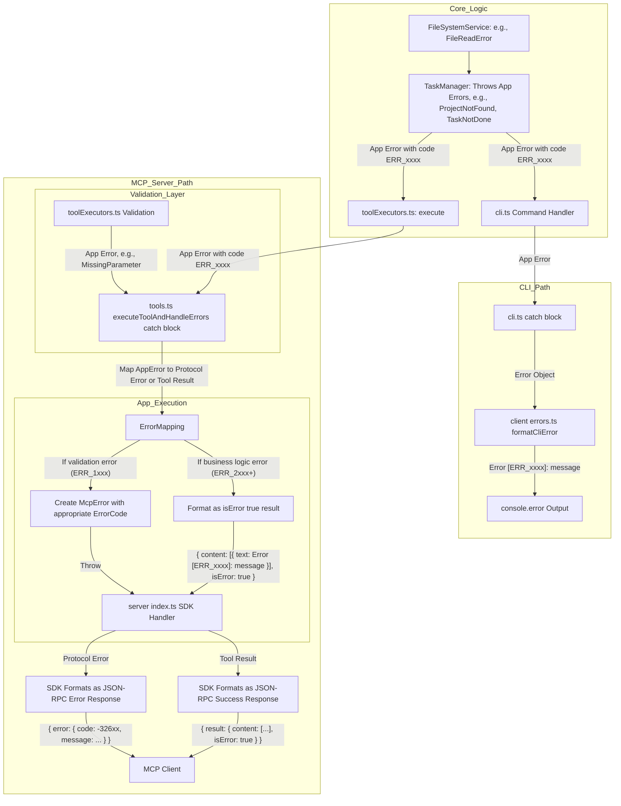

# Error Flow

**Explanation of Updated Error Flow and Transformations:**

Errors are consistently through a unified `AppError` system:

1. **Validation Errors** (`ERR_1xxx` series)
   - Used for validation issues (e.g., MissingParameter, InvalidArgument)
   - Thrown by tool executors during parameter validation
   - Mapped to protocol-level McpErrors in `executeToolAndHandleErrors`

2. **Business Logic Errors** (`ERR_2xxx` and higher)
   - Used for all business logic and application-specific errors
   - Include specific error codes
   - Returned as serialized CallToolResults with `isError: true`

---
> Source: [chriscarrollsmith/taskqueue-mcp](https://github.com/chriscarrollsmith/taskqueue-mcp) — distributed by [TomeVault](https://tomevault.io).
<!-- tomevault:4.0:windsurf_rules:2026-05-19 -->
