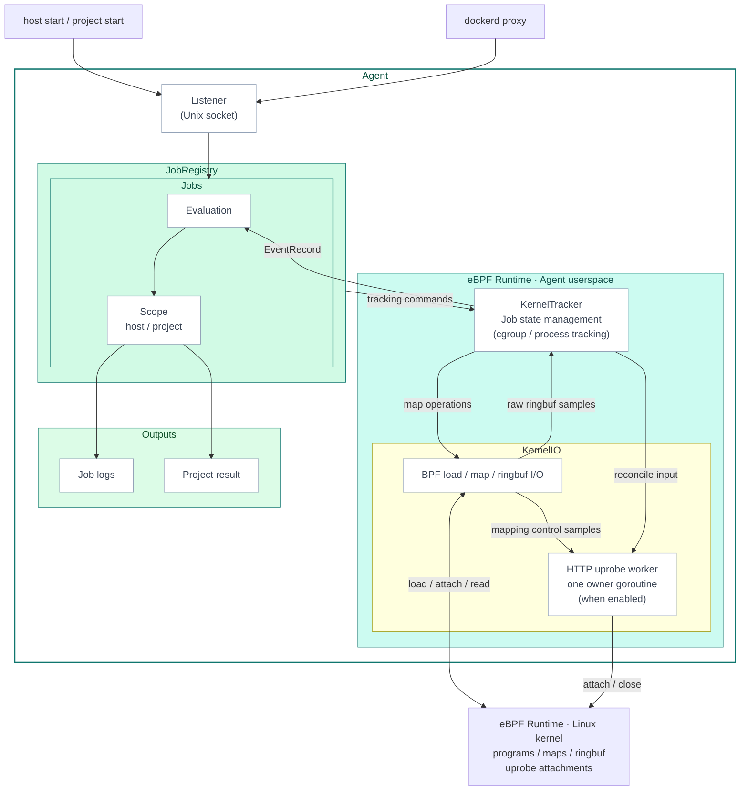

# Agent Architecture

The Agent is the central component that connects CI/CD job lifecycle with runtime events.

One agent process runs on one host and can observe multiple CI/CD jobs at the same time.
Kernel-side observation is handled with eBPF. Job lifecycle and rule evaluation are handled in userspace.

## Architecture

This diagram is the reference point for reading the Agent implementation.
`host start`, `project start`, and dockerd proxy staging requests enter the Agent through the Listener over a Unix socket.
JobRegistry issues tracking commands to KernelTracker.
Scope owns rule, summary, and output state, but it does not operate
KernelTracker or KernelIO directly. Together with the programs and resources
loaded into the Linux kernel, KernelTracker and KernelIO form the
**eBPF Runtime** described in the dedicated developer-guide chapter. eBPF
Runtime is an architectural layer, not a separate process or Go component.

## Concepts

### Job

A **Job** is one CI/CD job tracked by the Agent. It is identified by the provider-supplied job identity (repository, workflow run, job name, runner) and owns its own cgroup tracking, rule evaluation, scope-local summaries, and outputs. The Agent can run many Jobs at the same time; each Job is finalized independently when its work completes.

The Agent separates job identity from job metadata.
Identity is required to register and track a Job.
Metadata is attached to the Job for logs, reports, and search.

| Category | Fields | Required | Purpose |
| --- | --- | --- | --- |
| Job identity | `provider`, `provider_host`, `project_path` | Yes | Common provider identity for every Job |
| GitHub identity | `github_run_id`, `github_job`, `github_run_attempt`, `github_runner_tracking_id` | Yes for GitHub Jobs | Identifies a GitHub Actions job run attempt and runner tracking ID |
| GitLab identity | `gitlab_job_id` | Yes for GitLab Jobs | Identifies a GitLab CI job execution |
| Job metadata | `commit_sha`, `ref_name`, `trigger`, `actor_id`, `actor_name`, `github_workflow_ref`, `github_workflow_sha`, `github_workflow`, `gitlab_job_name`, `gitlab_config_ref_uri` | No | Enriches logs, reports, and triage |

### Scope

A **Scope** is the configuration / control surface attached to a Job. Two kinds exist, and a single Job may have one or both:

| Scope | Owner | Where it comes from | Typical setup |
| --- | --- | --- | --- |
| **Host scope** | Host operator (e.g., the platform team that installs cicd-sensor on the runner host) | `host start` from a runner hook | Self-hosted runners, where the agent is provisioned by infrastructure |
| **Project scope** | Project / repository operator (e.g., the team owning the workflow) | `project start` from the cicd-sensor-action (or equivalent) | GitHub-hosted runners, where each workflow brings its own configuration through the Action |

<!-- Content truncated to meet Windsurf 6KB limit -->

---
> Source: [cicd-sensor/cicd-sensor](https://github.com/cicd-sensor/cicd-sensor) — distributed by [TomeVault](https://tomevault.io).
<!-- tomevault:4.0:windsurf_rules:2026-09-26 -->
