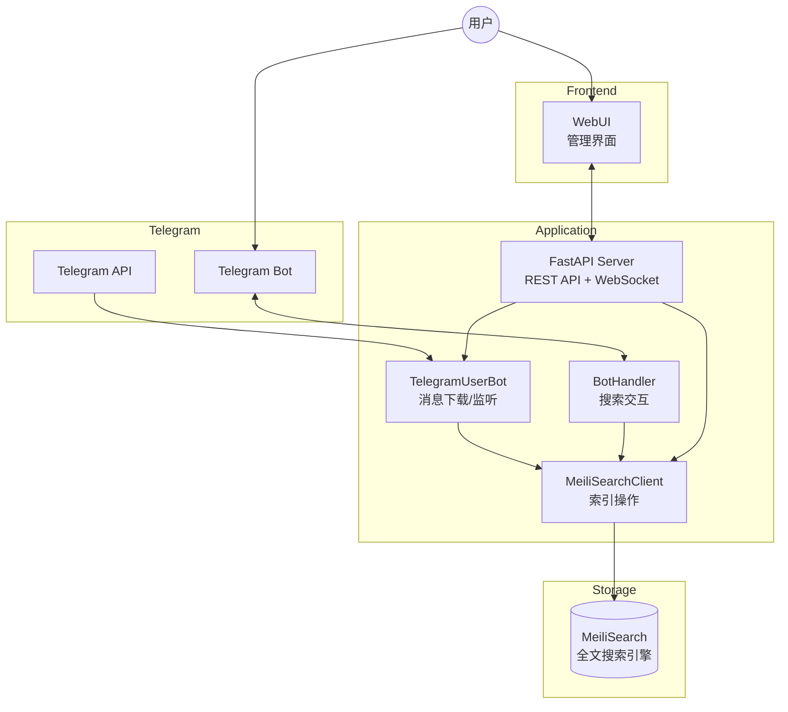

# Meilisearch4TelegramSearchCKJ

> 基于 Telethon + MeiliSearch 的 Telegram 中文/日文/韩文 (CJK) 消息搜索解决方案

---

## 项目概述

Telegram 官方搜索对中文支持不佳（不分词），本项目通过 MeiliSearch 全文搜索引擎解决此问题。

### 核心功能
- **消息下载**: 从 Telegram 下载历史消息到 MeiliSearch
- **实时监听**: 监听新消息并自动索引
- **Bot 搜索**: 通过 Telegram Bot 提供搜索界面
- **REST API**: 通过 FastAPI 提供 RESTful API（v0.2.0 新增）
- **WebSocket**: 实时推送下载进度（v0.2.0 新增）
- **黑白名单**: 支持配置要同步的频道/群组/用户

---

## 架构总览



### 数据流
1. **下载流程**: Telegram API -> TelegramUserBot -> serialize -> MeiliSearchClient -> MeiliSearch
2. **监听流程**: Telegram Events -> Handler -> MeiliSearch
3. **搜索流程 (Bot)**: User -> Bot -> MeiliSearch -> 格式化结果 -> User
4. **搜索流程 (API)**: WebUI -> FastAPI -> MeiliSearch -> JSON -> WebUI

---

## 技术栈

| 类别 | 技术 |
|------|------|
| 语言 | Python 3.10+ |
| Telegram 库 | Telethon 1.38+ |
| 搜索引擎 | MeiliSearch 0.33+ |
| Web 框架 | FastAPI 0.109+ |
| ASGI 服务器 | Uvicorn 0.27+ |
| 数据验证 | Pydantic 2.5+ |
| 日志 | coloredlogs |
| 重试机制 | tenacity |
| 构建工具 | hatchling (PEP 621) |
| 包管理 | uv |
| 容器化 | Docker / Docker Compose |
| 测试框架 | pytest + pytest-asyncio + httpx |

---

## 模块结构图

```mermaid
graph TD
    A["(根) Meilisearch4TelegramSearchCKJ"] --> B["src/tg_search"];
    B --> C["config"];
    B --> D["core"];
    B --> E["utils"];
    B --> I["services"];
    B --> G["api"];
    A --> F["tests"];
    A --> H["webui-example"];

    C --> C1["settings.py<br/>配置管理"];
    C --> C2["config_store.py<br/>ConfigStore 持久化"];
    D --> D1["bot.py<br/>Bot处理器"];
    D --> D2["telegram.py<br/>TG客户端"];
    D --> D3["meilisearch.py<br/>搜索客户端"];
    D --> D4["logger.py<br/>日志配置"];
    E --> E1["formatters.py<br/>格式化工具"];
    E --> E2["permissions.py<br/>权限检查"];
    E --> E3["message_tracker.py<br/>消息追踪"];
    E --> E4["memory.py<br/>内存监控"];
    I --> I1["config_policy_service.py<br/>策略服务"];
    I --> I2["search_service.py<br/>统一搜索服务"];
    I --> I3["contracts.py<br/>Service DTO"];
    I --> I4["observability_service.py<br/>统一可观测性服务"];
    I --> I5["container.py<br/>Service 容器"];
    I --> I6["runtime_control_service.py<br/>运行控制服务"];
    I --> I7["download_scheduler.py<br/>下载调度服务"];
    G --> G1["app.py<br/>FastAPI应用"];
    G --> G2["routes/<br/>API路由"];
    G --> G3["models.py<br/>Pydantic模型"];
    G --> G4["auth_store.py<br/>认证存储"];
    G --> G5["deps.py<br/>依赖注入"];
    G --> G6["state.py<br/>应用状态"];
    H --> H1["src/pages/<br/>页面组件"];
    H --> H2["src/api/<br/>API层"];
    H --> H3["src/store/<br/>状态管理"];
    H --> H4["src/hooks/<br/>React Hooks"];

    click C "./src/tg_search/config/CLAUDE.md" "查看 config 模块文档"
    click D "./src/tg_search/core/CLAUDE.md" "查看 core 模块文档"
    click E "./src/tg_search/utils/CLAUDE.md" "查看 utils 模块文档"
    click G "./src/tg_search/api/CLAUDE.md" "查看 api 模块文档"
    click F "./tests/CLAUDE.md" "查看 tests 模块文档"
    click H "./webui-example/CLAUDE.md" "查看 webui-example 模块文档"
```




## 目录结构

```
Meilisearch4TelegramSearchCKJ/
├── CLAUDE.md                    # 本文档
├── README.md                    # 项目说明
├── pyproject.toml               # 项目配置 (PEP 621)
├── .env.example                 # 环境变量示例
├── Dockerfile                   # Docker 构建文件
├── docker-compose.yml           # Docker Compose 配置
├── docker-compose-windows.yml   # Windows Docker 配置
├── docs/
│   ├── specs/                   # API 规格文档
│   │   ├── completed/           # 已完成的规格说明
│   │   ├── archived/            # 已归档的规格说明
│   │   └── SPEC-P0-webui-api-integration.md
│   └── operations/              # 运维手册
│       └── observability.md     # 日志与链路追踪 runbook
├── src/
│   └── tg_search/               # 主包
│       ├── __init__.py
│       ├── __main__.py          # CLI 入口 (python -m tg_search)
│       ├── main.py              # 主入口
│       ├── app.py               # Flask 健康检查入口（遗留）
│       ├── config/              # 配置模块
│       │   ├── __init__.py
│       │   ├── settings.py      # 环境变量配置
│       │   ├── config_store.py  # ConfigStore 配置持久化 (SQLite)
│       │   └── CLAUDE.md        # 模块文档
│       ├── core/                # 核心业务逻辑
│       │   ├── __init__.py
│       │   ├── bot.py           # Bot 处理器
│       │   ├── telegram.py      # Telegram 客户端
│       │   ├── meilisearch.py   # MeiliSearch 客户端
│       │   ├── logger.py        # 日志配置
│       │   └── CLAUDE.md        # 模块文档
│       ├── utils/               # 工具函数
│       │   ├── __init__.py
│       │   ├── formatters.py    # 格式化工具
│       │   ├── permissions.py   # 权限检查
│       │   ├── message_tracker.py # 消息追踪
│       │   ├── memory.py        # 内存监控
│       │   ├── bridge.py        # 桥接模块
│       │   └── CLAUDE.md        # 模块文档
│       ├── services/            # Service 层
│       │   ├── __init__.py
│       │   ├── contracts.py     # 领域 DTO

<!-- Content truncated to meet Windsurf 6KB limit -->

---
> Source: [clionertr/Meilisearch4TelegramSearchCKJ](https://github.com/clionertr/Meilisearch4TelegramSearchCKJ) — distributed by [TomeVault](https://tomevault.io).
<!-- tomevault:4.0:windsurf_rules:2026-06-02 -->
