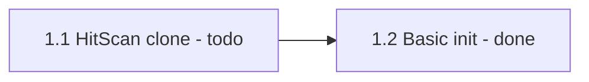
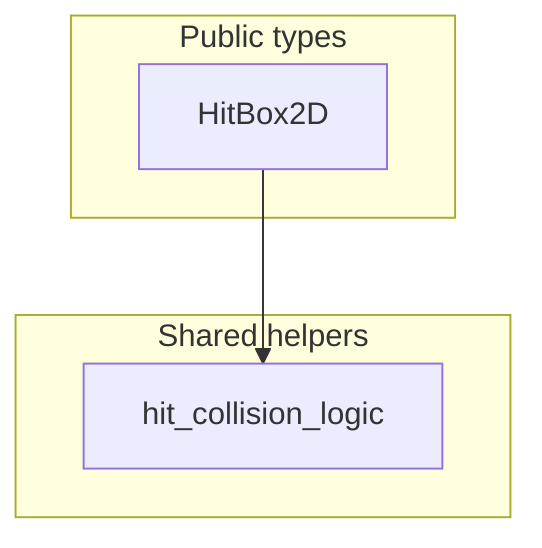

# Mermaid in Markdown

When creating or updating markdown (plans, READMEs, docs, `.cursor/plans/*`):

- Prefer **Mermaid** (` ```mermaid `) for architecture, data flow, phase/task progress, and relationships
- Pair diagrams with tables when a checklist/status column is useful
- Keep both in sync: if a task moves `todo` → `done`, update the Mermaid label and the table cell

## Mermaid syntax constraints

- No spaces in node IDs — use camelCase or underscores (`HitBox2D`, `phase1`)
- Labels with special chars: wrap in quotes (`A -->|"O(1) lookup"| B`)
- Subgraphs: `subgraph id [Label]` (ID required; no spaces in ID)
- Do not use `style`, `classDef`, or click handlers — theme handles colors
- Avoid reserved IDs: `end`, `subgraph`, `graph`, `flowchart`

## Status in diagrams

Embed status in node labels so progress is visible at a glance:



## Architecture example



## When not to use Mermaid

- Tiny one-line notes with no structure
- Pure API/reference lists where a table alone is clearer

---
> Source: [cluttered-code/godot-health-hitbox-hurtbox](https://github.com/cluttered-code/godot-health-hitbox-hurtbox) — distributed by [TomeVault](https://tomevault.io).
<!-- tomevault:4.0:windsurf_rules:2026-09-06 -->
