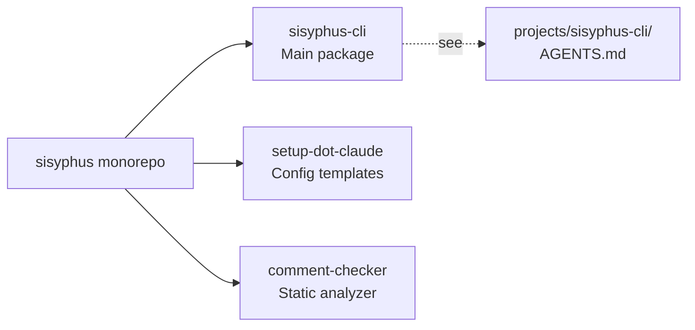

# PROJECT KNOWLEDGE BASE

**Generated:** 2025-11-18 17:24:07 KST
**Commit:** b90db35
**Branch:** master
**Repo:** https://github.com/code-yeongyu/sisyphus-private.git

## OVERVIEW

Python 3.12+ monorepo (uv workspace) → LLM agent orchestration CLI + Claude Code templates

**sisyphus-cli:** Compiles YAML work plans → production code via LLM agents
- Execute → Verify → Feedback loop
- Multi-agent (Claude, OpenCode), YAML plans, TUI/CLI



## STRUCTURE

```
sisyphus/
├── projects/
│   ├── sisyphus-cli/          → Main CLI (see AGENTS.md inside)
│   └── comment-checker/       → Python comment validator
├── sisyphus-setup-dot-claude/ → .claude config templates
│   ├── agents/                → Custom agents (executor, oracle, etc.)
│   ├── commands/              → Slash commands (/architect, /plan, etc.)
│   ├── hooks/                 → Tool hooks (static checks, etc.)
│   └── skills/                → Reusable skills (pr-creator, etc.)
└── pyproject.toml             → Workspace config (dev deps only)
```

## QUICK START

```bash
# Install CLI
uv pip install -e projects/sisyphus-cli/

# Create YAML plan → Execute tasks
sisyphus-speckit plan init .sisyphus/tasks/my-project.yaml
sisyphus-speckit task continue

# Test/Lint all
uv run pytest
uv run ruff check projects/
```

## NOTES

**For detailed architecture:** See `projects/sisyphus-cli/AGENTS.md`
- 2-phase Execute/Verify orchestration
- Agent Protocol (Claude, OpenCode)
- WorkPlan YAML v3.0 format
- TUI (Textual) + CLI (Rich)
- PlanNavigator, PlanLinter, GraphRenderer

**Workspace benefits:**
- Isolated dependencies per project
- Shared dev tools (basedpyright, pytest, ruff)
- Single lock file (uv.lock)

**Template usage:** Copy `sisyphus-setup-dot-claude/` → `.claude/` in your project

---
> Source: [code-yeongyu/sisyphus-private](https://github.com/code-yeongyu/sisyphus-private) — distributed by [TomeVault](https://tomevault.io).
<!-- tomevault:4.0:windsurf_rules:2026-06-30 -->
