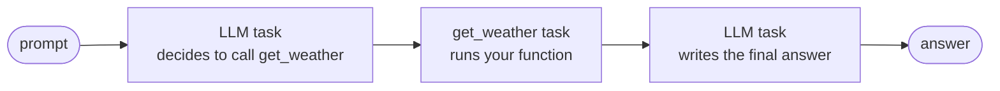

# Agent Concepts

An agent uses an LLM to decide what to do next, working in turns until a goal is met. The [Agents & AI overview](../ai/index.md) explains that loop. This page explains the concepts underneath: how Conductor represents an agent, how workflows and agents call each other, and the three ways to author one.

<section class="agent-concepts-hero" aria-label="How a workflow invokes an agent">
  <svg class="agent-concepts-hero__diagram" viewBox="0 0 570 315" role="img" aria-labelledby="agent-concepts-diagram-title agent-concepts-diagram-desc">
    <title id="agent-concepts-diagram-title">A workflow invokes an agent through the AGENT task</title>
    <desc id="agent-concepts-diagram-desc">A workflow reaches an AGENT task, which invokes a Conductor Agent compiled to a workflow graph of LLM turns and tool calls, or a remote A2A agent. The result returns to the workflow.</desc>
    <defs>
      <marker id="agent-concepts-arrow" markerWidth="8" markerHeight="8" refX="6" refY="4" orient="auto"><path class="agent-concepts-hero__arrowhead" d="M 0 0 L 8 4 L 0 8 z" /></marker>
    </defs>
    <rect class="agent-concepts-hero__conductor" x="18" y="24" width="220" height="160" rx="14" />
    <text class="agent-concepts-hero__conductor-detail" x="128" y="44" text-anchor="middle">Your workflow</text>
    <rect class="agent-concepts-hero__source agent-concepts-hero__source--workflow" x="42" y="52" width="172" height="40" rx="8" />
    <text class="agent-concepts-hero__title" x="128" y="77" text-anchor="middle">Task</text>
    <path class="agent-concepts-hero__arrow" d="M 128 92 V 106" marker-end="url(#agent-concepts-arrow)" />
    <rect class="agent-concepts-hero__source agent-concepts-hero__source--sdk" x="42" y="108" width="172" height="44" rx="8" />
    <text class="agent-concepts-hero__title" x="128" y="135" text-anchor="middle">AGENT task</text>
    <path class="agent-concepts-hero__arrow" d="M 214 122 H 296" marker-end="url(#agent-concepts-arrow)" />
    <text class="agent-concepts-hero__detail" x="255" y="114" text-anchor="middle">invoke</text>
    <path class="agent-concepts-hero__arrow" d="M 300 142 H 222" marker-end="url(#agent-concepts-arrow)" />
    <text class="agent-concepts-hero__detail" x="258" y="158" text-anchor="middle">result</text>
    <rect class="agent-concepts-hero__conductor" x="300" y="47" width="250" height="170" rx="14" />
    <text class="agent-concepts-hero__conductor-title" x="425" y="75" text-anchor="middle">Conductor Agent</text>
    <text class="agent-concepts-hero__conductor-detail" x="425" y="95" text-anchor="middle">compiled to a workflow graph</text>
    <rect class="agent-concepts-hero__source agent-concepts-hero__source--workflow" x="324" y="108" width="202" height="36" rx="8" />
    <text class="agent-concepts-hero__title" x="425" y="131" text-anchor="middle">LLM turn</text>
    <path class="agent-concepts-hero__arrow" d="M 425 144 V 156" marker-end="url(#agent-concepts-arrow)" />
    <rect class="agent-concepts-hero__source agent-concepts-hero__source--workflow" x="324" y="158" width="202" height="36" rx="8" />
    <text class="agent-concepts-hero__title" x="425" y="181" text-anchor="middle">Tool call</text>
    <path class="agent-concepts-hero__arrow" d="M 526 176 C 550 176 550 126 526 126" marker-end="url(#agent-concepts-arrow)" />
    <text class="agent-concepts-hero__detail" x="425" y="207" text-anchor="middle">loops until done</text>
    <path class="agent-concepts-hero__arrow" d="M 128 152 V 274 H 288" marker-end="url(#agent-concepts-arrow)" stroke-dasharray="5 4" />
    <text class="agent-concepts-hero__detail" x="140" y="236" text-anchor="start">or invoke remotely</text>
    <rect class="agent-concepts-hero__source agent-concepts-hero__source--a2a" x="300" y="245" width="250" height="58" rx="10" />
    <text class="agent-concepts-hero__title" x="316" y="270">Remote A2A agent</text>
    <text class="agent-concepts-hero__detail" x="316" y="290">independently deployed service</text>
  </svg>
</section>

## Agents are workflows underneath

A Conductor Agent starts as a definition, just like a workflow. The definition names the model to use, the instructions, and the tools the agent may call. Here is that definition in the Python SDK:

```python
from conductor.ai.agents import Agent, AgentRuntime, tool

@tool
def get_weather(city: str) -> str:
    return f"Weather for {city}"

agent = Agent(name="weather", model="openai/gpt-4o-mini",
              instructions="Answer concisely.", tools=[get_weather])
with AgentRuntime() as runtime:
    print(runtime.run(agent, "Weather in Seattle?").output)
```

When this runs, Conductor compiles the agent into a workflow graph and executes it. Nothing about that graph is special: each model call is a task, each tool call is a task, and the loop between them is workflow control flow. A run that calls the tool once produces this sequence of tasks:




<!-- Content truncated to meet Windsurf 6KB limit -->

---
> Source: [conductor-oss/conductor](https://github.com/conductor-oss/conductor) — distributed by [TomeVault](https://tomevault.io).
<!-- tomevault:4.0:windsurf_rules:2026-08-23 -->
