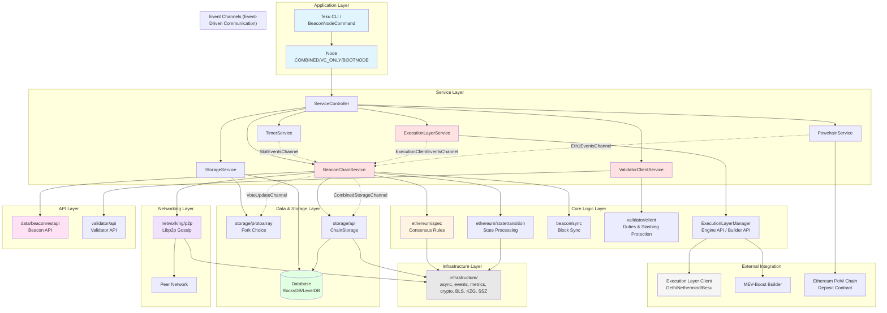

# AI Agent Instructions & Project Context

This file provides guidance to AI assistants when working with code in this repository.

## Project Overview

Teku is an open-source Ethereum consensus client written in Java, implementing a full beacon node and validator client. It is written in Java 25+ and follows the Ethereum consensus specifications.

## Build and Development Commands

### Building
```bash
# Full build with tests
./gradlew build

# Build without tests
./gradlew assemble

# Create distribution packages
./gradlew distTar installDist

# Build Docker image
./gradlew distDocker
```

### Code Style
```bash
# Apply Google Java code formatting (required before committing)
./gradlew spotlessApply

# Check code formatting
./gradlew spotlessCheck
```

### Testing
```bash
# Run all unit tests
./gradlew test

# Run tests for a specific module (example)
./gradlew :ethereum:spec:test

# Run integration tests
./gradlew integrationTest

# Run reference tests (consensus spec tests)
./gradlew referenceTest

# Run one reference suite manually (example)
ENV_TEST_TYPE=fork_choice/on_attestation ENV_SPEC=minimal ENV_MILESTONE=gloas ./gradlew --no-daemon :eth-reference-tests:referenceTest --tests tech.pegasys.teku.reference.ManualReferenceTestRunner -x generateReferenceTestClasses

# Run acceptance tests
./gradlew acceptanceTest

# Run property tests
./gradlew propertyTest
```

### Specrefs
Spec references live in `specrefs/` and reference the [Ethereum consensus specs](https://github.com/ethereum/consensus-specs/) or the user's local checkout of that repository. Run from the repository root:
```bash
ethspecify process --path=specrefs
ethspecify check --path=specrefs
```

When updating specrefs, keep exceptions only for references that are genuinely unimplemented, unnecessary, or intentionally implemented differently in Teku. If a reference has a real implementation source, remove it from exceptions and add stable `sources` anchors. After large generated diffs, check for duplicate entries:
```bash
rg '^- name:' specrefs/*.yml | sed 's/.*:- name: //' | sort | uniq -d
```

### Distribution
The built distribution is located in:
- Packaged: `build/distributions/`
- Expanded (ready to run): `build/install/teku/`

## Architecture Overview

### High-Level Architecture Diagram



### Module Dependency Layers

```
┌─────────────────────────────────────────────────────────────┐
│  teku/                    (Application Entry Point)         │
└────────────────────────────┬────────────────────────────────┘
                             │
┌────────────────────────────┴────────────────────────────────┐
│  services/         (Service Orchestration Layer)            │
│  ├─ beaconchain, chainstorage, executionlayer               │
│  ├─ powchain, timer, bootnode, zkchain                      │
└────────────┬──────────────────────────┬─────────────────────┘

<!-- Content truncated to meet Windsurf 6KB limit -->

---
> Source: [Consensys/teku](https://github.com/Consensys/teku) — distributed by [TomeVault](https://tomevault.io).
<!-- tomevault:4.0:windsurf_rules:2026-07-22 -->
