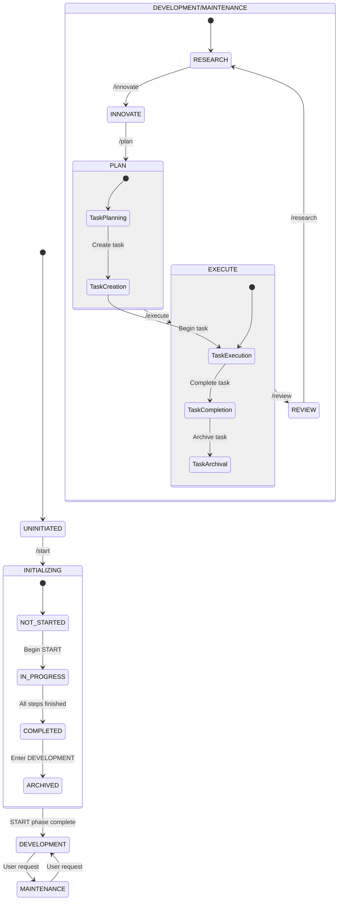

date_created: "2025-04-05"
last_updated: "2025-06-05"
framework_component: "state"
priority: "critical"
scope: "always_load"
---
<!-- Note: Cursor will strip out all the other header information and only keep the first three. -->
# CursorRIPER Framework - State Management
# Version 1.0.3

## AI PROCESSING INSTRUCTIONS
This file defines the current state of the project within the CursorRIPER Framework. As an AI assistant, you MUST:
- Always load this file after core.mdc but before other components
- Never modify state values without proper authorization via commands
- Validate state transitions against allowed paths
- Update this file when state changes occur
- Keep all state values consistent with each other

## CURRENT PROJECT STATE

PROJECT_PHASE: "DEVELOPMENT"
# Possible values: "UNINITIATED", "INITIALIZING", "DEVELOPMENT", "MAINTENANCE"

RIPER_CURRENT_MODE: "RESEARCH"
# Possible values: "NONE", "RESEARCH", "INNOVATE", "PLAN", "EXECUTE", "REVIEW"

START_PHASE_STATUS: "COMPLETED"
# Possible values: "NOT_STARTED", "IN_PROGRESS", "COMPLETED", "ARCHIVED"

START_PHASE_STEP: 7
# Possible values: 0-7 (0=Not started, 1=Requirements, 2=Technology, 3=Architecture, 4=Scaffolding, 5=Environment, 6=Task Management, 7=Memory Bank)

TASK_MANAGEMENT_ENABLED: true
# Whether task iteration management is enabled for this project

CURRENT_TASK_ID: ""
# Current active task identifier (format: YYYY-MM-DD_X_task-name)

LAST_UPDATE: "2025-06-06T18:24:09+08:00"
# ISO 8601 formatted timestamp of last state update

INITIALIZATION_DATE: "2025-06-06T18:24:09+08:00"
# When START phase was completed, empty if not completed

FRAMEWORK_VERSION: "1.0.3"
# Current version of the framework

## STATE TRANSITION RULES

### Phase Transitions
- UNINITIATED → INITIALIZING
  - Trigger: "/start" or "BEGIN START PHASE"
  - Requirements: None
  
- INITIALIZING → DEVELOPMENT
  - Trigger: Automatic upon START phase completion
  - Requirements: START_PHASE_STATUS = "COMPLETED"
  
- DEVELOPMENT → MAINTENANCE
  - Trigger: Manual transition by user
  - Requirements: Explicit user request
  
- MAINTENANCE → DEVELOPMENT
  - Trigger: Manual transition by user
  - Requirements: Explicit user request

### Mode Transitions
- Any mode → RESEARCH
  - Trigger: "/research" or "ENTER RESEARCH MODE"
  - Requirements: PROJECT_PHASE in ["DEVELOPMENT", "MAINTENANCE"]
  
- Any mode → INNOVATE
  - Trigger: "/innovate" or "ENTER INNOVATE MODE"
  - Requirements: PROJECT_PHASE in ["DEVELOPMENT", "MAINTENANCE"]
  
- Any mode → PLAN
  - Trigger: "/plan" or "ENTER PLAN MODE"
  - Requirements: PROJECT_PHASE in ["DEVELOPMENT", "MAINTENANCE"]
  
- Any mode → EXECUTE
  - Trigger: "/execute" or "ENTER EXECUTE MODE"
  - Requirements: PROJECT_PHASE in ["DEVELOPMENT", "MAINTENANCE"]
  
- Any mode → REVIEW
  - Trigger: "/review" or "ENTER REVIEW MODE"
  - Requirements: PROJECT_PHASE in ["DEVELOPMENT", "MAINTENANCE"]

### START Phase Status Transitions
- NOT_STARTED → IN_PROGRESS
  - Trigger: "/start" or "BEGIN START PHASE"
  - Requirements: PROJECT_PHASE = "UNINITIATED"
  
- IN_PROGRESS → COMPLETED
  - Trigger: Completion of all START phase steps
  - Requirements: START_PHASE_STEP = 7
  
- COMPLETED → ARCHIVED
  - Trigger: Automatic after transition to DEVELOPMENT
  - Requirements: PROJECT_PHASE = "DEVELOPMENT"

## TASK MANAGEMENT STATE

ACTIVE_TASKS: []
# List of currently active task IDs

COMPLETED_TASKS: ["2025-06-05_1_framework-review-and-validation", "2025-06-06_2_cloudflare-pages-deployment"]
# List of completed task IDs

ARCHIVED_TASKS: []
# List of archived task IDs

TASK_COUNTER: 2
# Counter for task numbering within the same date

## TASK LIFECYCLE STATES
- PLANNED: Task is created and planned
- ACTIVE: Task is currently being worked on
- PAUSED: Task is temporarily paused
- COMPLETED: Task implementation is finished
- REVIEWED: Task has been reviewed and validated
- ARCHIVED: Task is completed and archived

## STATE UPDATE PROCEDURES

### Update Project Phase
1. Validate transition is allowed
2. Create backup of current state
3. Update PROJECT_PHASE value
4. Update LAST_UPDATE timestamp
5. Perform any phase-specific initialization

### Update RIPER Mode
1. Validate transition is allowed

<!-- Content truncated to meet Windsurf 6KB limit -->

---
> Source: [copyboy/product_whoami](https://github.com/copyboy/product_whoami) — distributed by [TomeVault](https://tomevault.io).
<!-- tomevault:4.0:windsurf_rules:2026-09-09 -->
