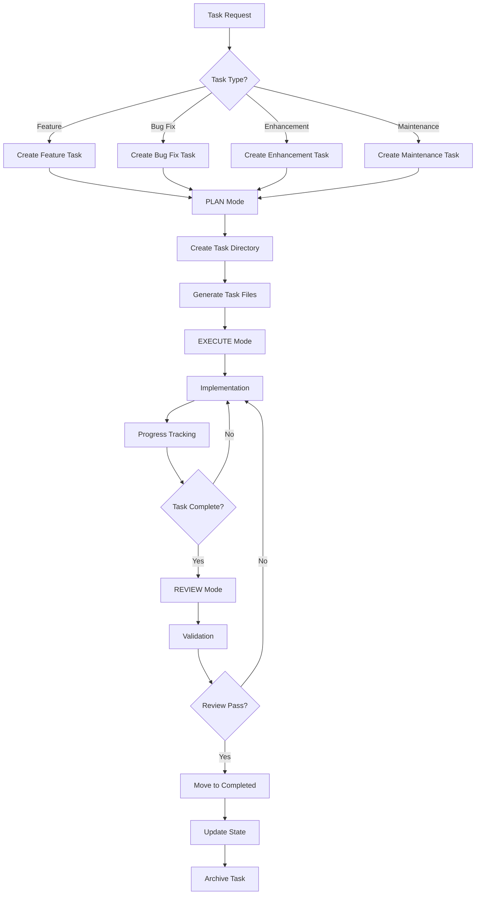

date_created: "2025-06-05"
last_updated: "2025-06-05"
framework_component: "task-management"
priority: "high"
scope: "development_maintenance"
---
<!-- Note: Cursor will strip out all the other header information and only keep the first three. -->
# CursorRIPER Framework - Task Management
# Version 1.0.0

## AI PROCESSING INSTRUCTIONS
This component manages enterprise-level task iteration and planning within the CursorRIPER Framework. As an AI assistant, you MUST:
- Only load this component when PROJECT_PHASE is "DEVELOPMENT" or "MAINTENANCE"
- Follow strict task creation and management protocols
- Maintain task documentation and progress tracking
- Never modify active tasks without proper authorization
- Integrate task management with the RIPER workflow

## TASK MANAGEMENT OVERVIEW

The Task Management system provides structured iteration tracking for enterprise development projects. It integrates seamlessly with the RIPER workflow to ensure proper planning, execution, and documentation of all development tasks.

## TASK DIRECTORY STRUCTURE

```
.tasks/
├── active/                    # Currently active tasks
│   └── YYYY-MM-DD_X_task-name/
│       ├── task.md           # Task definition and requirements
│       ├── plan.md           # Detailed implementation plan
│       ├── progress.md       # Implementation progress tracking
│       └── notes.md          # Development notes and decisions
├── completed/                 # Completed tasks
│   └── YYYY-MM-DD_X_task-name/
├── archived/                  # Archived tasks
│   └── YYYY-MM-DD_X_task-name/
└── templates/                 # Task templates
    ├── feature.md
    ├── bugfix.md
    ├── enhancement.md
    └── maintenance.md
```

## TASK NAMING CONVENTION

Tasks follow the format: `YYYY-MM-DD_X_task-name`
- YYYY-MM-DD: Creation date
- X: Sequential number for tasks created on the same date (1, 2, 3, etc.)
- task-name: Descriptive name using kebab-case

Examples:
- `2025-06-05_1_fix-jenkins-setting-validation`
- `2025-06-05_2_add-kubernetes-operator-support`
- `2025-06-06_1_enhance-devops-pipeline`

## TASK LIFECYCLE WORKFLOW



## TASK COMMANDS

### Task Creation Commands
- `/task create <type> <name>` - Create new task
- `/task list` - List all tasks
- `/task active` - Show active tasks
- `/task switch <task-id>` - Switch to specific task
- `/task complete` - Mark current task as complete
- `/task pause` - Pause current task
- `/task resume <task-id>` - Resume paused task

### Task Types
- `feature` - New feature development
- `bugfix` - Bug fix and troubleshooting
- `enhancement` - Improvement to existing functionality
- `maintenance` - Code maintenance and refactoring

## TASK TEMPLATE STRUCTURES

### Feature Task Template
```markdown
# Feature Task: [Task Name]

## Task Information
- **Task ID**: [YYYY-MM-DD_X_task-name]
- **Type**: Feature
- **Priority**: [High/Medium/Low]
- **Estimated Time**: [X hours/days]
- **Assignee**: [Name/AI Assistant]
- **Created**: [Date]
- **Status**: [PLANNED/ACTIVE/PAUSED/COMPLETED/REVIEWED/ARCHIVED]

## Requirements
- [ ] Functional requirement 1
- [ ] Functional requirement 2
- [ ] Non-functional requirement 1

## Acceptance Criteria
- [ ] Criteria 1
- [ ] Criteria 2
- [ ] Criteria 3

## Dependencies
- [ ] Dependency 1
- [ ] Dependency 2

## Technical Considerations
- Architecture impact
- Security considerations
- Performance implications
- Testing requirements

## Implementation Notes
[Space for implementation details and decisions]
```

### Bug Fix Task Template
```markdown
# Bug Fix Task: [Task Name]

## Task Information
- **Task ID**: [YYYY-MM-DD_X_task-name]
- **Type**: Bug Fix
- **Priority**: [Critical/High/Medium/Low]
- **Severity**: [Critical/Major/Minor]
- **Assignee**: [Name/AI Assistant]
- **Created**: [Date]
- **Status**: [PLANNED/ACTIVE/PAUSED/COMPLETED/REVIEWED/ARCHIVED]

## Bug Description
[Detailed description of the bug]

## Steps to Reproduce
1. Step 1
2. Step 2
3. Step 3

## Expected Behavior
[What should happen]

## Actual Behavior
[What actually happens]

## Root Cause Analysis
[Analysis of the root cause]

## Fix Strategy
[Approach to fix the bug]

## Test Plan
- [ ] Unit tests
- [ ] Integration tests
- [ ] Regression tests

## Verification Steps
- [ ] Verification step 1
- [ ] Verification step 2
```

## TASK INTEGRATION WITH RIPER WORKFLOW

### RESEARCH Mode + Task Management
- Analyze existing tasks and their relationships
- Research similar implementations
- Gather requirements and constraints
- Document findings in task notes

### INNOVATE Mode + Task Management
- Brainstorm implementation approaches

<!-- Content truncated to meet Windsurf 6KB limit -->

---
> Source: [copyboy/product_whoami](https://github.com/copyboy/product_whoami) — distributed by [TomeVault](https://tomevault.io).
<!-- tomevault:4.0:windsurf_rules:2026-09-09 -->
