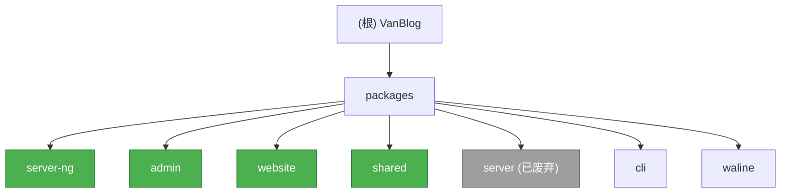

# CLAUDE.md

**最后更新时间**: 2025-12-22 13:05:00 CST

---

## 变更记录 (Changelog)

### 2025-12-22 - Logger 规范调整与 server-ng 迁移完成

- **规范调整**：
  - Logger 使用规范调整为**仅后端（server-ng）强制使用**
  - 前端（admin/website）保留 console，用于快速开发调试
  - 理由：前端调试主要在浏览器 DevTools，console 更灵活；后端需要结构化日志用于生产监控

- **server-ng 迁移成果**：
  - ✅ server-ng 包 Logger 迁移完成（生产代码 100% 使用 NestJS Logger）

### 2025-12-20 - 文档完善与代码优化

- **文档完善**：
  - 完成高优先级文档任务
  - 移除过时的插件开发笔记并修正误导信息
  - 新增 Shortcode 系统指南（`packages/server-ng/docs/SHORTCODE_GUIDE.md`）

- **代码优化**：
  - 移除已注释代码和未使用的导入
  - 重构测试文件命名（`.test.ts` → `.spec.ts`）
  - 优化插件测试覆盖率（beian、cat、email-notification、social-links）

- **架构改进**：
  - 所有插件已迁移至函数式 API（简化结构，移除 `module.ts`、`*.service.ts`）
  - 插件支持独立 `package.json`（beian、cat、social-links、book-manager、read-time）
  - 新增 ESLint 配置（`server-ng/eslint.config.mjs`）

### 2025-12-17 - 插件系统增量更新

- **新增功能**：
  - 函数式 Plugin API（`packages/shared/src/plugin/plugin-api.interface.ts`）
  - Shortcode 系统模块（`packages/server-ng/src/modules/shortcode`）
  - 2 个新插件：book-manager-plugin、read-time-plugin
  - admin 插件管理页面（`src/pages/SystemConfig/tabs/Plugin.tsx`）
  - 响应式信号系统（`@vanblog/shared/signals`）

- **文档更新**：
  - 新增插件开发指南：`packages/server-ng/docs/PLUGIN_DEVELOPMENT.md`
  - 新增复杂插件迁移指南：`packages/server-ng/docs/PLUGIN_MIGRATION_COMPLEX.md`
  - 更新 `.claude/index.json`（版本 1.2.0）

- **架构改进**：
  - 插件系统支持函数式 API（简化轻量级插件开发）
  - PluginModule 新增 5 个服务（plugin-api.service、plugin-config.service 等）
  - Shared package 新增 2 个导出路径（`/signals`、`/plugin`）

### 2025-12-09 - 架构师初始化

- 完成仓库初始化扫描，识别 7 个核心模块
- 创建根级与模块级 CLAUDE.md 文档结构
- 生成模块结构图与导航面包屑
- 覆盖率：已扫描核心配置、入口文件、类型系统与模块结构

---

## 项目愿景

VanBlog 是一个现代化的个人博客系统，包含管理后台、公开网站和 API 服务器。本仓库为 [CornWorld](https://github.com/CornWorld) 维护的分支版本。

**核心特性**：

- 基于 Drizzle ORM + SQLite 的轻量级数据层
- ts-rest 驱动的类型安全 API 契约
- 单一数据源（Single Source of Truth）类型系统
- 模块化插件架构（8 个内置插件 + 函数式 API）
  - beian-plugin（备案信息）
  - book-manager-plugin（书籍管理）
  - cat-plugin（访客追踪）
  - email-notification-plugin（邮件通知）
  - read-time-plugin（阅读时长）
  - rewards-plugin（打赏）
  - social-links-plugin（社交链接）
  - rss-plugin（RSS 订阅）
- Shortcode 系统（插件可注册自定义短代码）
- 高测试覆盖率（80% 阈值）

---

## 架构总览

### 技术栈

| 层级         | 技术选型                               | 版本要求                       |
| ------------ | -------------------------------------- | ------------------------------ |
| **包管理器** | pnpm workspace                         | >=10.x                         |
| **运行时**   | Node.js                                | >=22 (server-ng), >=18 (admin) |
| **API 服务** | NestJS 11 + ts-rest                    | -                              |
| **数据库**   | Drizzle ORM + SQLite                   | -                              |
| **前端框架** | React 19 (admin), Next.js 15 (website) | -                              |
| **构建工具** | Vite 6-7.x, Next.js 15.x               | -                              |
| **测试框架** | Vitest                                 | 80% 覆盖率阈值                 |
| **代码质量** | ESLint 9 (flat config) + Prettier      | -                              |

### 类型系统：单一数据源设计

```
Drizzle 表定义 (packages/shared/src/runtime/db.ts)
      ↓ drizzle-zod
Zod Schema (packages/shared/src/runtime/schema.ts)
      ↓
ts-rest Contracts (packages/shared/src/contracts/*.contract.ts)
      ↓
前端（类型推导）+ 后端（运行时校验）
```

**命名约定**：

| 层级       | 前缀 | 用途          | 示例                            |
| ---------- | ---- | ------------- | ------------------------------- |
| **数据库** | `$`  | 数据库操作    | `$User`, `$UserIns`, `$UserUpd` |
| **API**    | 无   | API 请求/响应 | `User`, `UserReq`, `UserPatch`  |

- `$Entity` - SELECT schema（从数据库读取）
- `$EntityIns` - INSERT schema（写入数据库）
- `$EntityUpd` - UPDATE schema（更新数据库）
- `Entity` - API 响应（通常是去除敏感字段的 `$Entity`）
- `EntityReq` - API 请求体（创建）
- `EntityPatch` - API 请求体（更新）

---

## 模块结构图



---

## 模块索引

| 模块          | 路径                  | 职责                                     | 状态      | 语言       | 版本          | 文档                                        |
| ------------- | --------------------- | ---------------------------------------- | --------- | ---------- | ------------- | ------------------------------------------- |
| **server-ng** | `packages/server-ng/` | NestJS API 服务器 (Drizzle ORM, ts-rest) | 🟢 活跃   | TypeScript | 0.54.0-corn.6 | [CLAUDE.md](./packages/server-ng/CLAUDE.md) |
| **admin**     | `packages/admin/`     | React 19 + Vite + Ant Design 管理后台    | 🟢 活跃   | TypeScript | 0.54.0-corn.6 | [CLAUDE.md](./packages/admin/CLAUDE.md)     |

<!-- Content truncated to meet Windsurf 6KB limit -->

---
> Source: [CornWorld/vanblog](https://github.com/CornWorld/vanblog) — distributed by [TomeVault](https://tomevault.io).
<!-- tomevault:4.0:windsurf_rules:2026-05-27 -->
