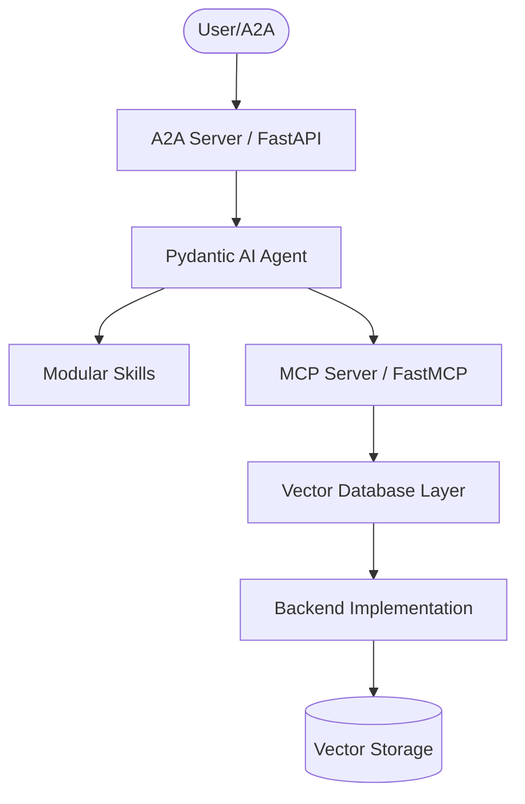
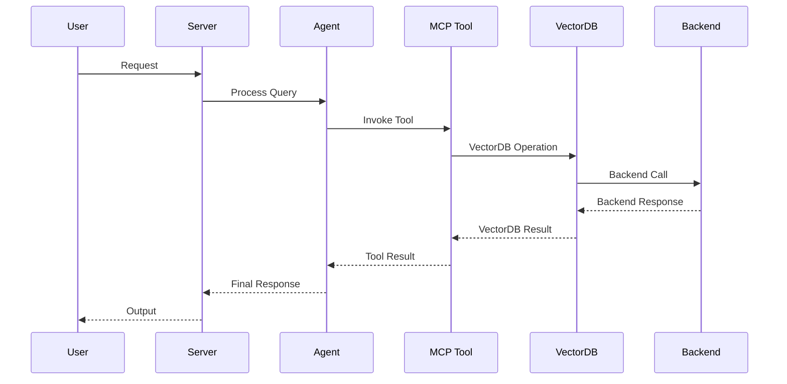

# AGENTS.md

> Claude Code loads this file via `CLAUDE.md` (`@AGENTS.md` import) — the two stay
> in sync. Edit **this** file, not `CLAUDE.md`.

## Tech Stack & Architecture
- Language/Version: Python 3.10+
- Core Libraries: `agent-utilities`, `fastmcp`, `pydantic-ai`
- Key principles: Functional patterns, Pydantic for data validation, asynchronous tool execution.
- Architecture:
    - `mcp_server.py`: Main MCP server entry point and tool registration.
    - `agent.py`: Pydantic AI agent definition and logic.
    - `skills/`: Directory containing modular agent skills (if applicable).
    - `vectordb/`: Vector database implementations for multiple backends.
    - `retriever/`: Retriever implementations for each backend.

### Architecture Diagram


### Workflow Diagram


## Commands (run these exactly)
# Installation
pip install .[all]

# Quality & Linting (run from project root)
pre-commit run --all-files

# Execution Commands
# vector-mcp\nvector_mcp.mcp:mcp_server\n# vector-agent\nvector_mcp.agent:agent_server

# Testing
# Start test databases
podman-compose -f docker-compose.test.yml up -d

# Run all tests
python -m pytest tests/test_all_backends.py -v

# Run specific backend tests
python -m pytest tests/test_all_backends.py -k chromadb -v
python -m pytest tests/test_all_backends.py -k postgres -v
python -m pytest tests/test_all_backends.py -k mongodb -v
python -m pytest tests/test_all_backends.py -k qdrant -v
python -m pytest tests/test_all_backends.py -k couchbase -v

# Stop test databases
podman-compose -f docker-compose.test.yml down

## Project Structure Quick Reference
- MCP Entry Point → `mcp_server.py`
- Agent Entry Point → `agent.py`
- Source Code → `vector_mcp/`
- Skills → `skills/` (if exists)
- VectorDB Implementations → `vector_mcp/vectordb/`
- Retriever Implementations → `vector_mcp/retriever/`
- Tests → `tests/`

### File Tree
```text
├── .bumpversion.cfg
├── .dockerignore
├── .env
├── .gitattributes
├── .github
│   └── workflows
│       └── pipeline.yml
├── .gitignore
├── .pre-commit-config.yaml
├── AGENTS.md
├── Dockerfile
├── LICENSE
├── MANIFEST.in
├── README.md
├── compose.yml
├── debug.Dockerfile
├── docker-compose.test.yml
├── mcp
│   ├── documents
│   └── pgdata
├── mcp.compose.yml
├── pyproject.toml
├── pytest.ini
├── requirements.txt
├── scripts
│   ├── debug_embedding.py
│   ├── debug_full.py
│   ├── debug_pg.py
│   ├── investigate_timeout.py
│   ├── test_embedding.py
│   ├── validate_a2a_agent.py
│   ├── validate_agents.py
│   ├── validate_all_dbs.py
│   └── verify_deps.py
├── tests
│   ├── README.md
│   ├── TEST_RESULTS.md
│   ├── reproduce_chunking.py
│   ├── test_all_backends.py
│   ├── test_databases.py
│   ├── test_optional_dependencies.py
│   ├── test_protocol_compliance.py
│   ├── test_pruning.py
│   └── test_vector_mcp_server.py
└── vector_mcp
    ├── __init__.py
    ├── __main__.py
    ├── agent.py
    ├── mcp_server.py
    ├── retriever
    │   ├── __init__.py
    │   ├── chromadb_retriever.py
    │   ├── couchbase_retriever.py
    │   ├── llamaindex_retriever.py
    │   ├── mongodb_retriever.py
    │   ├── postgres_retriever.py
    │   ├── qdrant_retriever.py
    │   └── retriever.py
    └── vectordb
        ├── __init__.py
        ├── base.py
        ├── chromadb.py
        ├── couchbase.py
        ├── db_utils.py
        ├── mongodb.py
        ├── postgres.py
        └── qdrant.py
```

## Code Style & Conventions
**Always:**
- Use `agent-utilities` for common patterns (e.g., `create_mcp_server`, `create_agent`).
- Define input/output models using Pydantic.
- Include descriptive docstrings for all tools (they are used as tool descriptions for LLMs).
- Check for optional dependencies using `try/except ImportError`.
- Use manual vector operations when SDK authentication issues arise (see MongoDB/Couchbase implementations).

**Good example:**
```python
from agent_utilities import create_mcp_server
from mcp.server.fastmcp import FastMCP

mcp = create_mcp_server("my-agent")

@mcp.tool()
async def my_tool(param: str) -> str:
    """Description for LLM."""
    return f"Result: {param}"
```

## Vector Database Backends

### Supported Backends
- **ChromaDB**: Local filesystem-based vector database (no container required)
- **PostgreSQL/PGVector**: PostgreSQL with pgvector extension (container required)
- **MongoDB**: MongoDB with manual cosine similarity calculation (container required)
- **Qdrant**: Qdrant vector database (container required)

<!-- Content truncated to meet Windsurf 6KB limit -->

---
> Source: [craftingcodegig/vector-mcp](https://github.com/craftingcodegig/vector-mcp) — distributed by [TomeVault](https://tomevault.io).
<!-- tomevault:4.0:windsurf_rules:2026-08-28 -->
