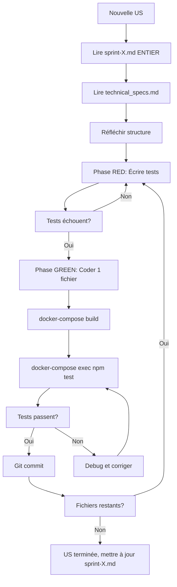

# ⚠️ RÈGLES CRITIQUES DE DÉVELOPPEMENT

> **Objectif**: Permettre à une IA de travailler de manière autonome sur ce projet microservices

## 🎯 RÈGLES FONDAMENTALES (NON NÉGOCIABLES)

### 1. 🐳 DOCKER OBLIGATOIRE
```powershell
# ✅ TOUJOURS
docker-compose build <service>
docker-compose up -d <service>
docker-compose exec <service> npm test

# ❌ JAMAIS
npm install  # en local
npm test     # en local
```

### 2. 📖 LIRE AVANT D'AGIR
**Ordre de lecture systématique** :
1. `docs/sprints/sprint-X.md` → User Story complète (TOUTE lire)
2. `docs/technical_specs.md` → Schémas Prisma, structure API
3. `docs/CONFORMITE_LEGALE.md` → Si allergènes/nutrition (300k€ d'amende)
4. `docs/design_system.md` → Standards de code

**Pourquoi**: Évite 2h de refactoring en lisant 5 minutes de doc

### 3. 🐢 DÉVELOPPEMENT MICRO-INCRÉMENTAL

**Processus obligatoire** :
```
Étape 1: Lire doc complète (30%)
Étape 2: Réfléchir structure (10%)
Étape 3: Coder 1 fichier < 100 lignes (20%)
Étape 4: Tester ce fichier (20%)
Étape 5: Commit si OK (10%)
Étape 6: Répéter (10%)
```

**🚨 Indicateurs de danger** :
- 🔴 > 3 fichiers modifiés non testés → STOP
- 🔴 > 100 lignes sans tester → STOP
- 🔴 Test échoue et tu ne sais pas pourquoi → STOP
- 🔴 Tu te dis "je testerai après" → STOP

**Règle absolue** : Si un test échoue, ne JAMAIS continuer avant de corriger

### 4. 🧪 TDD STRICT
```javascript
// Phase RED: Écrire le test (doit échouer)
it('should create recipe', async () => {
  const res = await request(app).post('/').send(data);
  expect(res.status).toBe(201); // ❌ Échoue
});

// Phase GREEN: Implémenter le minimum
export const create = async (req, res) => {
  const recipe = await prisma.recipe.create({ data: req.body });
  res.status(201).json(recipe); // ✅ Passe
};

// Phase REFACTOR: Améliorer si besoin
```

**Ne JAMAIS coder sans test d'abord**

---

## 📁 STRUCTURE DU PROJET

### Architecture microservices
```
frontend/          → React (port 80)
api-gateway/       → Proxy (port 3000)
services/
  auth-service/    → Users + JWT (port 3001, DB: saas_auth)
  recipe-service/  → Recettes (port 3002, DB: saas_recipes)
  label-service/   → PDF INCO (port 3003)
  production-service/ → Planning (port 3004, DB: saas_production)
postgres/          → 3 bases séparées
redis/             → Cache
minio/             → Storage S3
```

**Principe anti-monolithique** :
- 1 service = 1 responsabilité = 1 DB = 1 container
- Services indépendants, déployables séparément
- Communication via API REST uniquement

### Structure d'un service backend
```
src/
  controllers/     → Logique HTTP (< 30 lignes/fonction)
  services/        → Logique métier (< 100 lignes/fonction)
  validators/      → Schémas Zod (< 50 lignes)
  middleware/      → Auth, error handling
  routes/          → Définition endpoints
  lib/             → Utils réutilisables (prisma.js, etc.)
  index.js         → Point d'entrée (export default app)
tests/
  *.integration.test.js → Tests d'intégration
  setup.js         → Config Jest (NODE_ENV=test)
prisma/
  schema.prisma    → Modèles de données
  migrations/      → Historique des changements DB
```

**Standards de code** :
- Fichiers < 200 lignes
- Fonctions < 30 lignes
- 1 fichier = 1 responsabilité
- ESM (`import/export`, extensions `.js`)
- Validation Zod partout

---

## 🗺️ NAVIGATION DANS LA DOCUMENTATION

### Où trouver quoi ?

| Besoin | Document | Ce qu'on y trouve |
|--------|----------|-------------------|
| Comprendre une US | `docs/sprints/sprint-X.md` | Critères acceptation, points, statut |
| Schémas DB | `docs/technical_specs.md` | Modèles Prisma, relations |
| Règles métier | `docs/cahier_des_charges.md` | Fonctionnalités, specs |
| Standards code | `docs/design_system.md` | Patterns, conventions |
| Conformité légale | `docs/CONFORMITE_LEGALE.md` | INCO, allergènes, nutrition |
| Architecture globale | `docs/plan_projet_dev.md` | Vue d'ensemble, décisions |
| Erreurs passées | `docs/IMPORTANT_INSTRUCTIONS.md` | Erreurs documentées + correctifs |

### Workflow de travail



---

## 🚨 ERREURS CRITIQUES DOCUMENTÉES (À NE JAMAIS REFAIRE)

### 1. ❌ Lecture incomplète de doc
**Symptôme** : Lire seulement les 50 premières lignes d'un fichier  
**Impact** : Migration Prisma incomplète, Sprint marqué "complet" à tort  
**Correctif** : TOUJOURS lire un document EN ENTIER  

### 2. ❌ Faux tokens au lieu de vrais JWT
**Symptôme** : `Bearer test-token-${userId}` dans les tests  
**Impact** : Tous les tests retournent 403  
**Correctif** : Utiliser `jwt.sign({ userId }, secret, { expiresIn: '1h' })`

### 3. ❌ SQL manuel au lieu de Prisma Migrate
**Symptôme** : `ALTER TABLE` direct dans PostgreSQL  
**Impact** : État incohérent (DB ≠ schema.prisma)  

<!-- Content truncated to meet Windsurf 6KB limit -->

---
> Source: [Creariax5/M-tiers-de-Bouche](https://github.com/Creariax5/M-tiers-de-Bouche) — distributed by [TomeVault](https://tomevault.io).
<!-- tomevault:4.0:windsurf_rules:2026-06-02 -->
