# AGENTS.md

Project knowledge base for AI coding agents.

## Project Overview

**pycubrid** is a Pure Python DB-API 2.0 (PEP 249) driver for the CUBRID relational database.
It communicates with CUBRID via the CAS wire protocol over TCP/IP, requiring no C extensions
or native CCI library.

- **Language**: Python 3.10+
- **Protocol**: CUBRID CAS binary protocol (version 8, since CUBRID 10.2+)
- **License**: MIT
- **Version**: 1.1.0

## Architecture

```mermaid
graph TD
    root["pycubrid/ - Main package (9 modules)"]
    init["__init__.py - Public API, PEP 249 globals, connect(), exports"]
    exceptions["exceptions.py - Full PEP 249 exception hierarchy (10 classes)"]
    types[types.py - PEP 249 type objects and constructors]
    constants[constants.py - CAS protocol constants]
    packet[packet.py - PacketReader/PacketWriter binary serialization]
    protocol["protocol.py - CAS protocol packets (18 packet classes)"]
    connection[connection.py - PEP 249 Connection class]
    cursor[cursor.py - PEP 249 Cursor class]
    lob[lob.py - LOB support]
    typed[py.typed - PEP 561 marker]

    root --> init
    root --> exceptions
    root --> types
    root --> constants
    root --> packet
    root --> protocol
    root --> connection
    root --> cursor
    root --> lob
    root --> typed
```



### Module Responsibilities

| Module | Role |
|---|---|
| `__init__.py` | PEP 249 module globals (`apilevel`, `threadsafety`, `paramstyle`), `connect()`, re-exports |
| `exceptions.py` | `Warning`, `Error`, `InterfaceError`, `DatabaseError` + 6 subclasses |
| `types.py` | `DBAPIType` class, `STRING`/`BINARY`/`NUMBER`/`DATETIME`/`ROWID` type objects, constructors |
| `constants.py` | `CASFunctionCode` (41 funcs), `CUBRIDDataType` (27+ types), `CUBRIDStatementType`, protocol/data-size constants |
| `packet.py` | Low-level binary read/write with big-endian byte ordering |
| `protocol.py` | High-level CAS packet classes for each function code (18 packet types) |
| `connection.py` | `Connection` — TCP socket management, transactions, autocommit, LOB creation, schema info |
| `cursor.py` | `Cursor` — execute, executemany, fetch, callproc, description, iteration |
| `lob.py` | `Lob` class — LOB type, length, file locator, packed handle |

## Wire Protocol Summary

### Packet Format

```
[0:4]  DATA_LENGTH  (4 bytes, big-endian int)
[4:8]  CAS_INFO     (4 bytes)
[8:]   PAYLOAD      (variable length)
```

### Handshake Flow

1. **ClientInfoExchange**: Send 10 bytes (NO header) — magic `"CUBRS"` when `ssl` is requested (STARTTLS) or `"CUBRK"` plaintext, plus client type + version. Broker replies a 4-byte int32: `0`=ok, `<0`=fail-fast (`OperationalError`), `>0`=redirect port (reconnect on the new port WITHOUT repeating the handshake).
2. **TLS upgrade (optional)**: If `ssl` was truthy, upgrade the live transport via `loop.start_tls()` (async) or `ssl.SSLContext.wrap_socket()` (sync) before `OPEN_DATABASE`.
3. **OpenDatabase**: Send db/user/password (628 bytes payload, no header — `PacketWriter(reserve_header=False)`)
4. **PrepareAndExecute / Prepare+Execute → Fetch → CloseQuery → EndTran → CloseDatabase**

### Key Constants

- Magic string: `"CUBRK"` (plaintext) or `"CUBRS"` (STARTTLS-requested)
- Client type: `CAS_CLIENT_JDBC = 3`
- Protocol version: `8` (since CUBRID 10.2)
- Byte order: Big-endian throughout

## Development

### Setup

```bash
git clone https://github.com/cubrid-lab/pycubrid.git
cd pycubrid
make install          # pip install -e ".[dev]"
```

### Key Commands

```bash
make test             # Offline tests with 95% coverage threshold
make lint             # ruff check + format
make format           # Auto-fix lint/format
make integration      # Docker → integration tests → cleanup
```

### Test Commands (manual)

```bash
# Offline (no DB needed)
pytest tests/ -v --ignore=tests/test_integration.py \
  --cov=pycubrid --cov-report=term-missing --cov-fail-under=95

# Integration (requires Docker)
docker compose up -d
export CUBRID_TEST_URL="cubrid://dba@localhost:33000/testdb"
pytest tests/test_integration.py -v
```

### Test Stats

- **471 offline tests + 41 integration tests**, **99.88% coverage** (1654 statements, 2 missed)
- Coverage threshold: 95% (CI-enforced)

## Code Conventions

### Style

- **Linter/Formatter**: Ruff
- **Line length**: 100 characters
- **Target Python**: 3.10+
- **Imports**: `from __future__ import annotations` in every module
- **Type hints**: Full typing; PEP 561 compliant (`py.typed`)
- **super()**: Always `super().__init__()`, never `super(ClassName, self)`

### Anti-Patterns (Never Do)

- No type suppression (`as any`, `@ts-ignore`, etc.)
- No f-string interpolation in SQL queries
- No `super(ClassName, self)` — use `super()` only
- No Python 2 constructs
- No empty `except` blocks

## Development Workflow (cubrid-lab org standard)

All non-trivial work across cubrid-lab repositories MUST follow this 4-phase cycle:

1. **Oracle Design Review** — Consult Oracle before implementation to validate architecture, API surface, and approach. Raise concerns early.
2. **Implementation** — Build the feature/fix with tests. Follow existing codebase patterns.

<!-- Content truncated to meet Windsurf 6KB limit -->

---
> Source: [cubrid-lab/pycubrid](https://github.com/cubrid-lab/pycubrid) — distributed by [TomeVault](https://tomevault.io).
<!-- tomevault:4.0:windsurf_rules:2026-08-11 -->
