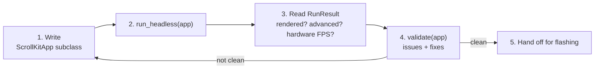

# AGENTS.md — Building ScrollKit LED apps with an AI agent

This is the entry doc for an AI agent (or a human) writing a **ScrollKit** app: a
scrolling LED-matrix display that runs unchanged on the **Adafruit MatrixPortal
S3** (CircuitPython) and on the desktop **pygame simulator**.

The whole point of the workflow below is to close the gap that bites everyone:
*the simulator runs at full desktop speed and looks fantastic, but the real
device is ~100× slower and RAM-tiny, so apps that look great in the sim can crawl
or fail on hardware.* ScrollKit lets you discover that **in the simulator,
headless, before flashing** — so you can iterate without a human and without a
board.

> Repo-specific rules (keep code under `/src`, CircuitPython compatibility) live
> in **CLAUDE.md** — read it too if you're editing this repository. This file is
> about *authoring ScrollKit apps*.

---

## The loop

1. **Write** a `ScrollKitApp` subclass (imperative Python — no config/DSL).
2. **Run it headless**: `scrollkit.dev.run_headless(app, frames=N, screenshot=...)`.
3. **Read** the `RunResult`: did it render? did it advance? would it run on
   hardware (estimated FPS + warnings)?
4. **Validate**: `scrollkit.dev.validate(app)` for structured issues + fixes.
5. **Iterate** until the result is clean, then hand off for flashing.



Everything in step 2-4 is **desktop-only** (`scrollkit.dev` raises `ImportError`
on CircuitPython by design — it pulls in numpy/pygame). The app you write in
step 1 runs on both.

### Running things

This is a library-only repo (no root `code.py`/`boot.py` — those live in the
separate app repo that consumes ScrollKit). Still run tests/scripts with
`PYTHONSAFEPATH=1` to keep the CWD off `sys.path`:

```bash
PYTHONSAFEPATH=1 PYTHONPATH=src python your_script.py
```

The harness sets `SDL_VIDEODRIVER=dummy` itself, so no window is needed.

---

## A minimal working app

```python
from scrollkit.app.base import ScrollKitApp
from scrollkit.display.content import ScrollingText


class HelloApp(ScrollKitApp):
    def __init__(self):
        super().__init__(enable_web=False, update_interval=10)

    async def create_display(self):
        from scrollkit.display.simulator import SimulatorDisplay
        return SimulatorDisplay(width=64, height=32)

    async def setup(self):
        # Add content to the queue; the display loop renders it.
        self.content_queue.add(ScrollingText("HELLO HARDWARE", y=12, color=0x00FF88))
```

Verify it:

```python
from scrollkit.dev import run_headless

result = run_headless(HelloApp(), frames=120, screenshot="frame.png")
print(result.as_text())
```

`run_headless` drives the app's real display loop deterministically (exactly `N`
frames, no inter-frame sleep — same app + same `frames` → same pixels), saves a
PNG, and returns a JSON-able `RunResult`.

---

## The panel and colors

- **Panel:** 64 × 32 pixels (the MatrixPortal S3 standard). `x` is 0-63, `y` is
  0-31. `y=12` vertically centers an ~8px-tall font.
- **Color:** a 24-bit RGB int `0xRRGGBB` (e.g. `0xFF8800`) **or** an `(r, g, b)`
  tuple with each channel 0-255. **Color name *strings* do not work** with the
  content classes below — a string is treated as a *settings key* (e.g. one
  defined via `self.settings.define(key, default, type="color")`), so an
  undefined name like `"red"` silently falls back to white instead of raising.
  `run_headless` won't catch this; `validate(app)` will (a `color_string`
  error). To use a name programmatically:
  `scrollkit.dev.capabilities()["named_colors"]["orange"]`.

## Content types

Discover these (and their exact parameters) at runtime with
`scrollkit.dev.capabilities()` — it's introspected from the live code so it can't
go stale. The two you'll use most:

- `ScrollingText(text, x=None, y=0, color=None, speed=None, priority=2,
  static_duration=5.0, palette=None, direction="vertical", palette_steps=8)` —
  scrolls right-to-left; ideal for anything wider than 64px. `color=None` /
  `speed=None` resolve to the library's settings defaults (effectively
  `0xFFFFFF` / `25` px/sec when no app override is set).
- `StaticText(text, x=0, y=0, color=0xFFFFFF, duration=None, priority=2,
  palette=None, direction="vertical", palette_steps=8)` — fixed; keep it short
  enough to fit 64px (≈10 chars) or it'll be clipped.

**Gradient fill:** pass `palette` to either class for a static gradient in the
normal font instead of a flat `color` — two stops `(0xA0E8FF, 0x206080)` for a
simple gradient, three+ for multi-stop, or `depth_palette(color)`
(`scrollkit.display.colors`) to derive a subtle close ramp from one base colour.
`direction` is `"vertical"` (default, reads as depth) / `"horizontal"` /
`"diagonal"`; reverse by reversing the palette. When `palette` is set, `color` is
ignored. Static fill, zero per-frame cost — for *animated* colour use `BitmapText`
+ a `palette_effect`. Details at `capabilities()["text_fills"]`; colour generators

<!-- Content truncated to meet Windsurf 6KB limit -->

---
> Source: [czei/scrollkit](https://github.com/czei/scrollkit) — distributed by [TomeVault](https://tomevault.io).
<!-- tomevault:4.0:windsurf_rules:2026-07-10 -->
