# Claude Code Project Bootstrap

## Overview

Set up a complete Claude Code project from scratch — GitHub repo, README, hooks, file protection, build-gated commits, secret scanning, auto-formatting, and git workflow conventions. Works for any stack.

## When to Use

- Starting a new project that will use Claude Code
- Adding guardrails to an existing project
- User asks about protecting files, blocking commands, or enforcing builds
- User wants to replicate hooks/workflow from another project
- User wants to create a GitHub repo for a project

## Bootstrap Flow

```dot
digraph bootstrap {
  rankdir=LR;
  "Has git repo?" [shape=diamond];
  "Init git + GitHub repo" [shape=box];
  "Has README?" [shape=diamond];
  "Generate README" [shape=box];
  "Create hooks + settings" [shape=box];
  "Write CLAUDE.md" [shape=box];
  "Initial commit + push" [shape=box];

  "Has git repo?" -> "Init git + GitHub repo" [label="no"];
  "Has git repo?" -> "Has README?" [label="yes"];
  "Init git + GitHub repo" -> "Has README?";
  "Has README?" -> "Generate README" [label="no"];
  "Has README?" -> "Create hooks + settings" [label="yes"];
  "Generate README" -> "Create hooks + settings";
  "Create hooks + settings" -> "Write CLAUDE.md";
  "Write CLAUDE.md" -> "Initial commit + push";
}
```



## Step 1: Git + GitHub Repo

Skip if the project already has a git repo and remote.

### New repo from existing directory

```bash
cd your-project
git init
```

### Create GitHub repo

Ask the user for visibility preference (public/private). Default to private.

```bash
# Private (default)
gh repo create <repo-name> --private --source=. --push

# Public
gh repo create <repo-name> --public --source=. --push

# With description
gh repo create <repo-name> --private --source=. --push --description "Short project description"
```

**If the directory is empty (brand new project):**
```bash
mkdir <project-name> && cd <project-name>
git init
gh repo create <repo-name> --private --source=. --push
```

### .gitignore

If no `.gitignore` exists, create one appropriate for the stack. Always include:

```gitignore
# Claude Code (user-specific, not shared)
.claude/settings.local.json

# Secrets
.env
.env.*
*.key
*.pem

# OS
.DS_Store
Thumbs.db
```

Add stack-specific entries (node_modules, __pycache__, target/, build/, etc.).

## Step 2: README

If no `README.md` exists, generate one. Ask the user for project context or infer from existing files.

````markdown
# Project Name

Brief description of what this project does.

## Getting Started

### Prerequisites
- List dependencies and tools needed

### Installation
```
# Installation commands
```

### Development
```
# How to run locally
```

### Testing
```
# How to run tests
```

## Project Structure

```
overview of key directories and files
```

## Contributing

This project uses [Claude Code](https://claude.ai/claude-code) with automated guardrails:
- Destructive git commands are blocked (force push, reset --hard, etc.)
- Commits are gated behind passing builds and tests
- Sensitive files (.env, credentials) are protected from accidental writes
- Conventional commits enforced: `<type>(<scope>): <subject>`
- Secrets are scanned on every file write
- Code is auto-formatted on save (if formatters are installed)

See `CLAUDE.md` for full development workflow.

## License

[Choose appropriate license]
````

**Adapt the README** to the actual project — don't use the template verbatim. Fill in real values from the codebase, package.json, Cargo.toml, go.mod, etc.

## Step 3: Directory Structure

```
your-project/
├── .claude/
│   ├── hooks/
│   │   ├── validate-bash.sh      # blocks destructive commands, gates commits
│   │   ├── protect-files.sh      # blocks writes to sensitive files
│   │   ├── build-check.sh        # auto-detects stack, runs build + tests
│   │   ├── scan-secrets.sh       # warns on hardcoded secrets in written files
│   │   ├── session-check.sh      # verifies hooks setup on session start
│   │   └── auto-format.sh        # formats files after write (if formatters installed)
│   ├── statusline.sh              # context window monitor (progressive color)
│   ├── settings.json             # hook wiring + statusline (committed to git)
│   └── settings.local.json       # user allow-list (NOT committed)
├── .gitignore
├── README.md
└── CLAUDE.md                      # project instructions
```

## Step 4: Hook System

Hooks are shell scripts triggered by Claude Code's tool lifecycle. They read JSON from stdin and control execution via exit codes:

| Exit | Meaning |
|------|---------|
| `0` | Allow |
| `1` | Soft block (retry possible) |
| `2` | Hard block (denied) |

### settings.json (commit this)

```json
{
  "hooks": {
    "PreToolUse": [
      {
        "matcher": "Bash",
        "hooks": [{"type": "command", "command": "\"$CLAUDE_PROJECT_DIR\"/.claude/hooks/validate-bash.sh", "timeout": 10}]
      },
      {
        "matcher": "Write|Edit",

<!-- Content truncated to meet Windsurf 6KB limit -->

---
> Source: [damoli1103/claude-code-project-bootstrap](https://github.com/damoli1103/claude-code-project-bootstrap) — distributed by [TomeVault](https://tomevault.io).
<!-- tomevault:4.0:windsurf_rules:2026-06-17 -->
