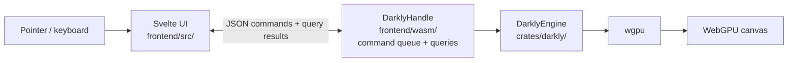

# Darkly — Agent Guidelines

Darkly is a web-based, gpu-native paint program written in Rust, Svelte and Typescript, leveraging WebAssembly and WebGPU.

This document exists to keep Darkly ***minimal, elegant, and proper***.

## Architecture

Darkly's Rust core (`crates/darkly/`) is platform-agnostic — document, brush engine, GPU compositor, undo, and `DarklyEngine` itself, all with zero platform dependencies. A WASM bridge (`frontend/wasm/`) wraps the engine for the browser: commands and query results cross the boundary as JSON (or `serde_wasm_bindgen` values for typed payloads).

State splits three ways:

- **Document** — authoritative, undoable, serializable. Layer tree, modifiers (mask / selection), canvas size. Reasoning about it requires no GPU.
- **Session** — transient editor state on `DarklyEngine`. Active tool, view transform, in-flight stroke, undo stack.
- **Compositor** — derived realization. GPU textures, pipelines, render caches. Always rebuildable from the document on the next frame.

Data flows downhill: document → compositor, session → compositor. Never upward. Bulk pixel data (layer pixels, mask pixels) is the principled exception — GPU-authoritative because it's huge and the GPU is where it's used.

**Runtime stack** — pointer event to pixel:



**Repo layout** — `★` marks modular subsystems (drop a new file with `pub fn register()`; `build.rs` discovers it — no central registration to touch):

```
crates/darkly/src/
  document/             Authoritative model (layer tree, canvas, ...)
    layer_kinds/  ★     group, raster, void
    modifiers/    ★     mask, selection
  engine/               DarklyEngine — session + per-domain dispatch
                          (painting, rendering, load/save, export,
                           floating, flatten, merge, undo_dispatch, …)
  gpu/                  Compositor, ping-pong blend, regions, readback
    blend_modes/  ★     normal, multiply, hue, color_burn, …
    veils/        ★     post-process effects (rainy_glass, VHS, painting, …)
    voids/        ★     procedural fill sources (camera, noise, …)
  brush/                Stroke engine + node-graph brush engine, GPU
                        compute pipelines, WGSL compilation, brush
                        bundles + import. Files: stroke_engine, eval,
                        pipeline, composite_pipeline, gpu_context,
                        wgsl_compile, bundle, library, save_points,
                        preview_renderer, checkpoint_ring, …
    nodes/        ★     graph nodes — input, math, color, shape,
                        modulation, output terminals
    stabilizers/  ★     stroke stabilizers (laplacian, …)
    import/             brush-bundle importers (krita)
  config/
    sections/     ★     schema sections (canvas, input, ui, …)
    presets/      ★     bundled presets (gimp, krita, photoshop)
  tools/          ★     brush, fill, gradient, colorpicker,
                        select (rect/ellipse/lasso/polygon/magic_wand), transform
  undo/                 Per-domain undoable ops (layer, modifier, property,
                        selection, gpu_region, compound)
  format/               Save/load — zip container, manifest, registry I/O
  nodegraph/            Generic node-graph (graph, compiler, layout)
frontend/wasm/          WASM bridge (wasm-bindgen) — single API surface
frontend/src/           Svelte UI
shared/styles/          @darkly/styles — tokens + themes (UI + website)
website/                Astro + Starlight site (splash, docs, /demo/)
```

### Hotkey & Config Presets

Darkly's settings use a three-layer resolution order: `user → overlay (krita/ps/gimp) → defaults`. Placement rule is documented in [`crates/darkly/presets/defaults.yaml`](crates/darkly/presets/defaults.yaml)'s header; host-editor reference hotkeys live in [`docs/*-default-hotkeys.md`](docs/).

## Modularity Principle

**Default to modular.** When you design anything with more than one variant — or that will plausibly grow one — the first question is "what's the unit, and how does the rest of the code stay ignorant of which one it's looking at?" That mindset applies at every scale: from a small enum where one method per variant beats a `match` at the call site, up to full subsystems with traits, registries, and per-variant files. The cost of designing modularly up front is almost always small; the cost of retrofitting after centralized branching has spread across the codebase is large. Hand-written dispatch should feel like an exception that needs justifying, not the default shape.

This is a stronger claim than the Engineering Principle's "build a proper system for it" — that one says *don't hack*; this one says *the proper system is almost always one where new variants slot in without consumers being edited*.


<!-- Content truncated to meet Windsurf 6KB limit -->

---
> Source: [darkly-art/darkly](https://github.com/darkly-art/darkly) — distributed by [TomeVault](https://tomevault.io).
<!-- tomevault:4.0:windsurf_rules:2026-06-03 -->
