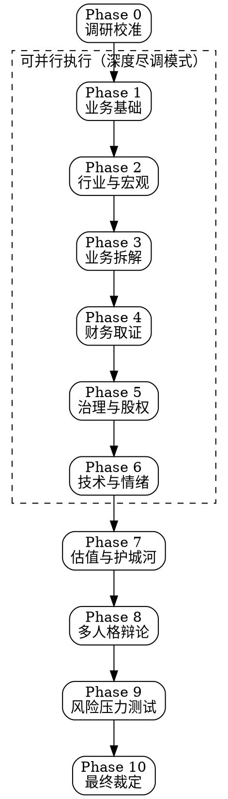

# Stock Deep Research — 终极尽调系统

## Overview

11 阶段 × 12 人格 × 5 维评分的股票深度调研框架。融合专业尽调方法论、多大师视角分析、Druckenmiller 确信度体系、财务取证检测，生成机构级调研报告。

**核心理念**：不做预测，只做取证。每个结论必须有数据支撑，每个风险必须被量化。

## When to Use

- 用户要求深度分析某只股票
- 用户想做投资尽职调查
- 用户问"该不该买某只股票"
- 用户要求对比分析多只股票
- 用户需要完整的调研报告

**When NOT to Use:**
- 只需要看个价格或基础指标 → 用基础股票查询
- 纯技术面短线交易信号 → 用技术分析工具
- 量化因子挖掘 → 用量化研究框架

---

## Phase 0: Research Calibration（调研校准）

在开始任何研究前，必须确认以下参数：

### 必问问题

1. **股票标的**：代码/名称？哪个市场（A股/美股/港股）？
2. **投资风格**（提供选项）：
   - 🏛️ 价值投资（安全边际、内在价值）
   - 🚀 成长投资（TAM、竞争壁垒）
   - 🔄 困境反转（催化剂、流动性）
   - 💰 红利投资（股息可持续性）
   - 📊 GARP（合理价格的成长）
3. **持有周期**：短期 (<6月) / 中期 (6-18月) / 长期 (1-3年+)
4. **风险偏好**：保守 / 平衡 / 激进
5. **研究深度**：
   - ⚡ **快速扫描**（15分钟，关键指标 + 信号灯）
   - 📋 **标准调研**（45分钟，完整 11 阶段）
   - 🔬 **深度尽调**（2-4小时，28 Agent 并行 + 多人格辩论）

### 风格适配矩阵

| 风格 | 研究重心 | 首选估值 | 核心指标 |
|------|----------|----------|----------|
| 价值 | 资产负债表、正常化盈利 | P/B, EV/EBITDA, DCF(保守) | P/B, FCF Yield, 安全边际 |
| 成长 | TAM、竞争格局 | PEG, DCF(激进), 用户模型 | 营收增速, 留存率, TAM渗透率 |
| 困境反转 | 流动性、偿债、催化剂 | 清算价值, 期权价值 | 负债率, 现金跑道, 催化剂时间线 |
| 红利 | 股息可持续性 | DDM, FCF Yield | 股息率, 派息率, FCF覆盖 |
| GARP | 成长与估值平衡 | PEG, GARP Score | PEG<1.5, ROE>15%, 盈利加速 |

---

## 11-Phase Research Framework（11 阶段调研框架）

### 调研流程图

**深度尽调模式**：Phase 1-6 使用 Task 工具并行执行，每个 Phase 分配 4 个子 Agent（共约 24 个并行 Agent），Phase 7-10 串行综合。

---

### Phase 1: Business Foundation（业务基础）

**目标**：建立公司事实底座，回答"这家公司到底是什么"。

**研究项**：
1. **公司身份**：成立时间、上市时间、总部、员工数
2. **商业模式画布**：价值主张、客户群、收入模式、成本结构
3. **产品/服务矩阵**：各产品线的收入占比、增速、生命周期阶段
4. **客户分析**：前5大客户集中度、客户留存率、获客成本
5. **价值链定位**：上下游关系、议价能力、替代风险
6. **战略方向**：管理层公开声明的战略、近3年并购记录

**数据来源**：年报/10-K、公司官网、招股书、行业报告

**输出文件**：`01_Business_Foundation.md`

---

### Phase 2: Industry & Macro Analysis（行业与宏观分析）

**目标**：判断行业所处周期和宏观环境是否有利。

**研究项**：
1. **行业生命周期**：导入期/成长期/成熟期/衰退期
2. **供需格局**：产能利用率、库存周期、价格趋势
3. **竞争格局**（波特五力）：
   - 现有竞争者强度
   - 新进入者威胁
   - 替代品威胁
   - 供应商议价力
   - 买方议价力
4. **政策环境**：
   - A股特别关注：产业政策、监管变化、集采/反垄断
   - 美股特别关注：FDA审批、反垄断、贸易政策
5. **宏观环境**（Druckenmiller 框架）：
   - 当前宏观周期阶段（扩张/峰值/收缩/复苏）
   - 利率环境与流动性
   - 通胀趋势
6. **行业关键驱动力**：识别 3-5 个决定行业走向的核心变量

**数据来源**：行业报告、统计局数据、央行政策、新闻

**输出文件**：`02_Industry_Macro.md`

---

### Phase 3: Business Deep Dive（业务拆解）

**目标**：拆解利润引擎，理解"钱从哪里来"。

**研究项**：
1. **分部拆解**：各业务板块的收入/利润/增速/利润率
2. **单位经济模型**：
   - SaaS：LTV/CAC、月度流失率、ARR
   - 零售：坪效、同店增长、周转率
   - 制造：产能利用率、良率、单位成本
   - 平台：GMV、Take Rate、DAU/MAU
3. **定价权分析**：
   - 近 5 年价格变化 vs 销量变化
   - 提价能力（价格弹性）
   - 品牌溢价量化
4. **增长驱动拆解**：
   - 量增 vs 价增 vs 新产品
   - 有机增长 vs 并购增长
5. **运营杠杆**：固定成本占比、规模效应曲线

**输出文件**：`03_Business_Deep_Dive.md`

---

### Phase 4: Financial Quality Forensics（财务质量取证）

**目标**：判断财务数据的真实性和质量，检测造假红旗。

**研究项**：

#### 4A. 核心财务健康（3-5年趋势）
1. **盈利能力**：毛利率、净利率、ROE、ROIC 趋势
2. **杜邦分析**：利润率 × 周转率 × 杠杆 的分解趋势
3. **现金流质量**：OCF/净利润比率（健康应 >80%）
4. **资产负债表**：流动比率、速动比率、利息覆盖倍数

#### 4B. 财务异常检测（红旗系统）

参考 `references/financial-forensics.md` 执行以下检测：

| # | 检测项 | 红旗阈值 | 风险等级 |
|---|--------|----------|----------|
| 1 | 应收账款增速 vs 营收增速 | AR增速 > 营收增速×1.5 | 🔴 高 |
| 2 | 现金流背离 | 利润增长但OCF下降 | 🔴 高 |
| 3 | 存货异常 | 存货增速 > 营收增速×2 | 🟡 中 |
| 4 | 毛利率突变 | 波动 > 行业均值波动×2 | 🟡 中 |
| 5 | 资本化率异常 | R&D/CapEx资本化比率突增 | 🔴 高 |
| 6 | 关联交易 | 占比 > 30% | 🔴 高 |
| 7 | 审计意见 | 非标意见或频繁更换审计师 | 🔴 高 |
| 8 | 现金收入比 | < 80% | 🟡 中 |
| 9 | 商誉占净资产比 | > 30% | 🟡 中 |
| 10 | 经营活动现金流/负债 | < 10% | 🟡 中 |

**财务质量评分**：每项通过得 10 分，满分 100。60 分以下标记为"财务质量存疑"。

#### 4C. 同行对比
- 关键财务指标 vs 行业中位数
- 异常偏离项标注

**输出文件**：`04_Financial_Forensics.md`

---

### Phase 5: Governance & Ownership（治理与股权）

**目标**：判断管理层是否值得信任，利益是否对齐。

**研究项**：
1. **股权结构**：
   - 控股股东类型（国企/民企/家族/机构）
   - 股权集中度（CR1/CR5/CR10）
   - 实控人持股比例与质押率
2. **管理层评估**：
   - CEO 任期与背景
   - 管理层薪酬 vs 业绩关联度
   - 管理层/董事持股变动（近 12 月）
3. **资本配置能力**：
   - ROIC vs WACC 趋势（>WACC 说明在创造价值）
   - 分红、回购、再投资的比例
   - 并购记录（成功率、整合效果）
4. **治理风险**：
   - 关联交易频率与金额
   - 独董比例与独立性
   - 信息披露质量（及时性、完整性）
5. **A股特色**：
   - 大股东减持公告
   - 限售股解禁时间表
   - 股权质押风险

**输出文件**：`05_Governance.md`

---

### Phase 6: Technical & Sentiment（技术面与市场情绪）

**目标**：判断当前市场定价行为和情绪状态。

**研究项**：

#### 6A. 技术分析
1. **趋势判断**：MA20/50/200 排列、趋势强度
2. **关键指标**：RSI、MACD、布林带
3. **支撑/阻力位**：近期高低点、均线位、整数关口
4. **量价关系**：放量/缩量、量价背离
5. **形态识别**：头肩顶/底、双顶/底、旗形、三角形

#### 6B. 市场情绪
1. **机构持仓变动**：
   - 美股：13F filing、机构增减持
   - A股：北向资金、公募基金持仓
2. **内部人交易**：管理层/大股东买卖记录
3. **分析师覆盖**：
   - 一致预期 EPS 修正方向（上调/下调）
   - 目标价中位数 vs 当前价
   - 覆盖分析师数量变化
4. **做空数据**（美股）：空头比例、借券成本
5. **散户情绪**：社交媒体热度、搜索趋势

#### 6C. 市场广度信号（Druckenmiller 维度）
1. **市场结构健康度**：行业参与广度
2. **分配/承接判断**：主力资金流向

<!-- Content truncated to meet Windsurf 6KB limit -->

---
> Source: [DEROOCE/stock-deep-research](https://github.com/DEROOCE/stock-deep-research) — distributed by [TomeVault](https://tomevault.io).
<!-- tomevault:4.0:windsurf_rules:2026-06-17 -->
