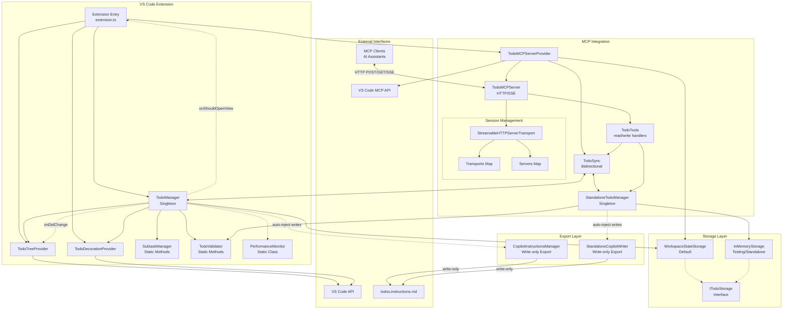

## Project Overview

This extension provides VS Code agent mode with todo management tools through MCP (Model Context Protocol) and an integrated VS Code tree view. It enables AI assistants to proactively track tasks during development workflows with support for subtasks, priorities, auto-injection into Copilot instructions.

For more details:

- [Main README](../README.md) - Feature overview and usage
- [MCP Server Documentation](../src/mcp/README.md) - Server architecture, protocol details, and completion support
- [MCP TypeScript SDK](https://github.com/modelcontextprotocol/typescript-sdk/)

## IMPORTANT:

- ALWAYS plan changes using detailed todos
- ALWAYS keep `.github/copilot-instructions.md` up-to-date with the latest architecture and coding standards, addressing any drifts in implementation!
- ALWAYS validate changes by running compile and test commands!
- NEVER proactively create documentation files (\*.md) or README files. Only create documentation files if explicitly requested by the User.
- NEVER make changes backwards compatible unless explicitly requested by the User.
- NEVER create one-off scripts to test changes.

## Architecture



## Performance Optimizations

### Event System Architecture

The extension uses a **consolidated event pattern** to prevent performance issues:

```typescript
// CORRECT: Single consolidated event
todoManager.onDidChange((change) => {
  // Handle both todo and title changes
  updateTreeView(change.todos);
  updateTitle(change.title);
});

// WRONG: Never use separate events (causes cascade loops)
// todoManager.onDidChangeTodos(...) // DO NOT USE
// todoManager.onDidChangeTitle(...) // DO NOT USE
```

**Key Requirements:**

- Always use the single `onDidChange` event that provides both todos and title
- Never create or use separate events for different properties
- All managers (TodoManager, StandaloneTodoManager) must implement the same event interface

### Change Deduplication

All state changes use enhanced hash-based deduplication with version tracking to handle edge cases:

```typescript
private fireConsolidatedChange(): void {
  const isEmptyTransition = // ... detect empty transitions
  const currentHash = JSON.stringify({
    todos: this.todos,
    title: this.title,
    version: isEmptyTransition ? ++this.updateVersion : this.updateVersion
  });
  if (currentHash !== this.lastUpdateHash || isEmptyTransition) {
    this.lastUpdateHash = currentHash;
    this.onDidChangeEmitter.fire({ todos: this.todos, title: this.getTitle() });
  }
}
```

**Key Features:**

- Version field increments on empty transitions to force updates
- Empty transitions (0→n or n→0 todos) always trigger immediate updates
- Prevents deduplication from blocking critical UI updates

### Debouncing Strategy

Components use optimized debounce timings with special handling for empty transitions:

- **Tree View Updates**: 50ms debounce (immediate for empty transitions)
- **File Operations**: 500ms debounce to batch rapid changes

<!-- Content truncated to meet Windsurf 6KB limit -->

---
> Source: [digitarald/vscode-agent-todos](https://github.com/digitarald/vscode-agent-todos) — distributed by [TomeVault](https://tomevault.io).
<!-- tomevault:4.0:windsurf_rules:2026-05-06 -->
