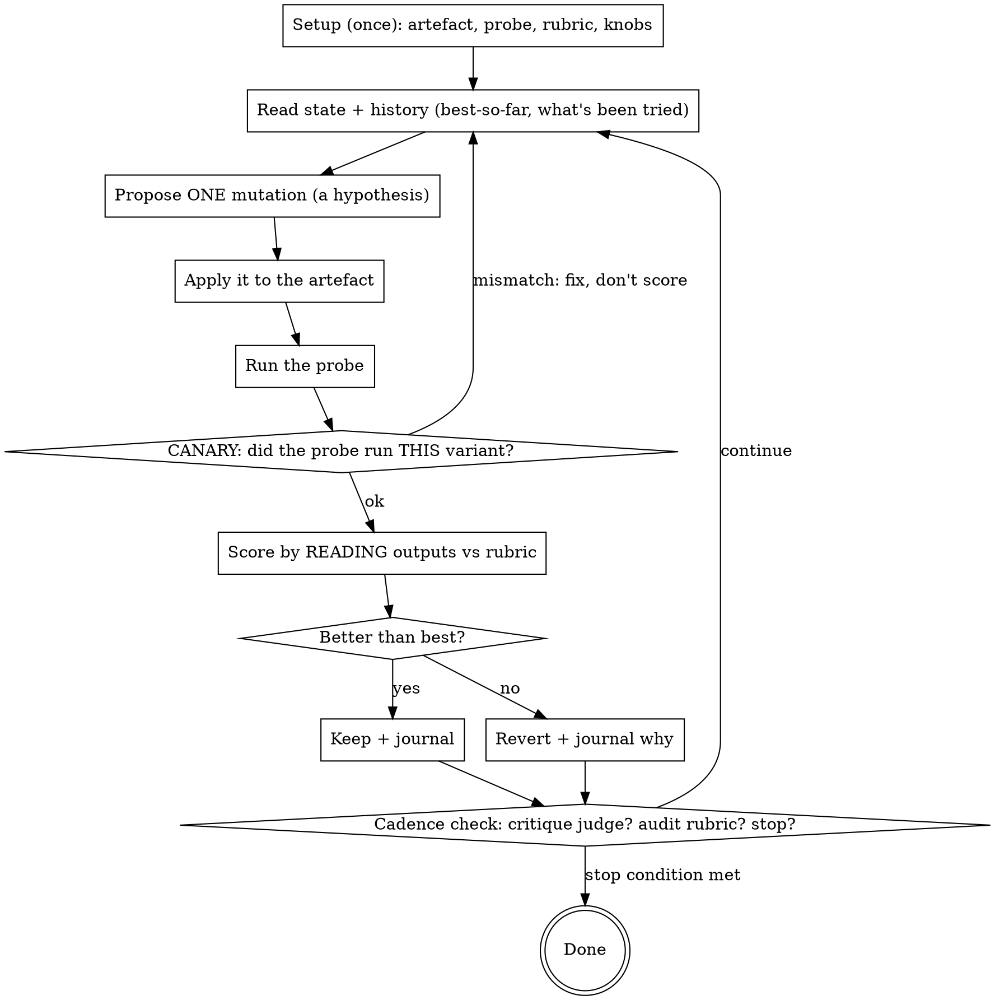

# betterbest

**You've got good. Go for best.** Polish and improve just about anything, from code to prose.

betterbest is a **general-purpose adaptation of autoresearch**: you improve a *thing* by running
**iterative experiments** on it. One experiment = change one thing, run a probe, read the result,
keep it if better or revert if not. Repeat until the thing is as good as it can be.

It works on anything you can **inspect, change, and measure**: a prompt, a config, a function, an
agent system, an essay, a recipe, a melody, a policy doc, a UI flow. The thing only has to be
*good enough to start* — betterbest refines what exists, it does not generate from nothing.

## The mapping (this is the whole idea)

| Piece | What it is | Examples |
|---|---|---|
| **Artefact** | the thing you're improving (inspectable, mutable, versionable) | `prompt.txt`, a function, `speech.md`, a recipe |
| **Experiment** | one change → run probe → read → keep/revert | the loop body |
| **Probe** | whatever *exercises* the artefact and yields something to read | test questions at a prompt; tests+profile for code; a critic-persona panel for prose (see *Working on prose*) |
| **Rubric** | the weighted dimensions you read each result against, each tagged **hard gate or soft penalty**; each dimension's scorer can be a formula OR a subagent evaluation — same interface, just a weighted term | `+5 cites source / −50 hallucination / −20 cost`; or `+30 "a fresh critic judges clarity"` |
| **Journal** | the running record of every experiment and verdict | `scripts/journal.py` |

## The loop

## Setup interview (do this once, with AskUserQuestion cards)

Before iterating, settle these. Use `AskUserQuestion` for the multiple-choice knobs; ask
free-form for the artefact/probe/rubric. Don't start the loop until they're set.

1. **Artefact** — what file/thing are we improving? (must be inspectable, mutable, versionable —
   put it under git so each experiment is a revertible commit)
2. **Probe** — what command/process exercises it and produces something readable? It must be
   *deterministic enough* to compare two runs, *cheap enough* to run every iteration, and
   **FIXED across the run** (changing the probe mid-run destroys comparability).
3. **Rubric** — the weighted dimensions, with concrete pass/fail criteria and a **cost term**.
   For EACH term, DECLARE its status: a **hard gate** (violating its cap/constraint caps the score —
   the variant fails regardless of the numeric total) or a **soft penalty** (nets into the total).
   The numeric total alone must NEVER override a hard gate: a variant that totals high but violates a
   hard gate is a revert, not a keep. An undeclared term defaults to soft penalty, so any
   must-not-violate constraint MUST be declared a hard gate explicitly.
   A hard gate must be **binary at judging time**. If its dimension is graded (0–10 / 0–N)
   rather than already pass/fail, declare the **gate threshold at setup**: the score below which
   the variant fails outright (e.g. 'honesty is a gate with threshold 8 → honesty ≤ 7 fails,

<!-- Content truncated to meet Windsurf 6KB limit -->

---
> Source: [drewmccormack/betterbest](https://github.com/drewmccormack/betterbest) — distributed by [TomeVault](https://tomevault.io).
<!-- tomevault:4.0:windsurf_rules:2026-06-17 -->
