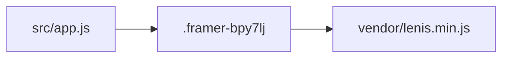

# NOVIA STUDIO site

Inherit [../AGENTS.md](../AGENTS.md). This folder is the CURRENT runnable
portfolio.

## Always

- Stay inside `novia-studio-react/**` unless Chief expands scope.
- Keep Framer class names, CSS, and section order.
- Bind Lenis to `.framer-bpy7lj` only.

## Commands

```bash
node server.js
```

Tests live one level up:
`node --test projects/portfolio/tests/capsule-paths.test.mjs projects/portfolio/tests/lenis-contract.test.mjs`.



---
> Source: [drnovia/MyWebsite](https://github.com/drnovia/MyWebsite) — distributed by [TomeVault](https://tomevault.io).
<!-- tomevault:4.0:windsurf_rules:2026-08-28 -->
