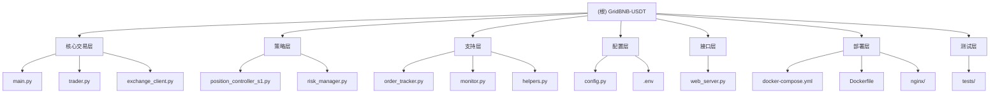

# GridBNB-USDT 项目 AI 上下文文档

> **最后更新**: 2025-10-17 14:50:00
> **状态**: 生产环境运行中
> **版本**: 主分支

## 变更记录 (Changelog)

| 日期 | 变更内容 | 影响范围 |
|------|---------|---------|
| 2025-10-17 14:50 | 添加 Web 监控界面详解和 API 使用指南 | CLAUDE.md |
| 2025-10-17 14:45 | 完整扫描 monitor.py 和 web_server.py，更新文档 | monitor.py, web_server.py, CLAUDE.md, index.json |
| 2025-10-17 14:36 | 初始化 AI 上下文文档 | 全局 |

---

## 项目愿景

GridBNB-USDT 是一个基于 Python 的**企业级自动化交易系统**，专为币安 (Binance) 交易所设计。采用先进的网格交易策略，结合动态波动率分析和多层风险管理，旨在稳定捕捉市场波动收益。

**核心价值主张**：
- 🚀 支持任意多币种并发交易（BNB/USDT, ETH/USDT, BTC/USDT 等）
- 🧠 智能网格策略：基于52日年化波动率和 EWMA 混合算法
- 🛡️ 多层风险管理：仓位限制、连续失败保护、实时监控
- 🌐 企业级部署：Docker 容器化、Nginx 反向代理、健康检查
- 📱 现代化 Web 界面：实时监控、多币种视图、响应式设计

---

## 架构总览

### 系统层次结构

```
GridBNB-USDT/
├── 核心交易层 (Core Trading Layer)
│   ├── main.py                 # 应用入口，多币种并发管理
│   ├── trader.py               # 网格交易核心逻辑（2042行）
│   └── exchange_client.py      # 币安 API 封装（542行）
├── 策略层 (Strategy Layer)
│   ├── position_controller_s1.py  # S1辅助策略（52日高低点调仓）
│   └── risk_manager.py         # 高级风险管理器
├── 支持层 (Support Layer)
│   ├── order_tracker.py        # 订单跟踪与历史管理
│   ├── monitor.py              # 交易监控
│   └── helpers.py              # 工具函数与通知
├── 配置层 (Configuration Layer)
│   ├── config.py               # 统一配置管理（Pydantic）
│   └── .env                    # 环境变量配置（敏感信息）
├── 接口层 (Interface Layer)
│   └── web_server.py           # Web 监控界面（aiohttp）
├── 部署层 (Deployment Layer)
│   ├── docker-compose.yml      # 容器编排
│   ├── Dockerfile              # 容器镜像定义
│   └── nginx/nginx.conf        # 反向代理配置
└── 测试层 (Testing Layer)
    └── tests/                  # 单元测试与集成测试
```

### 模块结构图



---

## 模块索引

| 模块名称 | 路径 | 职责 | 关键类/函数 | 行数 |
|---------|------|------|-----------|------|
| **主程序** | `main.py` | 应用入口，多币种并发管理 | `main()`, `run_trader_for_symbol()`, `periodic_global_status_logger()` | 157 |
| **网格交易器** | `trader.py` | 网格交易核心逻辑 | `GridTrader` | 2042 |
| **交易所客户端** | `exchange_client.py` | 币安 API 封装与时间同步 | `ExchangeClient` | 542 |
| **S1仓位控制** | `position_controller_s1.py` | 基于52日高低点的辅助策略 | `PositionControllerS1` | 319 |
| **风险管理器** | `risk_manager.py` | 仓位限制与风控状态管理 | `AdvancedRiskManager`, `RiskState` | 142 |
| **订单跟踪器** | `order_tracker.py` | 订单记录与交易历史管理 | `OrderTracker`, `OrderThrottler` | 314 |
| **Web服务器** | `web_server.py` | 实时监控界面与 API 端点 | `start_web_server()`, `handle_status()`, `handle_log()`, `IPLogger` | 698 |
| **配置管理** | `config.py` | 统一配置与验证 | `Settings`, `TradingConfig` | 208 |
| **辅助函数** | `helpers.py` | 日志、通知、格式化 | `send_pushplus_message()`, `LogConfig` | 151 |
| **监控器** | `monitor.py` | 交易监控逻辑与状态采集 | `TradingMonitor` | 100 |

---

## 运行与开发

### 快速启动

#### Docker 部署（推荐）
```bash
# 1. 克隆项目
git clone https://github.com/EBOLABOY/GridBNB-USDT.git
cd GridBNB-USDT

# 2. 配置环境变量
cp .env.example .env
# 编辑 .env 文件，填入 API 密钥

# 3. 启动服务（Windows）
start-with-nginx.bat

# 启动服务（Linux/Mac）
chmod +x start-with-nginx.sh
./start-with-nginx.sh

# 4. 访问 Web 界面
# http://localhost
```

#### Python 直接运行
```bash
# 1. 创建虚拟环境
python -m venv .venv
source .venv/bin/activate  # Linux/Mac
# .\.venv\Scripts\activate  # Windows

# 2. 安装依赖
pip install -r requirements.txt

# 3. 配置并运行
cp .env.example .env
# 编辑 .env 文件
python main.py
```

### 环境要求
- **Python**: 3.8+ (推荐 3.10+)
- **Docker**: 20.10+ (可选，推荐生产环境)
- **内存**: 最低 512MB，推荐 1GB+
- **网络**: 稳定互联网连接，建议低延迟到币安服务器

### 核心依赖
```
ccxt>=4.1.0           # 统一交易所 API
numpy>=1.26.0         # 数值计算
pandas>=2.2.0         # 数据分析
aiohttp>=3.9.1        # 异步 HTTP 客户端
python-dotenv>=1.0.0  # 环境变量管理
pydantic>=2.5.0       # 数据验证
loguru>=0.7.2         # 日志管理
```

### 配置说明

**必填配置** (`.env`)：
```bash
# 币安 API
BINANCE_API_KEY="your_api_key"
BINANCE_API_SECRET="your_api_secret"

# 交易对列表（逗号分隔）
SYMBOLS="BNB/USDT,ETH/USDT,BTC/USDT"

# 交易对特定参数（JSON 格式）
INITIAL_PARAMS_JSON='{"BNB/USDT": {"initial_base_price": 683.0, "initial_grid": 2.0}}'

# 最小交易金额
MIN_TRADE_AMOUNT=20.0
```

**可选配置**：
```bash
# 初始本金（用于收益计算）
INITIAL_PRINCIPAL=800

# 理财功能开关（子账户用户建议设为 false）
ENABLE_SAVINGS_FUNCTION=true

# PushPlus 通知
PUSHPLUS_TOKEN="your_pushplus_token"

# Web UI 认证
WEB_USER=admin
WEB_PASSWORD=your_password
```

---

## 测试策略

### 测试文件结构
```
tests/
├── __init__.py
├── test_config.py          # 配置验证测试
├── test_trader.py          # 交易器核心逻辑测试
├── test_risk_manager.py    # 风险管理测试
└── test_web_auth.py        # Web 认证测试
```

### 运行测试
```bash
# 运行所有测试
python run_tests.py

# 或使用 pytest
pytest tests/

# 运行特定测试文件
pytest tests/test_trader.py -v
```

### 测试覆盖的关键场景
- ✅ 配置加载与验证
- ✅ 网格交易信号检测
- ✅ 风险管理状态转换
- ✅ Web 界面认证机制
- ⚠️ **缺失**：交易所 API 模拟测试、S1 策略单元测试

---


<!-- Content truncated to meet Windsurf 6KB limit -->

---
> Source: [EBOLABOY/GridBNB-USDT](https://github.com/EBOLABOY/GridBNB-USDT) — distributed by [TomeVault](https://tomevault.io).
<!-- tomevault:4.0:windsurf_rules:2026-05-18 -->
