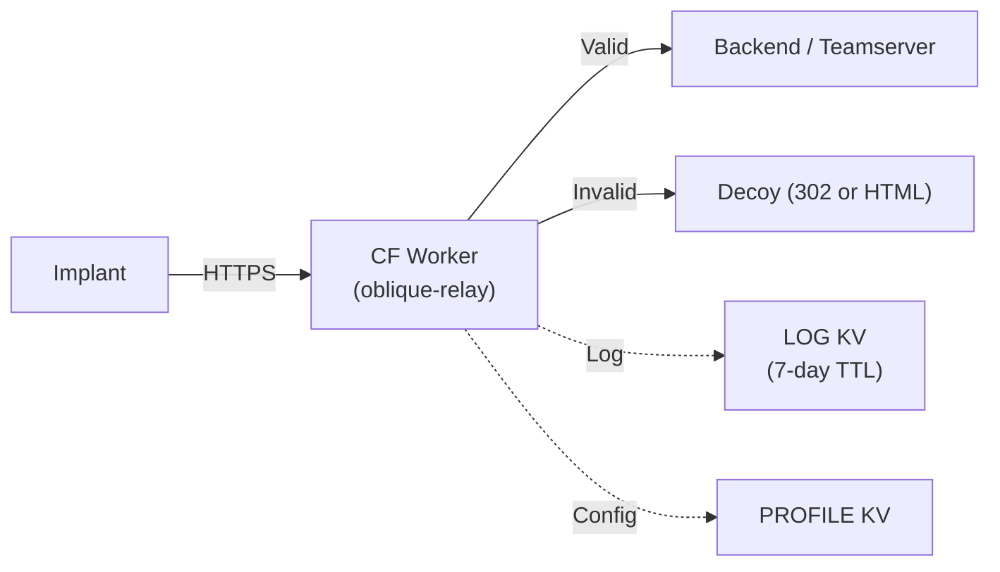
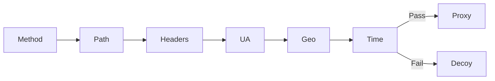

# CLAUDE.md — Oblique Relay

## Purpose

Oblique Relay is a Cloudflare Workers-based edge redirector for authorized red team / penetration testing infrastructure. Sits between implants and a backend teamserver, filtering invalid traffic to a decoy destination. Named for the angle of deflection — the edge worker is the oblique surface that relays traffic to its intended target.

## Architecture

Source is split into focused modules under `src/`. No build step required — plain JS, runs directly on CF Workers runtime. Profile config is loaded from KV at runtime.

## Key Files

| File | Role |
|---|---|
| `src/worker.js` | Entry point — routing, operator endpoints, orchestration |
| `src/validation.js` | Request validation pipeline (method, path, headers, UA, geo, time) |
| `src/proxy.js` | Backend proxying and decoy responses |
| `src/profile.js` | Profile loading and management (KV-backed) |
| `src/logging.js` | Request logging (best-effort KV) |
| `src/metrics.js` | HTML metrics dashboard (aggregates LOG KV) |
| `src/sessions.js` | Durable Object session tracking (ImplantSession) |
| `src/util.js` | Shared utilities (response helpers, timing-safe comparison, escaping) |
| `src/parsers/index.js` | Parser registry + importProfile dispatcher |
| `src/parsers/schema.js` | Profile schema validation (used by PUT + import) |
| `src/parsers/cobalt-strike.js` | Cobalt Strike Malleable C2 parser |
| `src/parsers/sliver.js` | Sliver HTTP C2 parser |
| `src/parsers/mythic.js` | Mythic C2 parser (JSON) |
| `src/parsers/havoc.js` | Havoc C2 parser (Yaotl/HCL-like) |
| `src/parsers/poshc2.js` | PoshC2 parser (Python config) |
| `src/parsers/oblique.js` | Oblique Server native protocol parser (JSON) |
| `wrangler.toml` | CF deployment config (routes, KV bindings) |
| `eslint.config.js` | ESLint flat config — recommended + security rules |
| `vitest.config.js` | Test config — Workers pool with miniflare bindings |
| `test/helpers.js` | Shared test utilities (req builders, profile management, setup hooks) |
| `test/validation.test.js` | Profile validation, KV profile, geo-fencing, UA, multi-backend tests |
| `test/operator.test.js` | Operator endpoints, health check, metrics dashboard tests |
| `test/proxy.test.js` | Proxy headers, decoy responses, secret leak prevention tests |
| `test/logging.test.js` | KV logging tests |
| `test/sessions.test.js` | Durable Objects session tracking tests |
| `test/parsers/*.test.js` | Per-parser tests (CS, Sliver, Mythic, Havoc, PoshC2, Oblique) + schema validation |
| `test/c2-validate.js` | Live C2 traffic simulation suite |
| `test/e2e/validate-sliver.sh` | Sliver E2E test (27 tests, PTY/log-driven, single container + tunnel) |
| `test/e2e/validate-mythic.sh` | Mythic E2E test (33 tests, API/postgres-driven, 9 containers + tunnel) |
| `test/e2e/docker-compose.mythic.yml` | Mythic stack (postgres, rabbitmq, server, graphql, nginx, http, poseidon, tunnel, victim) |
| `test/e2e/docker-compose.yml` | Sliver stack (server, tunnel, victim) |
| `tools/dashboard.html` | Local operator dashboard (single HTML file, no external deps) |
| `docs/dashboard.md` | Dashboard documentation |
| `docs/adding-a-parser.md` | Guide for adding new C2 parser support |
| `.dev.vars.example` | Template for local dev secrets |
| `.github/workflows/ci.yml` | CI: lint + test on PR and push to main |

## Configuration

Secrets (set via `wrangler secret put`):
- `BACKEND_URL` — default backend/teamserver URL
- `DECOY_URL` — redirect target for invalid traffic
- `PROFILE_SECRET` — operator auth token (gates operator endpoints via `X-Auth-Token`; NOT checked on implant traffic)

KV Namespaces:
- `LOG` — request logging with 7-day TTL (keys prefixed `valid:` or `decoy:`)
- `PROFILE` — runtime profile config at key `profile:active`

## Profile Configuration

The profile is stored in the `PROFILE` KV namespace and controls request validation. It can be updated at runtime via the operator API without redeployment. When no KV profile exists, `DEFAULT_PROFILE` in `worker.js` is used.

Profile fields: `paths`, `methods`, `headers`, `ua_pattern`, `geo_allow`, `geo_deny`, `time_window`, `jitter_ms`, `backends`.

### Validation Pipeline

Implant traffic is validated by the profile pipeline. `PROFILE_SECRET` only gates operator endpoints (`/__health`, `/__profile`, etc.). It is not checked on implant traffic because C2 frameworks typically do not include custom auth headers in their callbacks by default. Operators can require specific headers on implant traffic via the profile `headers` config.

## Operator Endpoints

<!-- Content truncated to meet Windsurf 6KB limit -->

---
> Source: [errantpacket/Oblique-Relay](https://github.com/errantpacket/Oblique-Relay) — distributed by [TomeVault](https://tomevault.io).
<!-- tomevault:4.0:windsurf_rules:2026-08-11 -->
