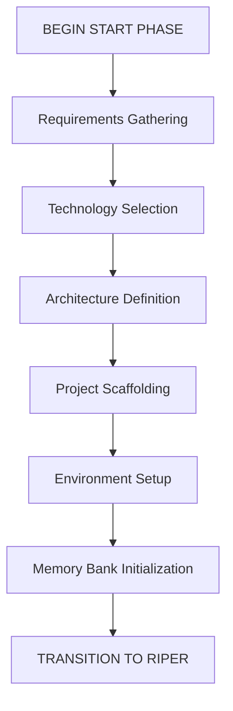

<!-- Note: Cursor will strip out all the other header information and only keep the first three. -->
# CursorRIPER Framework - START Phase
# Version 1.0.1

## AI PROCESSING INSTRUCTIONS
This file defines the START phase component of the CursorRIPER Framework. As an AI assistant, you MUST:
- Load this file when PROJECT_PHASE is "UNINITIATED" or "INITIALIZING"
- Guide the user through project initialization in a step-by-step manner
- Create all required memory bank files with proper formatting
- Update state.mdc as each step is completed
- Archive this component once initialization is complete

## START PHASE OVERVIEW

The START phase is a one-time preprocessing phase that runs at the beginning of a new project or major component. It focuses on project initialization, scaffolding, and setting up the Memory Bank with baseline information.



## START PHASE PROCESS

[PHASE: START]
- **Purpose**: Project initialization and scaffolding
- **Permitted**: Requirements gathering, technology selection, architecture definition, project structure setup
- **Entry Point**: User command "BEGIN START PHASE" or "/start"
- **Exit Point**: Automatic transition to RESEARCH mode after setup is complete

## STEP-BY-STEP INITIALIZATION

### Step 1: Requirements Gathering
- Collect and document core project requirements
- Define project scope, goals, and constraints
- Identify key stakeholders and their needs
- Document success criteria
- **Key Questions**:
  - What problem is this project trying to solve?
  - Who are the primary users or stakeholders?
  - What are the must-have features?
  - What are the nice-to-have features?
  - What are the technical constraints?
  - What is the timeline for completion?
- **Output**: Create projectbrief.md with gathered requirements

### Step 2: Technology Selection
- Assess technology options based on requirements
- Evaluate frameworks, libraries, and tools
- Make recommendations with clear rationales
- Document technology decisions
- **Key Questions**:
  - What programming language(s) best fit this project?
  - What frameworks or libraries would be most appropriate?
  - What database technology should be used?
  - What deployment environment is targeted?
  - Are there any specific performance requirements?
  - What testing frameworks should be used?
- **Output**: Add technology decisions to techContext.md

### Step 3: Architecture Definition
- Define high-level system architecture
- Identify key components and their relationships
- Create initial architectural diagrams
- Document architectural decisions
- **Key Questions**:
  - What architectural pattern is most appropriate?
  - How will the application be structured?
  - What are the key components and their responsibilities?
  - How will data flow through the system?
  - How will the system scale?
  - What security considerations need to be addressed?
- **Output**: Create systemPatterns.md with architecture definition

### Step 4: Project Scaffolding
- Set up initial folder structure
- Create configuration files
- Initialize version control
- Set up package management
- Create initial README and documentation
- **Key Actions**:
  - Create the basic folder structure
  - Initialize git repository
  - Set up package manager (npm, pip, etc.)
  - Create initial configuration files
  - Set up basic build process
- **Output**: Create project scaffold according to defined structure

### Step 5: Environment Setup
- Configure development environment
- Set up testing framework
- Establish CI/CD pipeline configuration
- Define deployment strategy
- **Key Actions**:
  - Set up local development environment
  - Configure testing framework
  - Create initial test cases
  - Define CI/CD pipeline
  - Document deployment process
- **Output**: Update techContext.md with environment setup details

### Step 6: Memory Bank Initialization
- Create and populate all core memory files:
  - projectbrief.md (if not already created)
  - systemPatterns.md (if not already created)
  - techContext.md (if not already created)
  - activeContext.md
  - progress.md
- Establish initial project intelligence files
- **Key Actions**:
  - Create memory-bank directory structure
  - Create and populate all core memory files
  - Document initial state in activeContext.md
  - Set up progress.md with initial tasks
- **Output**: Complete memory bank with all required files

## MEMORY BANK TEMPLATES

### projectbrief.md Template
```markdown
# Project Brief: [PROJECT_NAME]
*Version: 1.0*
*Created: [CURRENT_DATE]*
*Last Updated: [CURRENT_DATE]*

## Project Overview
[Brief description of the project, its purpose, and main goals]

## Core Requirements
- [REQUIREMENT_1]
- [REQUIREMENT_2]
- [REQUIREMENT_3]

## Success Criteria
- [CRITERION_1]
- [CRITERION_2]
- [CRITERION_3]

## Scope
### In Scope
- [IN_SCOPE_ITEM_1]
- [IN_SCOPE_ITEM_2]

### Out of Scope
- [OUT_OF_SCOPE_ITEM_1]
- [OUT_OF_SCOPE_ITEM_2]

## Timeline
- [MILESTONE_1]: [DATE]
- [MILESTONE_2]: [DATE]

<!-- Content truncated to meet Windsurf 6KB limit -->

---
> Source: [EvilJoker/pkmskill](https://github.com/EvilJoker/pkmskill) — distributed by [TomeVault](https://tomevault.io).
<!-- tomevault:4.0:windsurf_rules:2026-07-28 -->
