# aidrama-studio

AI-powered novel-to-video production platform. Accepts novel text input and orchestrates a multi-stage pipeline (text analysis, screenplay conversion, storyboard generation, image/video/voice synthesis) to produce promotional video content.

## Architecture Overview

- **Framework**: Next.js 15 (App Router, Turbopack) + React 19
- **Language**: TypeScript (strict mode)
- **Database**: MySQL 8.0 via Prisma ORM
- **Queue**: BullMQ on Redis 7 (4 worker pools: image, video, voice, text)
- **Storage**: MinIO / S3-compatible object storage (pluggable: local, COS)
- **Auth**: NextAuth v4, credentials provider, JWT sessions, bcrypt passwords
- **i18n**: next-intl, locales: zh (default), en
- **Styling**: Tailwind CSS v4, Glass design system primitives
- **Testing**: Vitest, multi-tier (unit / integration / system / regression / concurrency)
- **CI/CD**: GitHub Actions (Docker multi-arch build), Husky pre-commit/pre-push gates
- **Deployment**: Docker Compose (MySQL + Redis + MinIO + App), Caddy for HTTPS, Mac Mini deploy via `scripts/deploy-to-mini.sh`

```mermaid
graph TD
    ROOT["aidrama-studio"] --> SRC["src/"]
    ROOT --> TESTS["tests/"]
    ROOT --> PRISMA["prisma/"]
    ROOT --> LIB_PROMPTS["lib/prompts/"]
    ROOT --> SCRIPTS["scripts/"]
    ROOT --> STANDARDS["standards/"]
    ROOT --> MESSAGES["messages/"]
    ROOT --> FEATURES["src/features/"]

    SRC --> APP["app/ (pages + API routes)"]
    SRC --> COMPONENTS["components/ (shared UI)"]
    SRC --> LIB["lib/ (core logic)"]

    APP --> API["api/ (120+ REST routes)"]
    APP --> PAGES["[locale]/ (pages)"]

    API --> API_NP["studio/ (68 routes)"]
    API --> API_AH["asset-hub/ (27 routes)"]
    API --> API_ASSETS["assets/ (7 routes)"]
    API --> API_USER["user/ (12 routes)"]
    API --> API_PROJECTS["projects/ (5 routes)"]
    API --> API_TASKS["tasks/ (3 routes)"]
    API --> API_RUNS["runs/ (5 routes)"]
    API --> API_AUTH["auth/ (2 routes)"]

    LIB --> WORKERS["workers/ (4 pools, 50+ handlers)"]
    LIB --> BILLING_LIB["billing/ (freeze-settle ledger)"]
    LIB --> GENERATORS["generators/ (image/video/audio)"]
    LIB --> LLM["llm/ (multi-provider gateway)"]
    LIB --> TASK_LIB["task/ (queue + SSE)"]
    LIB --> STORAGE_LIB["storage/ (MinIO/local/COS)"]
    LIB --> MEDIA["media/ (object lifecycle)"]
    LIB --> ASSETS_LIB["assets/ (registry + services)"]
    LIB --> LOGGING["logging/ (structured, semantic)"]
    LIB --> AI_RUNTIME["ai-runtime/ (step executor)"]
    LIB --> MODEL_GW["model-gateway/ (router)"]
    LIB --> LIPSYNC["lipsync/ (bailian/fal/vidu)"]
    LIB --> ASSISTANT["assistant-platform/"]

    FEATURES --> VIDEO_EDITOR["video-editor/ (Remotion)"]

    click WORKERS "./src/lib/workers/CLAUDE.md" "Workers module"
    click BILLING_LIB "./src/lib/billing/CLAUDE.md" "Billing module"
    click GENERATORS "./src/lib/generators/CLAUDE.md" "Generators module"
```

## Module Index

| Module | Path | Description |
|--------|------|-------------|
| API Routes (studio) | `src/app/api/studio/` | 68 REST endpoints for the core pipeline |
| API Routes (asset-hub) | `src/app/api/asset-hub/` | 27 endpoints for global asset CRUD |
| API Routes (user) | `src/app/api/user/` | 12 endpoints for user config, balance, costs |
| API Routes (assets) | `src/app/api/assets/` | 7 endpoints for project-scoped asset operations |
| API Routes (projects) | `src/app/api/projects/` | 5 endpoints for project CRUD |
| API Routes (runs) | `src/app/api/runs/` | 5 endpoints for workflow graph runs |
| API Routes (tasks) | `src/app/api/tasks/` | 3 endpoints for task lifecycle |
| Workers | `src/lib/workers/` | BullMQ worker pools (image, video, voice, text) with 50+ handlers |
| Billing | `src/lib/billing/` | Freeze-settle billing ledger with shadow/enforce modes |
| Generators | `src/lib/generators/` | Multi-provider media generation (Fal, Ark, Google, OpenAI-compat, Bailian, SiliconFlow) |
| LLM | `src/lib/llm/` | Multi-provider LLM gateway (chat/stream/vision) |
| Model Gateway | `src/lib/model-gateway/` | Model routing and OpenAI-compatible protocol adapter |
| Task System | `src/lib/task/` | Task lifecycle, queue, SSE publisher, submitter |
| Storage | `src/lib/storage/` | Pluggable object storage (MinIO, local, COS) |
| Media | `src/lib/media/` | Media object lifecycle, URL normalization, outbound image handling |
| Assets | `src/lib/assets/` | Asset registry, grouping, mappers, services |
| AI Runtime | `src/lib/ai-runtime/` | AI step execution abstraction layer |
| Logging | `src/lib/logging/` | Structured logging with semantic actions, redaction |
| Lipsync | `src/lib/lipsync/` | Lip-sync providers (Bailian, Fal, Vidu) |
| Assistant Platform | `src/lib/assistant-platform/` | In-app AI assistant with skills framework |
| Video Editor | `src/features/video-editor/` | Remotion-based timeline video editor |
| Shared Components | `src/components/` | UI primitives (Glass design system), modals, selectors |
| Prompts | `lib/prompts/` | AI prompt templates (zh/en), studio + character-reference |

<!-- Content truncated to meet Windsurf 6KB limit -->

---
> Source: [EvoLinkAI/ai-short-drama](https://github.com/EvoLinkAI/ai-short-drama) — distributed by [TomeVault](https://tomevault.io).
<!-- tomevault:4.0:windsurf_rules:2026-06-16 -->
