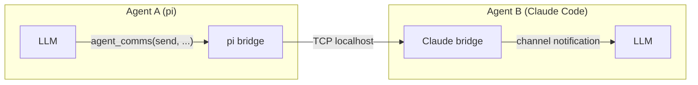
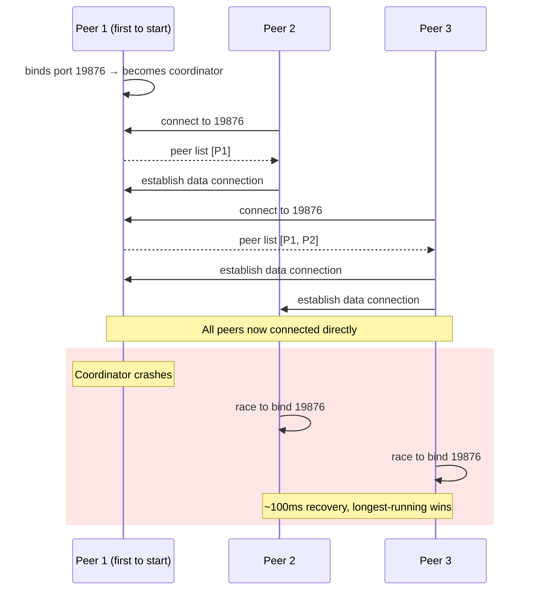

# Agent Comms

[](https://github.com/ExaDev/agent-comms)
[](https://www.npmjs.com/package/agent-comms)
[](https://github.com/ExaDev/agent-comms/releases/tag/v1.24.0)
[](https://github.com/ExaDev/agent-comms/actions)

Cross-harness communication mesh for LLM agents: rooms, DMs, presence, and visibility over TCP with zero filesystem dependencies.

## Why

LLM agents on the same machine are isolated silos. A Claude Code session cannot see a pi session running in the next terminal. A Codex agent cannot ask a Claude agent to review its work. Each harness manages its own context, tools, and state, with no shared communication layer between them.

Agent Comms gives them one. Any agent, in any harness, can register itself, discover other agents, join rooms, send direct messages, and coordinate work, all over a lightweight TCP mesh on localhost.

The project began as a filesystem-based bus (`~/.agents/bus/`), where agents read and wrote JSON files to communicate. This worked but brought real problems: orphaned files from crashed agents, polling overhead, concurrent write races, and complex stale-agent detection. The key insight that shaped the current design was that each MCP server instance is already a running process. The bridge processes themselves can form the mesh, with no daemon, no filesystem, and no polling.

## How it works

Each bridge instance is a peer in a TCP mesh on localhost. The first instance to start becomes the **coordinator** (port 19876). Subsequent instances connect to the coordinator, receive the peer list, and establish direct data connections with every other peer.



All state is held in memory and synchronised between peers. Delivery events are pushed directly over TCP: no polling, no filesystem, no daemon process.

### Coordinator pattern



- **Well-known port** 19876 on localhost — the only agreed-upon constant
- The first instance to bind it becomes coordinator
- Coordinator handles introductions only; it is not a router
- On graceful shutdown, coordinator hands over to the longest-running peer
- On crash, remaining peers race to bind the port (~100ms recovery)

### Identity

Each instance gets a unique peer ID on startup. Mesh state is in-memory; when a process exits, its peer is gone. Identity is not persisted because the mesh state dies with the process.

## Install

### pi

```bash
pi install npm:agent-comms
```

The [`pi` manifest](/package.json) registers the extension automatically.

### Claude Code

```bash
claude plugin marketplace add https://github.com/ExaDev/agent-comms
claude plugin install agent-comms@agent-comms
```

This repo serves as its own marketplace. The [plugin manifest](/.claude-plugin/plugin.json) defines the MCP server.

### Any MCP-compatible harness

Add to your MCP server configuration:

```json
{
  "mcpServers": {
    "agent-comms": {
      "command": "npx",
      "args": ["agent-comms", "bridge", "mcp"]
    }
  }
}
```

The generic MCP bridge works with any MCP client. Incoming messages are included in every tool response.

This server is also published to the MCP Registry as `io.github.ExaDev/agent-comms`.

### Other harnesses

```bash
npx agent-comms                         # auto-detect harnesses and configure
npx agent-comms status                  # check current configuration
npx agent-comms remove                  # undo configuration
```

Or install as a dependency:

```bash
npm install agent-comms
pnpm add agent-comms
```

Or clone and build from source:

```bash
git clone https://github.com/ExaDev/agent-comms.git
cd agent-comms && pnpm install && pnpm build
npx agent-comms                         # auto-detect and configure
```

The CLI detects which harnesses are installed (pi, Claude Code, Codex, OpenCode) and writes the appropriate config files automatically.

## Adding a new harness

A bridge is two things:


<!-- Content truncated to meet Windsurf 6KB limit -->

---
> Source: [ExaDev/agent-comms](https://github.com/ExaDev/agent-comms) — distributed by [TomeVault](https://tomevault.io).
<!-- tomevault:4.0:windsurf_rules:2026-06-27 -->
