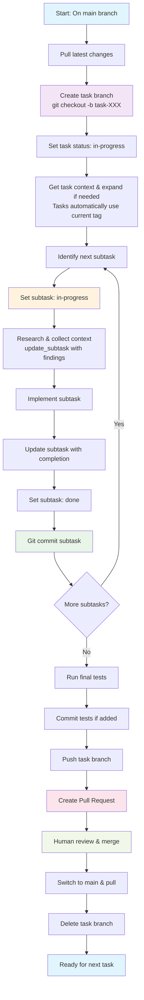

# Git Workflow with Task Master Integration

## **Branch Strategy**

### **Main Branch Protection**
- **main** branch contains production-ready code
- All feature development happens on task-specific branches
- Direct commits to main are prohibited
- All changes merge via Pull Requests

### **Task Branch Naming**
```bash
# ✅ DO: Use consistent task branch naming
task-001  # For Task 1
task-004  # For Task 4
task-015  # For Task 15

# ❌ DON'T: Use inconsistent naming
feature/user-auth
fix-database-issue
random-branch-name
```

## **Tagged Task Lists Integration**

Task Master's **tagged task lists system** provides significant benefits for Git workflows:

### **Multi-Context Development**
- **Branch-Specific Tasks**: Each branch can have its own task context using tags
- **Merge Conflict Prevention**: Tasks in different tags are completely isolated
- **Context Switching**: Seamlessly switch between different development contexts
- **Parallel Development**: Multiple team members can work on separate task contexts

### **Migration and Compatibility**
- **Seamless Migration**: Existing projects automatically migrate to use a "master" tag
- **Zero Disruption**: All existing Git workflows continue unchanged
- **Backward Compatibility**: Legacy projects work exactly as before

### **Manual Git Integration**
- **Manual Tag Creation**: Use `--from-branch` option to create tags from current git branch
- **Manual Context Switching**: Explicitly switch tag contexts as needed for different branches
- **Simplified Integration**: Focused on manual control rather than automatic workflows

## **Workflow Overview**



## **Complete Task Development Workflow**

### **Phase 1: Task Preparation**
```bash
# 1. Ensure you're on main branch and pull latest
git checkout main
git pull origin main

# 2. Check current branch status
git branch  # Verify you're on main

# 3. Create task-specific branch
git checkout -b task-004  # For Task 4

# 4. Set task status in Task Master (tasks automatically use current tag context)
# Use: set_task_status tool or `task-master set-status --id=4 --status=in-progress`
```

### **Phase 2: Task Analysis & Planning**
```bash
# 5. Get task context and expand if needed (uses current tag automatically)
# Use: get_task tool or `task-master show 4`
# Use: expand_task tool or `task-master expand --id=4 --research --force` (if complex)

# 6. Identify next subtask to work on
# Use: next_task tool or `task-master next`
```

### **Phase 3: Subtask Implementation Loop**
For each subtask, follow this pattern:

```bash
# 7. Mark subtask as in-progress
# Use: set_task_status tool or `task-master set-status --id=4.1 --status=in-progress`

# 8. Gather context and research (if needed)
# Use: update_subtask tool with research flag or:
# `task-master update-subtask --id=4.1 --prompt="Research findings..." --research`

# 9. Collect code context through AI exploration
# Document findings in subtask using update_subtask

# 10. Implement the subtask
# Write code, tests, documentation

# 11. Update subtask with completion details
# Use: update_subtask tool or:
# `task-master update-subtask --id=4.1 --prompt="Implementation complete..."`

# 12. Mark subtask as done
# Use: set_task_status tool or `task-master set-status --id=4.1 --status=done`

# 13. Commit the subtask implementation
git add .
git commit -m "feat(task-4): Complete subtask 4.1 - [Subtask Title]

- Implementation details
- Key changes made
- Any important notes

Subtask 4.1: [Brief description of what was accomplished]
Relates to Task 4: [Main task title]"
```

### **Phase 4: Task Completion**
```bash
# 14. When all subtasks are complete, run final testing
# Create test file if needed, ensure all tests pass
npm test  # or jest, or manual testing

# 15. If tests were added/modified, commit them
git add .
git commit -m "test(task-4): Add comprehensive tests for Task 4

- Unit tests for core functionality
- Integration tests for API endpoints
- All tests passing

Task 4: [Main task title] - Testing complete"

# 16. Push the task branch
git push origin task-004

# 17. Create Pull Request
# Title: "Task 4: [Task Title]"
# Description should include:
# - Task overview
# - Subtasks completed

<!-- Content truncated to meet Windsurf 6KB limit -->

---
> Source: [eyaltoledano/claude-task-master](https://github.com/eyaltoledano/claude-task-master) — distributed by [TomeVault](https://tomevault.io).
<!-- tomevault:4.0:windsurf_rules:2026-05-17 -->
