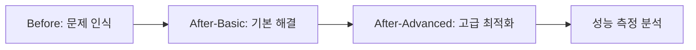

# 성능 측정 모노레포 아키텍처 설계

## 전체 시스템 아키텍처

### 1. 모노레포 구조

```
performance-measurement-monorepo/
├── apps/
│   ├── before/                 # 최적화 전 사이트 (CSR)
│   ├── after-basic/            # 기본 최적화 사이트 (SSR/SSG)
│   ├── after-advanced/         # 고급 최적화 사이트 (고급 기법)
│   ├── analytics/              # 성능 분석 대시보드
│   └── docs/                   # 프로젝트 문서 사이트
├── packages/
│   ├── ui/                     # 공통 UI 컴포넌트 라이브러리
│   ├── utils/                  # 공통 유틸리티 함수
│   ├── types/                  # 공통 타입 정의
│   ├── config/                 # 공통 설정 (ESLint, TypeScript 등)
│   ├── data/                   # 목업 데이터 및 API 클라이언트
│   └── performance/            # 성능 측정 유틸리티
├── .cursor/rules/
│   ├── requirements.mdc
│   ├── architecture.mdc
│   ├── tasks.mdc
│   └── test.mdc
└── turbo.json                  # Turborepo 설정
```

### 2. 기술 스택 매트릭스

| 영역 | 최적화 전 (Before) | 기본 최적화 (After-Basic) | 고급 최적화 (After-Advanced) | 공통 |
|------|-------------------|---------------------------|-------------------------------|------|
| **렌더링** | CSR | SSR/SSG | SSR/SSG + 가상화 | - |
| **번들링** | 기본 Webpack | Next.js 기본 최적화 | Next.js + 고급 코드 스플리팅 | Turborepo |
| **상태관리** | 기본 useState/useReducer | SWR + 기본 상태관리 | Zustand + SWR + 고급 캐싱 | TypeScript |
| **스타일링** | 일반 CSS | Tailwind CSS | Tailwind + CSS-in-JS 최적화 | - |
| **이미지** | 일반 img 태그 | Next.js Image | Next.js Image + WebP/AVIF | - |
| **코드분할** | 없음 | 라우트 기반 분할 | 라우트 + 컴포넌트 + 동적 분할 | - |
| **캐싱** | 기본 브라우저 캐시 | Next.js 기본 캐싱 | 다층 캐싱 + 서비스 워커 | - |
| **성능 기법** | 없음 | 기본 메모이제이션 | 가상화, 워커, WebAssembly | - |

## 패키지별 상세 설계

### 1. 앱 패키지 (`apps/`)

#### A. `apps/before` - 최적화 전 사이트

**핵심 특징:**
- Vite+React+Typescript 기반 구조
- 모든 컴포넌트 즉시 로딩
- 최소한의 최적화만 적용

**디렉토리 구조:**
```
before/
├── src/
│   ├── components/
│   │   ├── ProductCatalog/      # 대용량 상품 목록
│   │   ├── LiveStream/          # 실시간 스트림 상태
│   │   ├── ImageGallery/        # 이미지 갤러리
│   │   └── DataTable/           # 복잡한 테이블
│   ├── pages/
│   ├── hooks/
│   ├── utils/
│   └── styles/
├── public/
└── package.json
```

**성능 의도적 저하 요소:**
- 모든 이미지 즉시 로딩 (lazy loading 없음)
- 대용량 라이브러리 전체 번들 포함
- 인라인 스타일 및 중복 CSS
- 동기적 데이터 페칭
- 메모이제이션 미적용

#### B. `apps/after-basic` - 기본 최적화 사이트

**핵심 특징:**
- Next.js 14 App Router 기반
- 기본적인 최적화 기법 적용
- SSR/SSG 중심 성능 개선

**디렉토리 구조:**
```
after-basic/
├── app/
│   ├── catalog/
│   │   ├── loading.tsx         # 로딩 UI
│   │   ├── error.tsx           # 에러 UI
│   │   └── page.tsx            # SSG 페이지
│   ├── live/
│   │   └── page.tsx            # SSR 페이지
│   ├── gallery/
│   │   └── page.tsx            # ISR 페이지
│   └── layout.tsx
├── components/
│   ├── ProductCatalog/
│   │   ├── index.tsx
│   │   ├── ProductCard.tsx
│   │   └── ProductSkeleton.tsx
│   ├── LiveStream/
│   │   ├── index.tsx
│   │   └── StreamStatus.tsx
│   └── ImageGallery/
│       ├── index.tsx
│       └── LazyImage.tsx        # 지연 로딩 이미지
├── lib/
│   ├── api.ts                   # API 클라이언트
│   └── utils.ts                 # 기본 유틸리티
└── next.config.js               # Next.js 기본 설정
```

**적용된 기본 최적화 기법:**
- Next.js Image 컴포넌트 활용
- 라우트 기반 코드 스플리팅
- 기본 메모이제이션 (React.memo)
- SWR을 통한 데이터 캐싱
- Tailwind CSS 최적화
- 자동 이미지 최적화

#### C. `apps/after-advanced` - 고급 최적화 사이트

**핵심 특징:**
- 모든 고급 최적화 기법 적용
- 극한의 성능 최적화 추구
- 실험적 기법 포함

**디렉토리 구조:**
```
after-advanced/
├── app/
│   ├── (dashboard)/            # Route Groups
│   ├── catalog/
│   │   ├── loading.tsx         # 스켈레톤 로딩
│   │   ├── error.tsx           # 에러 바운더리
│   │   └── page.tsx            # SSG + ISR
│   ├── live/
│   │   └── page.tsx            # Streaming SSR
│   ├── gallery/
│   │   └── page.tsx            # 가상화된 갤러리
│   └── layout.tsx
├── components/
│   ├── ProductCatalog/
│   │   ├── index.tsx
│   │   ├── ProductCard.tsx
│   │   ├── ProductSkeleton.tsx
│   │   ├── VirtualizedList.tsx  # 가상화된 리스트
│   │   └── InfiniteScroll.tsx   # 무한 스크롤
│   ├── LiveStream/
│   │   ├── index.tsx
│   │   ├── StreamStatus.tsx
│   │   ├── RealtimeComments.tsx
│   │   └── WebRTCPlayer.tsx     # WebRTC 스트리밍
│   └── ImageGallery/
│       ├── index.tsx
│       ├── LazyImage.tsx
│       ├── ImageModal.tsx
│       └── ImageWorker.ts       # Web Worker 처리
├── lib/
│   ├── api.ts                   # API 클라이언트
│   ├── cache.ts                 # 다층 캐싱 전략
│   ├── performance.ts           # 성능 모니터링
│   ├── workers/                 # Web Workers
│   │   ├── imageOptimizer.ts
│   │   └── dataProcessor.ts
│   └── wasm/                    # WebAssembly 모듈
│       └── imageFilter.wasm
├── middleware.ts                # 고급 미들웨어
├── next.config.js               # 고급 Next.js 설정
└── service-worker.js            # 서비스 워커
```

**적용된 고급 최적화 기법:**
- 가상화된 리스트 (react-window)
- Web Workers를 통한 백그라운드 처리
- WebAssembly 모듈 활용
- 서비스 워커 캐싱
- 고급 코드 스플리팅 (컴포넌트 단위)
- React.memo, useMemo, useCallback 적극 활용
- Intersection Observer API 활용
- Critical CSS 인라인화
- 프리로딩 및 프리페칭 전략
- 다층 캐싱 (메모리, 디스크, CDN)
- Streaming SSR
- 이미지 포맷 최적화 (WebP, AVIF)

#### D. `apps/analytics` - 성능 분석 대시보드

**기능:**
- 실시간 성능 지표 모니터링
- 세 사이트 성능 비교 시각화 (before, after-basic, after-advanced)
- Core Web Vitals 트래킹
- 사용자 세션 분석
- 최적화 효과 시각화

**기술 스택:**
- Next.js + Recharts (시각화)
- Vercel Analytics API
- Google PageSpeed Insights API
- 실시간 WebSocket 연결

### 2. 공통 패키지 (`packages/`)

#### A. `packages/ui` - UI 컴포넌트 라이브러리

**아토믹 디자인 패턴 적용:**
```
ui/
├── atoms/
│   ├── Button/
│   ├── Input/
│   ├── Badge/
│   └── Avatar/
├── molecules/
│   ├── SearchBox/
│   ├── ProductCard/
│   ├── NavigationItem/
│   └── CommentItem/
├── organisms/
│   ├── Header/
│   ├── ProductGrid/
│   ├── CommentList/
│   └── LiveStreamPlayer/
├── templates/
│   ├── ProductListTemplate/
│   ├── LiveStreamTemplate/
│   └── GalleryTemplate/
└── index.ts                    # 배럴 export
```

**설계 원칙:**
- **완전한 재사용성**: 두 앱에서 동일한 컴포넌트 사용
- **Headless UI 패턴**: 로직과 스타일 분리
- **Compound Component 패턴**: 복잡한 컴포넌트 구성
- **Props 최적화**: 필요한 props만 전달
- **Forward Ref 지원**: DOM 참조 전달 가능

#### B. `packages/utils` - 공통 유틸리티

**모듈별 구성:**
```
utils/
├── performance/
│   ├── metrics.ts              # 성능 지표 수집
│   ├── observer.ts             # Intersection Observer
│   └── vitals.ts               # Core Web Vitals
├── api/
│   ├── client.ts               # API 클라이언트
│   ├── cache.ts                # 캐시 전략
│   └── retry.ts                # 재시도 로직
├── ui/
│   ├── theme.ts                # 테마 설정
│   ├── responsive.ts           # 반응형 유틸리티
│   └── animation.ts            # 애니메이션 헬퍼
└── data/
    ├── validation.ts           # 데이터 검증
    ├── transformation.ts       # 데이터 변환
    └── pagination.ts           # 페이지네이션
```

#### C. `packages/types` - 공통 타입 정의

**타입 카테고리:**
```
types/
├── api/
│   ├── product.ts              # 상품 관련 타입
│   ├── stream.ts               # 스트림 관련 타입
│   ├── user.ts                 # 사용자 관련 타입
│   └── common.ts               # 공통 API 타입
├── ui/
│   ├── component.ts            # 컴포넌트 props 타입
│   ├── theme.ts                # 테마 관련 타입
│   └── event.ts                # 이벤트 관련 타입
├── performance/
│   ├── metrics.ts              # 성능 지표 타입
│   └── analytics.ts            # 분석 데이터 타입
└── index.ts                    # 통합 export
```

#### D. `packages/data` - 데이터 레이어

**구성 요소:**
```
data/
├── mock/
│   ├── products.ts             # 상품 목업 데이터
│   ├── streams.ts              # 스트림 목업 데이터
│   └── users.ts                # 사용자 목업 데이터
├── api/
│   ├── products.ts             # 상품 API 클라이언트
│   ├── streams.ts              # 스트림 API 클라이언트
│   └── analytics.ts            # 분석 API 클라이언트
├── hooks/
│   ├── useProducts.ts          # 상품 데이터 훅
│   ├── useStream.ts            # 스트림 데이터 훅
│   └── useAnalytics.ts         # 분석 데이터 훅
└── stores/
    ├── productStore.ts         # 상품 상태 관리
    ├── streamStore.ts          # 스트림 상태 관리
    └── uiStore.ts              # UI 상태 관리
```

## 성능 최적화 전략

### 1. 로딩 최적화

#### A. 코드 스플리팅 전략
```typescript
// 라우트 기반 스플리팅
const ProductCatalog = lazy(() => import('./ProductCatalog'));
const LiveStream = lazy(() => import('./LiveStream'));

// 컴포넌트 기반 스플리팅  
const HeavyComponent = lazy(() => 
  import('./HeavyComponent').then(module => ({
    default: module.HeavyComponent
  }))
);

// 조건부 로딩
const AdminPanel = lazy(() => 
  user.isAdmin 
    ? import('./AdminPanel')
    : Promise.resolve({ default: () => null })
);
```

#### B. 리소스 최적화
```typescript
// 이미지 최적화 전략
const OptimizedImage = ({ src, alt, ...props }) => (
  <Image
    src={src}
    alt={alt}
    placeholder="blur"
    blurDataURL="data:image/jpeg;base64,..."
    sizes="(max-width: 768px) 100vw, (max-width: 1200px) 50vw, 33vw"
    {...props}
  />
);

// 폰트 최적화
import { Inter, Roboto } from 'next/font/google';
const inter = Inter({ 
  subsets: ['latin'],
  display: 'swap',
  preload: true
});
```

### 2. 렌더링 최적화

#### A. 가상화 및 윈도잉
```typescript
// react-window를 활용한 가상화
import { FixedSizeList as List } from 'react-window';

const VirtualizedProductList = ({ products }) => (
  <List
    height={600}
    itemCount={products.length}
    itemSize={120}
    width="100%"
  >
    {({ index, style }) => (
      <div style={style}>
        <ProductCard product={products[index]} />
      </div>
    )}
  </List>
);
```

#### B. 메모이제이션 전략
```typescript
// 컴포넌트 메모이제이션
const ProductCard = memo(({ product }) => {
  const price = useMemo(() => 
    formatPrice(product.price), [product.price]
  );
  
  const handleClick = useCallback(() => {
    onProductClick(product.id);
  }, [product.id, onProductClick]);

  return (
    <Card onClick={handleClick}>
      <h3>{product.name}</h3>
      <p>{price}</p>
    </Card>
  );
});
```

### 3. 데이터 페칭 최적화

#### A. SWR 캐싱 전략
```typescript
// 계층적 캐싱 전략
const useProducts = (category?: string) => {
  return useSWR(
    category ? `/api/products?category=${category}` : '/api/products',
    fetcher,
    {
      revalidateOnFocus: false,
      revalidateOnReconnect: true,
      refreshInterval: 30000,
      dedupingInterval: 5000,
    }
  );
};
```

#### B. 병렬 및 의존적 데이터 로딩
```typescript
// 병렬 데이터 로딩
const useProductsWithDetails = (productId: string) => {
  const { data: product } = useSWR(`/api/products/${productId}`, fetcher);
  const { data: reviews } = useSWR(
    product ? `/api/reviews?productId=${productId}` : null,
    fetcher
  );
  const { data: related } = useSWR(
    product ? `/api/products/related/${productId}` : null,
    fetcher
  );

  return { product, reviews, related };
};
```

## 성능 모니터링 아키텍처

### 1. 클라이언트 사이드 모니터링

```typescript
// Core Web Vitals 수집
export const reportWebVitals = (metric: Metric) => {
  switch (metric.name) {
    case 'LCP':
      analytics.track('Performance', {
        metric: 'LCP',
        value: metric.value,
        app: process.env.NEXT_PUBLIC_APP_NAME
      });
      break;
    case 'FID':
      analytics.track('Performance', {
        metric: 'FID', 
        value: metric.value,
        app: process.env.NEXT_PUBLIC_APP_NAME
      });
      break;
    case 'CLS':
      analytics.track('Performance', {
        metric: 'CLS',
        value: metric.value,
        app: process.env.NEXT_PUBLIC_APP_NAME
      });
      break;
  }
};
```

### 2. 실시간 성능 비교

```typescript
// 성능 데이터 실시간 수집 및 비교
export class PerformanceComparator {
  private metricsStore: Map<string, PerformanceMetric[]> = new Map();

  collectMetric(appName: string, metric: PerformanceMetric) {
    const metrics = this.metricsStore.get(appName) || [];
    metrics.push(metric);
    this.metricsStore.set(appName, metrics);
    
    // 실시간 비교 데이터 생성
    this.generateComparison();
  }

  private generateComparison() {
    const beforeMetrics = this.metricsStore.get('before') || [];
    const afterBasicMetrics = this.metricsStore.get('after-basic') || [];
    const afterAdvancedMetrics = this.metricsStore.get('after-advanced') || [];
    
    return {
      lcp: this.compareMetrics(beforeMetrics, afterBasicMetrics, afterAdvancedMetrics, 'LCP'),
      fid: this.compareMetrics(beforeMetrics, afterBasicMetrics, afterAdvancedMetrics, 'FID'),
      cls: this.compareMetrics(beforeMetrics, afterBasicMetrics, afterAdvancedMetrics, 'CLS'),
    };
  }
}
```

## 배포 및 CI/CD 아키텍처

### 1. Turborepo 빌드 최적화

```json
{
  "pipeline": {
    "build": {
      "dependsOn": ["^build"],
      "outputs": [".next/**", "!.next/cache/**"]
    },
    "test": {
      "dependsOn": ["^build"],
      "inputs": ["src/**/*.tsx", "src/**/*.ts", "test/**/*.ts"]
    },
    "lint": {
      "outputs": []
    },
    "type-check": {
      "dependsOn": ["^build"],
      "outputs": []
    }
  }
}
```

### 2. Vercel 배포 최적화

```javascript
// vercel.json
{
  "builds": [
    { "src": "apps/before/package.json", "use": "@vercel/next" },
    { "src": "apps/after-basic/package.json", "use": "@vercel/next" },
    { "src": "apps/after-advanced/package.json", "use": "@vercel/next" },
    { "src": "apps/analytics/package.json", "use": "@vercel/next" }
  ],
  "routes": [
    { "src": "/before/(.*)", "dest": "/apps/before/$1" },
    { "src": "/after-basic/(.*)", "dest": "/apps/after-basic/$1" },
    { "src": "/after-advanced/(.*)", "dest": "/apps/after-advanced/$1" },
    { "src": "/analytics/(.*)", "dest": "/apps/analytics/$1" }
  ]
}
```

## 테스트 아키텍처

### 1. 성능 테스트 자동화

```typescript
// 성능 회귀 테스트
describe('Performance Regression Tests', () => {
  it('should meet LCP threshold', async () => {
    const metrics = await measurePagePerformance('/products');
    expect(metrics.lcp).toBeLessThan(2500);
  });

  it('should maintain bundle size limits', async () => {
    const bundleSize = await getBundleSize();
    expect(bundleSize.js).toBeLessThan(250000); // 250KB
  });
});
```

### 2. 크로스 브라우저 테스트

```typescript
// Playwright를 활용한 크로스 브라우저 성능 테스트
const browsers = ['chromium', 'firefox', 'webkit'];

browsers.forEach(browserName => {
  test(`Performance on ${browserName}`, async ({ browser }) => {
    const context = await browser.newContext();
    const page = await context.newPage();
    
    // 성능 메트릭 수집
    const metrics = await collectPerformanceMetrics(page, '/products');
    
    expect(metrics.lcp).toBeLessThan(3000);
    expect(metrics.fcp).toBeLessThan(1500);
  });
});
```

## 확장성 고려사항

### 1. 마이크로프론트엔드 대비

```typescript
// Module Federation 설정 (미래 확장)
const ModuleFederationPlugin = require('@module-federation/webpack');

module.exports = {
  plugins: [
    new ModuleFederationPlugin({
      name: 'performance_shell',
      remotes: {
        beforeApp: 'before@http://localhost:3001/remoteEntry.js',
        afterBasicApp: 'after-basic@http://localhost:3002/remoteEntry.js',
        afterAdvancedApp: 'after-advanced@http://localhost:3003/remoteEntry.js',
      },
    }),
  ],
};
```

### 2. 플러그인 시스템

```typescript
// 성능 최적화 플러그인 인터페이스
export interface PerformancePlugin {
  name: string;
  apply(config: PerformanceConfig): void;
  measure?(page: Page): Promise<PerformanceMetric>;
}

// 이미지 최적화 플러그인 예시
export class ImageOptimizationPlugin implements PerformancePlugin {
  name = 'image-optimization';
  
  apply(config: PerformanceConfig) {
    config.imageOptimization = {
      formats: ['webp', 'avif'],
      quality: 85,
      lazy: true
    };
  }
}
```

## 최적화 단계별 성능 비교 전략

### 1. 3단계 성능 비교 매트릭스

| 최적화 단계 | 목표 성능 | 주요 기술 | 예상 개선율 |
|------------|----------|----------|------------|
| **Before** | 의도적 저성능 | 기본 React | 기준점 (0%) |
| **After-Basic** | 기본 최적화 | Next.js SSR/SSG | 40-60% 개선 |
| **After-Advanced** | 극한 최적화 | 고급 기법 적용 | 70-90% 개선 |

### 2. 단계별 학습 곡선



### 3. 실무 적용 가이드

- **Before**: 일반적인 React 프로젝트의 성능 이슈 재현
- **After-Basic**: 실무에서 바로 적용 가능한 기본 최적화
- **After-Advanced**: 고성능이 필요한 서비스를 위한 고급 기법

이 아키텍처 설계는 성능 최적화의 단계적 접근을 통해 학습 효과를 극대화하고, 실제 운영 환경에서의 성능 차이를 정확히 측정할 수 있도록 설계되었습니다.

---
> Converted and distributed by [TomeVault](https://tomevault.io/claim/fliklab)
> This is a context snippet only. You'll also want the standalone SKILL.md file — [download at TomeVault](https://tomevault.io/claim/fliklab)
<!-- tomevault:4.0:windsurf_rules:2026-04-09 -->
