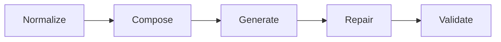
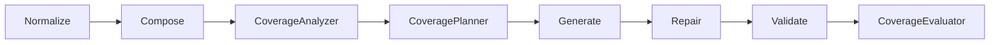

# Claude AI Development Guide — FoundryData Project

> **Purpose**: Practical instructions for Claude AI when assisting with FoundryData development.
> **Canonical Spec**: **Feature Support Simplification Plan** — single source of truth for pipeline, options, and SLO/SLI.
> This guide complements the spec and also includes non-functional guidance (workflow, testing, quality gates).

> **Scope**: General-purpose guide for Claude AI assistance on FoundryData project.
> **For coverage-aware tasks (9300..9327)**: See **[AGENTS.md](AGENTS.md)** for detailed runbook with coverage-specific workflows, schemas, and invariants.

---

## 🚀 TL;DR — FoundryData in 30 seconds

* **What**: JSON Schema → Test Data Generator with a compliance guarantee (AJV as oracle)
* **Why**: Generate thousands of valid records fast (targets per spec)
* **How**: `foundrydata generate --schema user.json --n 10000`
* **Unique (roadmap)**: Scenario‑based generation for edge cases and stress tests (not yet exposed as a CLI flag)
* **Philosophy**: Deterministic, schema‑true data with explicit limits

---

## 🎯 Scenario‑Based Generation

Generate targeted datasets for different testing aims:

> Note: the `--scenario` flag illustrated below is a design example; the current CLI does not yet implement scenario selection. Use plain `--n` (or `--count`) for now.

```bash
# Standard generation - realistic data
foundrydata generate --schema user.json --n 100

# Edge cases - min/max values, boundary conditions, empty arrays
foundrydata generate --schema user.json --n 100 --scenario edge-cases

# Stress test - uncommon values, max arrays, near-boundary values
foundrydata generate --schema user.json --n 100 --scenario stress-test

# Error conditions - invalid formats, missing required fields (for testing error handlers)
foundrydata generate --schema user.json --n 100 --scenario errors
```

---

## 📋 Project Overview

### Core Value Proposition

> Generate valid test data quickly and deterministically. Targets and limits follow the canonical spec.

### Target User

**Frontend/Backend Developer at a small team**

* 2–5 years experience
* Pain: Time spent creating fixtures
* Budget: €0–100/month
* Prefers open source tools

### MVP Constraints (v0.1)

* **Performance**: Adhere to spec SLO/SLI (e.g., \~1K simple/medium rows p50 ≈ 200–400 ms).
* **Bundle target**: <1 MB (core package; current builds may exceed this while optimization work is ongoing)
* **Runtime**: Single Node.js process, offline‑friendly

### JSON Schema Support (high‑level)

* `allOf` / `anyOf` / `oneOf` / `not` with deterministic branch selection
* Conditionals (`if/then/else`): **no rewrite by default**; safe rewrite opt‑in; if‑aware‑lite generation
* Objects: `properties`, `patternProperties`, `additionalProperties` (must‑cover), `propertyNames`, `dependent*`, `unevaluated*`
* Arrays: tuples (`prefixItems`), `items`, `additionalItems`, `contains` (bag semantics), `uniqueItems`
* Numbers: exact rational `multipleOf` with documented caps/fallbacks
* Refs: in‑document `$ref` supported; external `$ref` error by default (configurable); `$dynamicRef/*` preserved
  All guarantees and limits mirror the canonical spec.

---

## 🏗️ Technical Architecture

### Core Principles

1. **AJV is the oracle** — validate against the original schema (not transforms).
2. **Pipeline modularity** — Core: `Normalize → Compose → Generate → Repair → Validate`. Coverage-aware extends with optional phases.
3. **Determinism** — same seed ⇒ same data.
4. **Performance** — meet documented SLO/SLI with budgets and graceful degradation.
5. **Developer‑friendly** — clear diagnostics.

### Generation Pipeline

**Core Pipeline (5 stages)**:



* **Normalize**: Draft‑aware canonicalization; keep original for AJV.
* **Compose**: Build effective view (must‑cover `AP:false`, bag `contains`, rational math).
* **Generate**: Deterministic, seeded; `enum/const` outrank `type`; if‑aware‑lite.
* **Repair**: AJV‑driven corrections (keyword→action), idempotent, budgeted.
* **Validate**: Final AJV validation against the **original** schema.

**Coverage-Aware Extension** (when `coverage.mode !== 'off'`):



* **CoverageAnalyzer**: Build coverage graph from canonical schema + OpenAPI spec
* **CoveragePlanner**: Generate test units with hints to maximize coverage
* **CoverageEvaluator**: Measure achieved coverage, emit reports

See [docs/spec-coverage-aware-v1.0.md](docs/spec-coverage-aware-v1.0.md) and [AGENTS.md](AGENTS.md) for details.

---

## 🎯 Coverage-Aware Generation (V1.0)

FoundryData includes optional coverage-guided generation for maximizing schema and OpenAPI operation coverage.

### Coverage Modes

* **`off`** (default): No coverage tracking or instrumentation
* **`measure`**: Track coverage without modifying generation behavior
* **`guided`**: Optimize instance generation to maximize coverage via hints

### Coverage Dimensions

* **`structure`**: Schema keywords (type, properties, items, etc.)

<!-- Content truncated to meet Windsurf 6KB limit -->

---
> Converted and distributed by [TomeVault](https://tomevault.io/claim/foundrydata) — claim your Tome and manage your conversions.
<!-- tomevault:4.0:windsurf_rules:2026-04-10 -->
