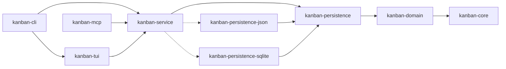

# CLAUDE.md

This file provides guidance to Claude Code (claude.ai/code) when working with code in this repository.

**See also:**
- [CONTRIBUTING.md](CONTRIBUTING.md) - Development workflow, code style, testing, and PR guidelines
- [README.md](README.md) - Project overview, features, installation, and usage

## Project Overview

This is a **terminal-based kanban/project management tool** written in **Rust**, inspired by lazygit's interface design. It follows **SOLID principles** with a clean, modular architecture using Cargo workspaces.

**Tech Stack**:
- Language: Rust (2021 edition)
- TUI Framework: ratatui + crossterm
- Async Runtime: Tokio
- Development Environment: Nix

## Architecture Philosophy

### SOLID Principles Applied

1. **Single Responsibility**: Each crate has one clear purpose
2. **Open/Closed**: Domain models are extensible through traits
3. **Liskov Substitution**: Repository and Service traits enable polymorphism
4. **Interface Segregation**: Minimal, focused trait definitions
5. **Dependency Inversion**: All layers depend on abstractions (traits)

### Workspace Structure

```
crates/
├── kanban-core/               # Core traits, errors, and result types
├── kanban-domain/             # Domain models (Board, Card, Column, Sprint)
├── kanban-persistence/        # Persistence traits, registry, and shared types
├── kanban-persistence-json/   # JSON file storage backend
├── kanban-persistence-sqlite/ # SQLite storage backend
├── kanban-service/            # Service layer: KanbanContext, persistence orchestration
├── kanban-tui/                # Terminal UI with ratatui
├── kanban-cli/                # CLI entry point
└── kanban-mcp/                # Model Context Protocol server for LLM integration
```

**Dependency Flow** (respecting dependency inversion):



## Development Environment

### Nix Setup
```bash
nix develop            # Enter development shell
```

The shell provides:
- Rust toolchain (stable, rust-analyzer, rust-src)
- cargo-watch, cargo-edit, cargo-audit, cargo-tarpaulin
- bacon (background compiler)

## Common Commands

### Building
```bash
cargo build            # Build all crates
cargo build --release  # Optimized production build
nix build              # Build with Nix (reproducible)
```

### Running
```bash
cargo run              # Launch TUI
cargo run -- tui       # Explicit TUI mode
cargo run -- init --name "My Board"  # Initialize board
```

### Development
```bash
cargo watch -x run     # Auto-rebuild on changes
bacon                  # Background compiler with diagnostics
cargo check            # Fast compilation check
cargo clippy           # Linting
cargo fmt              # Format code
```

### Testing
```bash
cargo test             # Run all tests
cargo test --package kanban-domain  # Test specific crate
cargo tarpaulin        # Code coverage
```

## Crate Descriptions

### kanban-core
**Purpose**: Foundation crate with shared abstractions

- `KanbanError` - Centralized error types
- `KanbanResult<T>` - Standard result type
- `Repository<T, Id>` - Generic repository trait
- `Service<T, Id>` - Generic service trait

**Design Pattern**: Error handling with thiserror, async traits

### kanban-domain
**Purpose**: Pure domain models with business logic

**Models**:
- `Board` - Top-level kanban board
- `Column` - Board columns with WIP limits
- `Card` - Task cards with priority, status, due dates
- `Tag` - Categorization tags

**Design Pattern**: Rich domain models with behavior, no infrastructure dependencies

### kanban-persistence
**Purpose**: Persistence trait layer — defines `PersistenceStore`, `StoreFactory`, `StoreRegistry`, and shared types (errors, snapshots, conflict detection, file watching)

- `PersistenceStore` - Async trait for load/save operations
- `StoreFactory` - Trait for backend registration (`name`, `supported_patterns`, `matches`, `create`)
- `StoreRegistry` - Registry that matches a locator string to the right factory
- `StoreSnapshot`, `PersistenceMetadata` - Shared serialization types
- `ConflictResolver`, `FormatVersion`, `MigrationStrategy` - Shared abstractions

**Design Pattern**: Trait-based abstraction layer; backends register via `StoreFactory`

### kanban-persistence-json
**Purpose**: JSON file storage backend implementing `StoreFactory`

- `JsonFileStore` - `PersistenceStore` impl with atomic writes (temp file + rename)
- `JsonStoreFactory` - Matches `*.json` and any non-URI path (catch-all fallback)
- V2 format with metadata envelope; automatic V1→V2 migration with `.v1.backup`
- Debounced saving (500ms minimum interval)

### kanban-persistence-sqlite
**Purpose**: SQLite storage backend implementing `StoreFactory`

- `SqliteStore` - `PersistenceStore` impl with WAL mode, foreign keys, max 2 connections
- `SqliteStoreFactory` - Matches `*.sqlite`, `*.sqlite3`, and `*.db`

<!-- Content truncated to meet Windsurf 6KB limit -->

---
> Source: [fulsomenko/kanban](https://github.com/fulsomenko/kanban) — distributed by [TomeVault](https://tomevault.io).
<!-- tomevault:4.0:windsurf_rules:2026-05-05 -->
